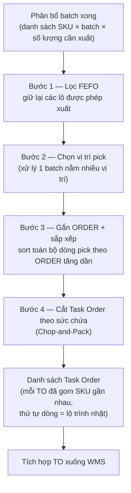

# PHƯƠNG PHÁP XỬ LÝ — Gom SKU gần nhau khi tạo Task Order

> Tài liệu nội bộ làm **nguyên liệu viết TO-BE Bài toán 2**. Mô tả phương pháp xử lý đã chốt cho chức năng "phân bổ batch xong → chọn vị trí pick → gom SKU gần nhau vào 1 Task Order". Báo cáo nghiên cứu thuật toán đầy đủ: `_research/2026-06-27_gom-sku-gan-nhau-order-picking.md`.

---

## 1. Bài toán cần giải

Sau khi hệ thống phân bổ batch cho nhu cầu xuất, phát sinh hai việc phải quyết định trước khi tạo phiếu soạn hàng (Task Order — TO):

- **Chọn vị trí pick** — một batch của một SKU có thể nằm ở nhiều vị trí trong kho rack; cần quyết định lấy hàng ở (các) vị trí nào.
- **Gom SKU gần nhau** — gom nhiều cặp (SKU × batch) có vị trí lấy hàng gần nhau vào cùng một TO, để rút ngắn quãng đường đi bộ của nhân viên soạn hàng.

Kho MDLZ (BKD1) là kho rack/kệ chọn lọc, ~52 dãy (A02–A52) cộng các zone đặc thù (BUN, CHE, FLOWRACK F01, PICKTO, STAGE), tổng 3.027 vị trí.

---

## 2. Quyết định cốt lõi — dùng trường `ORDER` có sẵn, KHÔNG gắn tọa độ x,y

Phương án được chốt là **tận dụng trường `ORDER` (pick-path sequence) đã có sẵn trong location master của WMS**, không xây hệ trục tọa độ x,y mới.

- **`ORDER` là lộ trình đã tính sẵn** — đây là số thứ tự duyệt kho theo đường chân nhân viên do WMS đánh sẵn; mỗi vị trí có một giá trị duy nhất. Sắp xếp danh sách pick theo `ORDER` tăng dần chính là thứ tự đi nhặt hàng.
- **Tọa độ x,y không cho thêm lợi ích trên layout hiện tại** — khoảng cách đường chim bay (Euclidean) sai trong kho rack vì nhân viên phải đi vòng theo lối đi, không xuyên qua kệ; muốn x,y có ích phải dựng thêm đồ thị lối đi + ma trận khoảng cách + thuật toán định tuyến, độ phức tạp cao mà cải thiện không đáng kể với kho dạng single-block.
- **Mã vị trí đã là tọa độ** — cấu trúc `LINE.BAY.LEVEL` (ví dụ `A17.13.2` = dãy A17, bay 13, tầng 2) đã mang đủ thông tin không gian; `ORDER` đã nén ba chiều này thành một chiều theo đúng đường đi.

> **Pain AS-IS:** Planner MDLZ / nhân viên kho hiện gom đơn và chọn vị trí theo kinh nghiệm thủ công, dễ tạo lộ trình đi lại lòng vòng, một SKU nằm nhiều vị trí thì chọn cảm tính.
> **TO-BE:** Hệ thống tự gom SKU gần nhau và chỉ định vị trí pick tối ưu dựa trên `ORDER`, cho ra TO có lộ trình nhặt liền mạch.

---

## 3. Kết quả kiểm chứng dữ liệu `ORDER` (đã thực hiện)

Toàn bộ 3.027 vị trí trong `Location BKD1.xlsx` đã được kiểm tra:

- **Liên tục & duy nhất** — `ORDER` chạy thẳng 1 → 3026, không trùng, không lỗ (chỉ 1 vị trí rác `A0` = 1000000 cần loại).
- **Thứ tự dãy đúng** — dải `ORDER` của các dãy liền mạch, không chồng lấn: A02 (1–84) → A03 (85–168) → … → A52 → rồi tới các zone BUN/CHE/F01/PIC/STA.
- **Đơn điệu trong dãy** — kiểm tra 55/55 dãy: 0 dãy bị lệch; trong mỗi dãy `ORDER` tăng đúng theo (bay → tầng) vật lý.

**Một lưu ý (không phải lỗi):** `ORDER` đánh theo kiểu **"Return"** chứ không phải serpentine — mọi dãy đều đi bay 01 → bay cuối cùng một chiều, tức giả định nhân viên quay về đầu dãy mỗi khi đổi dãy.

- Nếu kho **chỉ có một lối cắt ngang ở đầu dãy** → cách đánh số này **đúng**, không cần sửa.
- Nếu kho có lối cắt ngang **cả hai đầu** → còn dư địa tối ưu đường đi (phần dành cho lộ trình nâng cấp ở mục 8).
- **Điểm này không ảnh hưởng việc gom SKU** — chỉ liên quan tối ưu đường đi *bên trong* một TO, tách biệt với logic *gom* TO.

> **Cần xác nhận với team kho:** kho có lối cắt ngang ở một đầu hay cả hai đầu dãy.

---

## 4. Luồng xử lý tổng thể

Câu nền: Sau khi phân bổ batch, hệ thống chạy bốn bước tuần tự để biến nhu cầu xuất thành các Task Order tối ưu.



---

## 5. Chi tiết từng bước

### 5.1. Bước 1 — Lọc FEFO (ràng buộc cứng)

Vì là hàng FMCG thực phẩm có hạn dùng, FEFO là rào cản tối cao, không được hy sinh để đổi quãng đường.

- **Lọc lô hợp lệ** — với mỗi dòng cần xuất, hệ thống chỉ giữ lại các vị trí đang chứa lô được phép xuất theo nguyên tắc hết hạn trước xuất trước.
- **Bài toán tối ưu chỉ chạy trên tập vị trí đã lọc** — mọi bước sau chỉ thao tác trên không gian vị trí hợp lệ này.

### 5.2. Bước 2 — Chọn vị trí pick khi 1 batch nằm nhiều vị trí

Áp dụng quy tắc tham lam (greedy), không cần mô hình tối ưu phức tạp:

- **Sắp theo `ORDER`** — trong các vị trí cùng hạn dùng, sắp xếp theo `ORDER` rồi lấy lần lượt cho đến khi đủ số lượng yêu cầu.
- **Ưu tiên ít điểm dừng** — nếu một vị trí có tồn ≥ nhu cầu, lấy gọn ở một chỗ để giảm số lần dừng.
- **Cắt số lượng khi cần** — vị trí cuối cùng chỉ lấy đúng phần còn thiếu.

### 5.3. Bước 3 — Gắn `ORDER` và sắp xếp

- **Tra `ORDER`** — mỗi vị trí pick được tra giá trị `ORDER` từ location master (một phép JOIN).
- **Sort toàn đợt** — gom tất cả dòng pick của mọi SKU trong đợt rồi sắp xếp theo `ORDER` tăng dần. Danh sách sau khi sort chính là trình tự đi nhặt liền mạch qua các dãy.

### 5.4. Bước 4 — Cắt Task Order theo sức chứa (Chop-and-Pack)

- **Dồn liên tiếp** — duyệt danh sách đã sort từ trên xuống, dồn các dòng vào một TO.
- **Cắt khi chạm ngưỡng** — khi tổng (số dòng / thể tích / khối lượng) chạm sức chứa thiết bị → chốt TO, mở TO mới.
- **Lộ trình tự có sẵn** — thứ tự dòng trong mỗi TO đã là lộ trình nhặt, không cần bước định tuyến riêng.

---

## 6. Pseudo-code

```text
ĐẦU VÀO : D = danh sách dòng cần xuất {SKU, batch, qty}
          CAP = ngưỡng sức chứa của một TO (theo loại zone)
ĐẦU RA  : danh sách Task Order

picklines = []
cho mỗi dòng d trong D:
    locs = LọcFEFO(d)                       # Bước 1: chỉ giữ lô hợp lệ
    locs = sort(locs theo ORDER tăng dần)   # Bước 2: chọn vị trí
    còn = d.qty
    cho mỗi loc trong locs khi còn > 0:
        lấy = min(còn, tồn(loc))
        picklines.add({d.SKU, d.batch, loc, lấy, ORDER(loc)})
        còn -= lấy

picklines = sort(picklines theo ORDER tăng dần)   # Bước 3

TOs = []; to_hiện = TO_mới(); tải = 0              # Bước 4: Chop-and-Pack
cho mỗi p trong picklines:
    nếu tải + khối(p) > CAP:
        TOs.add(to_hiện); to_hiện = TO_mới(); tải = 0
    to_hiện.add(p); tải += khối(p)
TOs.add(to_hiện)
trả về TOs
```

---

## 7. Tham số cấu hình

| Tham số | Ý nghĩa | Ghi chú |
|---|---|---|
| `CAP_MIXED_FULL` | Sức chứa TO cho zone pallet/thùng chẵn | Xe nâng / pallet — đơn vị thể tích hoặc số pallet |
| `CAP_MIXED_LOOS` | Sức chứa TO cho zone nhặt lẻ | Giỏ pick — đơn vị số dòng hoặc khối lượng |
| `ĐƠN_VỊ_CAP` | Tiêu chí cắt: số dòng / thể tích / khối lượng | Vận hành chọn theo thực tế thiết bị |

Câu nền: Vì hai loại zone dùng thiết bị soạn hàng khác nhau, ngưỡng sức chứa nên tách riêng theo zone và cho phép vận hành chỉnh được.

---

## 8. Vệ sinh dữ liệu & lưu ý triển khai

- **Loại vị trí không pick được** — bỏ `STATUS = CHECK` (1), `STATUS = HOLD` (1) và vị trí rác `A0` (`ORDER` = 1000000).
- **Tách ngưỡng theo zone** — tồn chủ yếu ở MIXED FULL (2.180 vị trí) và MIXED LOOS (833); FLOWRACK chỉ 12.
- **Khối lượng build rất nhẹ** — chỉ cần 1 phép JOIN (pick line ↔ location), 1 lệnh SORT, 1 vòng lặp cắt, 1 tham số cấu hình; không cần mô hình toán, engine tối ưu hay thư viện ML.

---

## 9. Lộ trình nâng cấp (để ngỏ — chưa làm ngay)

Câu nền: Phương án trên là mức cơ bản, đủ tốt cho giai đoạn đầu; có thể nâng cấp dần khi vận hành phát sinh nhu cầu.

- **Mức 2 — Seed Algorithm + phạt khác dãy** — bù điểm yếu serpentine bằng cách dùng `LINE` (số dãy) làm điều kiện phạt khi gom, kết hợp định tuyến Composite; cải thiện ~20–30%. Áp dụng khi vận hành thấy còn lãng phí ở khúc cua đổi dãy.
- **Mức 3 — Metaheuristic JOBPRP** — chỉ cân nhắc khi chuyển sang Wave Picking quy mô lớn hoặc xe tự hành (AGV).

---

## 10. Tóm tắt để đưa vào TO-BE

- Chức năng gom SKU gần nhau **dùng trường `ORDER` có sẵn**, không gắn tọa độ x,y.
- Dữ liệu `ORDER` đã kiểm chứng là **sạch và đáng tin** để sort/gom.
- Luồng xử lý **4 bước**: Lọc FEFO → Chọn vị trí pick → Sort theo `ORDER` → Cắt TO theo sức chứa.
- Mỗi TO ra đời đã **gom SKU gần nhau** và **thứ tự dòng chính là lộ trình nhặt**.
- Cần xác nhận với team kho: **kho có một hay hai lối cắt ngang** — quyết định việc có nâng cấp định tuyến về sau.
