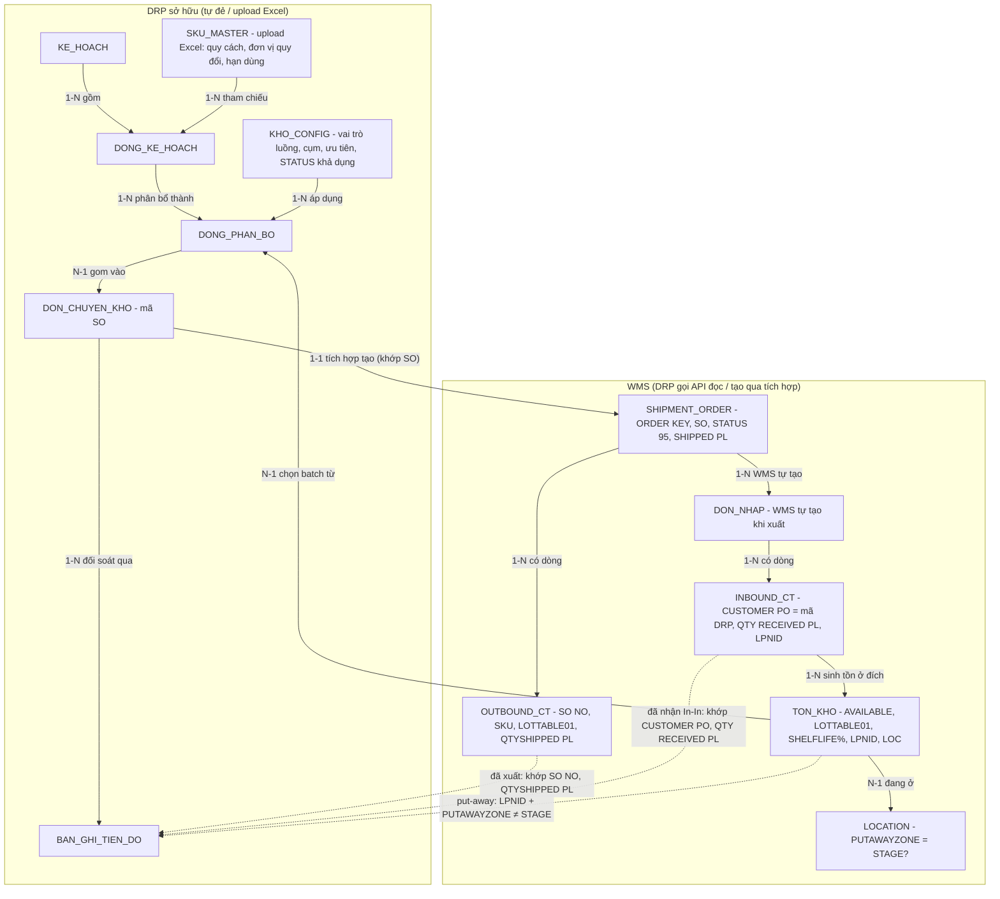
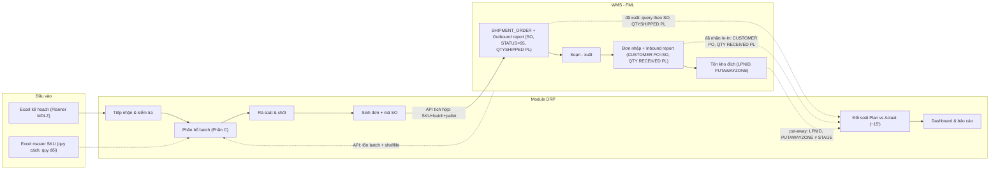

# GIẢI PHÁP LÕI — Module Phân bổ lô hàng & Theo dõi tiến độ chuyển kho

> **Mục đích:** Chốt phần lõi giải pháp (ERD · Data flow · Logic phân bổ · Logic tracking) **trước khi viết tiếp TO-BE từ mục 4** — bản v0.2 dựng lại trên **dữ liệu WMS thật** (tồn kho, location, đơn nhập, đơn xuất) thay cho giả định.
>
> **Khách hàng:** Mondelez · **Vận hành kho & WMS:** FML (3PL) · **Triển khai:** Smartlog
> **Phiên bản:** 0.2 (nháp) · **Nguồn:** BRD tinh gọn v1.3 + TO-BE mục 1 + dữ liệu WMS khảo sát + ghi chú "Thuật input thêm về giải pháp".

## Quy ước đánh dấu

- 🟢 **Đã chốt** — có cơ sở từ dữ liệu/trao đổi.
- 🟡 **Giả định** — cần MDLZ/FML xác nhận.
- 🔴 **Điểm treo** — chưa có dữ liệu, phải hỏi trước khi build.

## Nền tảng đã chốt (đọc từ dữ liệu WMS thật)

| Khái niệm DRP | Lấy từ | Trường WMS | Ghi chú |
|---|---|---|---|
| Tồn khả dụng | API tồn kho | `AVAILABLE` | Đơn vị nhỏ nhất (PCS), chưa ghim đơn |
| Tồn onhand | API tồn kho | `QTY` | Quy về đơn vị nhỏ nhất |
| Batch / lô | API tồn kho | `LOTTABLE01` | = ngày SX format lại |
| Hạn dùng còn lại (FEFO/LEFO) | API tồn kho | `SHELF LIFE (%)` | % để xếp FEFO/LEFO |
| Trạng thái hàng | API tồn kho | `STATUS` | DRP cấu hình "kho nào lấy STATUS nào" |
| Vị trí | API tồn kho | `LOC` | Map sang Location → zone |
| Zone (tách Stage Transfer) | API location | `PUTAWAYZONE` | Loại trừ zone Stage Transfer = đã lên kệ |
| Truy nguồn pallet về đơn xuất | API tồn kho | `GENERATED FROM KEY` | vd `BKD3-SO-2600002439` = kho xuất + ORDER KEY đơn xuất |
| Mã DRP sinh (khóa đối soát) | DRP → ghi vào đơn xuất | `SO` (shipment order) | vd `WH2 TO WH3 26062026` |
| Mã đơn xuất WMS | API đơn xuất | `ORDER KEY` | WMS tự sinh; DRP query theo `SO` để lấy |
| Đơn xuất đã xuất hay chưa | API đơn xuất (header) | `STATUS` = **95** (Shipped) | **Chỉ `STATUS=95` mới tính là hoàn thành xuất; `PART SHIP` KHÔNG tính.** Trạng thái khác: NEW · PICKED · PART SHIP · CANCEL |
| SL đã xuất theo SKU+batch | **Outbound report** (chi tiết đơn xuất) | `SO NO` (=mã DRP), `SKU`, `LOTTABLE01`, **`QTYSHIPPED PCS`** (đơn vị nhỏ nhất) | Sum số lượng xuất theo `QTYSHIPPED PCS`; cũng để kiểm chứng xuất đúng batch đã phân bổ |
| Mã DRP trên đơn nhập (In-In) | **Inbound report** (chi tiết đơn nhập) | `CUSTOMER PO` (=mã DRP) **khi `TYPE = "Nhập nội bộ (Internal Transfer) EDI"`** | ✅ Đã kiểm chứng: 14 mã trùng khít với `SO` đơn xuất. Lưu ý: TYPE khác (FGTN EDI nhập nhà máy…) thì CUSTOMER PO KHÔNG phải mã DRP → phải lọc TYPE trước |
| SL đã nhận theo SKU+batch | **Inbound report** | `QTY RECEIVED PCS`, `SKU/ITEM CODE`, `LOTTABLE01`, `% SHELFLIFE AT REC` | "Đã nhận" mức dòng, sum theo `QTY RECEIVED PCS` (Complete hệ thống) |
| Zone Stage Transfer (giá trị thật) | Inbound report / Location | `PUTAWAYZONE` = **`STAGE`** (chỉ tính **của kho BKD1**) | Hàng ở zone STAGE của BKD1 = chưa lên kệ; STAGE của kho khác không tính |
| Kho đích đơn xuất | API đơn xuất | `TO WHSEID` | |
| Quy cách & quy đổi đơn vị | **Master SKU upload Excel** | (không từ WMS) | PCS > CASE > PALLET, DRP tự setup |

> 🟢 **Nguyên tắc đơn vị tính:** BE **sum mọi số lượng bằng đơn vị nhỏ nhất (PCS)**; việc quy đổi & hiển thị (vd về PALLET) dựa trên **master data SKU trên DRP**. Các cột `...PL` của WMS chỉ để tham khảo, không dùng làm chuẩn cho phép cộng.

> 🟢 **Hai luồng tích hợp tạo đơn GIỐNG nhau** (theo ghi chú đính chính): cả hai DRP đều **đẩy đơn XUẤT (shipment order) xuống WMS — cùng một kênh, KHÔNG qua SAP**; khi xuất, WMS tự tạo đơn nhập ở kho đích. Khác biệt **chỉ ở bước nhận hàng**:
> - **In-In** (BKD2/BKD3→BKD1): đơn nhập **tự động** chuyển "đã nhập" → track được đến put-away tại BKD1.
> - **In-Ex** (cụm BKD/NKD→kho ngoài): đơn nhập **KHÔNG tự động** — thủ kho ngoài bấm nhận mới chuyển; mà kho ngoài không phải lúc nào cũng có trên WMS → **In-Ex chỉ track đến "đã xuất khỏi kho nguồn"**.

---

# PHẦN A — ERD (Mô hình thực thể & quan hệ)

## A.1. Sơ đồ

> Quy ước: **DRP sở hữu** = bảng DRP tự đẻ / upload Excel · **WMS** = DRP gọi API đọc, hoặc DRP tạo qua tích hợp rồi đọc lại. Nhãn mũi tên: `1-N`, `N-1`, `1-1`.



## A.2. Mô tả thực thể

| Thực thể | Sở hữu | Ý nghĩa | Trường chính | Nguồn | Cờ |
|---|---|---|---|---|---|
| **KHO_CONFIG** | DRP | Danh mục kho + cụm + loại; STATUS khả dụng & zone trung chuyển tách bảng ánh xạ riêng; thứ tự lấy theo luồng tách ở "Nguồn lấy hàng theo luồng" | Mã kho, Tên, **Cụm** (nhóm xét chung khi làm nguồn), Loại (trong/ngoài) | Cấu hình Module | 🟢 |
| **SKU_MASTER** | DRP (upload) | Mặt hàng + đơn vị & hệ số quy đổi 3 cấp | sku, name, masterunit, uomlevel2 + quantitylevel2exchange, uomlevel3 + quantitylevel3exchange (exchange = số đơn vị nhỏ nhất/đơn vị cấp đó) | **Upload Excel** | 🟢 |
| **KE_HOACH** | DRP | Một lần tải file kế hoạch | Mã KH, Ngày D, Người tải, Trạng thái | Sinh khi upload | 🟢 |
| **DONG_KE_HOACH** | DRP | Dòng plan (1 SKU, 1 luồng) | Luồng, Kho nguồn, Kho đích, SKU, SL (PCS/pallet), Chiến thuật, Batch chỉ định | Đọc file Excel | 🟢 |
| **DONG_PHAN_BO** | DRP | Kết quả phân bổ → batch/pallet | Dòng KH, Batch (LOTTABLE01), Kho lấy, SL pallet, Cờ break-FEFO | Module tính (Phần C) | 🟢 |
| **DON_CHUYEN_KHO** | DRP | Đơn DRP sinh, mang **mã SO** | **Mã SO**, Kho nguồn/đích, Luồng, Các dòng SKU+batch+pallet, Trạng thái tích hợp | Module sinh | 🟢 |
| **BAN_GHI_TIEN_DO** | DRP | Snapshot Plan vs Actual mỗi ~15' | Mã SO, Thời điểm, Plan/Shipped/Received/Stage Transfer/Complete thực tế | Module tính | 🟢 |
| **SHIPMENT_ORDER** | WMS | Đơn xuất WMS (DRP tạo qua tích hợp) | `ORDER KEY`, `SO`, `STATUS`, `ORDER TYPE`, `TO WHSEID`, `SHIPPED PL`… | DRP tạo → query lại theo SO | 🟢 |
| **DON_NHAP** | WMS | Đơn nhập kho đích (WMS tự tạo khi xuất) | RECEIPT KEY, STATUS, TYPE | WMS tự tạo | 🟢 |
| **TON_KHO** | WMS | Tồn theo dòng LPN | SKU, STATUS, LOC, AVAILABLE, LOTTABLE01, SHELF LIFE %, LPNID, GENERATED FROM KEY | API WMS | 🟢 |
| **LOCATION** | WMS | Vị trí → zone | LOCATION, PUTAWAYZONE | API WMS | 🟢 |

## A.3. Hai chuỗi khóa đối soát (phần MDLZ/FML cần soi)

1. **Tạo & đối soát đơn (cả 2 luồng):** `DON_CHUYEN_KHO (SO)` → tích hợp tạo `SHIPMENT_ORDER (SO=…, ORDER KEY do WMS sinh)`. DRP **query shipment order theo SO** để lấy `ORDER KEY` + tiến độ `SHIPPED PL`. 🟢 *(theo câu trả lời: WMS không trả ORDER KEY ngay)*

2. **Đối soát nhận hàng tại kho đích (chỉ In-In) — đường gọn:** lọc đơn nhập **`TYPE = "Nhập nội bộ (Internal Transfer) EDI"`**, khi đó **`CUSTOMER PO` = mã DRP (SO)** → khớp thẳng về `DON_CHUYEN_KHO`, lấy `QTY RECEIVED PL`. ✅ Đã kiểm chứng 14 mã trùng SO↔CUSTOMER PO; không cần đi vòng `GENERATED FROM KEY`. 🟢
3. **Tách put-away (chỉ In-In):** để biết pallet đã lên kệ hay còn Stage Transfer, xét **vị trí hiện tại** của pallet: `LOC` → `PUTAWAYZONE`. Hàng ở zone **`STAGE` của kho BKD1** = chưa lên kệ (STAGE của kho khác không tính). Liên kết pallet ↔ đơn của ta qua `LPNID` (có ở cả tồn kho và Inbound report) hoặc `GENERATED FROM KEY`. 🟢

---

# PHẦN B — DATA FLOW

## B.1. Sơ đồ luồng end-to-end



## B.2. Điểm tích hợp với WMS

| # | Điểm | Chiều | Dữ liệu | Khi nào | Cờ |
|---|---|---|---|---|---|
| **I-1** | Lấy tồn batch để phân bổ | WMS → DRP | SKU, STATUS, AVAILABLE, LOTTABLE01, SHELF LIFE %, theo kho | Lúc phân bổ | 🟢 |
| **I-2** | Tạo đơn xuất | DRP → WMS | Mã SO, kho nguồn/đích, dòng SKU+batch+pallet | Khi chốt phương án | 🟢 |
| **I-3a** | Query đơn xuất theo SO + chi tiết xuất | WMS → DRP | header: ORDER KEY, STATUS, SHIPPED PL · Outbound report: SO NO, SKU, LOTTABLE01, QTYSHIPPED PL | ~15'/lần | 🟢 |
| **I-3b** | Lấy chi tiết đơn nhập (In-In) | WMS → DRP | Inbound report: CUSTOMER PO (=mã DRP), SKU, LOTTABLE01, QTY RECEIVED PL, LPNID, RECEIPT DATE | ~15'/lần | 🟢 |
| **I-3c** | Lấy vị trí hiện tại pallet (In-In, tách Stage) | WMS → DRP | tồn kho: LPNID, LOC, PUTAWAYZONE (=STAGE?), onhand pallet | ~15'/lần | 🟢 |
| **I-4** | Danh mục location → zone | WMS → DRP | LOCATION, PUTAWAYZONE | Khi thay đổi | 🟢 |

> 🟡 **Còn cần FML xác nhận:** xem Q1 (zone Stage Transfer = `STAGE`, có giá trị nào khác?) và Q2 (mốc thời gian nhập về BKD1) ở bảng cuối.

## B.3. Công thức tính tiến độ

> **Đơn vị:** mọi vế dưới sum bằng **PCS** (đơn vị nhỏ nhất); quy đổi sang PALLET khi hiển thị bằng master SKU trên DRP.
> **Xác định "đã xuất":** đơn xuất hoàn thành **chỉ khi `SHIPMENT_ORDER.STATUS = 95`** (Shipped); `PART SHIP` **không** tính là đã xuất.

**Luồng In-In** (đầy đủ chuỗi — đây là lõi pain point PP-03):
```
Plan              = Σ SL kế hoạch (PCS) — DONG_KE_HOACH
Đã xuất           = Σ QTYSHIPPED PCS ở Outbound report, chỉ các đơn STATUS=95 (khớp SO NO)
Complete_hệ_thống = Σ QTY RECEIVED PCS ở Inbound report (khớp CUSTOMER PO = mã DRP)   (đã nhận, gồm cả STAGE)
Stage_Transfer    = Σ tồn (PCS) của ta đang ở vị trí có PUTAWAYZONE = STAGE CỦA KHO BKD1   (chưa lên kệ)
Complete_thực_tế  = Complete_hệ_thống − Stage_Transfer                                  (đã lên kệ)
Pending           = Plan − Complete_hệ_thống
Thời_gian_lưu_Stage(LPN) = thời điểm xem − thời điểm hàng nhập về BKD1 (RECEIPT/DETAIL RECEIPT DATE)
→ Hiển thị: quy đổi mọi giá trị sang PALLET bằng master SKU trên DRP
```

**Luồng In-Ex** (chỉ đến "đã xuất" — kho ngoài có thể không có trên WMS):
```
Plan     = Σ SL kế hoạch (PCS)
Complete = Σ QTYSHIPPED PCS ở Outbound report, chỉ các đơn STATUS=95 (khớp SO NO)
Pending  = Plan − Complete
(không tách Stage Transfer / put-away; hiển thị quy đổi sang PALLET bằng master SKU DRP)
```

---

# PHẦN C — LOGIC PHÂN BỔ (pseudo-rule + ví dụ số)

## C.1. Quy tắc nền

- **R0-1 — Đơn vị & quy đổi:** Kế hoạch đầu vào nhập theo **pallet nguyên**; BE quy đổi sang **đơn vị nhỏ nhất** (số pallet × số lượng quy đổi cấp pallet) và **xử lý toàn bộ ở đơn vị nhỏ nhất**. Vì plan luôn pallet nguyên nên số quy đổi là bội số chẵn — **không có bước làm tròn pallet khi phân bổ**; pallet chỉ là đơn vị nhập & hiển thị (quy ngược khi hiển thị).
- **R0-2 — Lọc STATUS (whitelist tùy chọn):** nếu kho nguồn **có khai** danh sách STATUS khả dụng (mục 2.1 Bảng 2) thì chỉ chọn dòng tồn có `STATUS` thuộc danh sách đó; nếu **không khai** thì lấy **tất cả trạng thái** của kho (không lọc). Khuyến nghị khai whitelist `…_OK` để loại `…_BLOCKED`/`…_EXPIRED`/`HOLD_FM`/`GTDC`/`TEST_FM`.
- **R0-3 — Vét batch:** batch hiện tại không đủ → lấy hết rồi sang batch kế theo thứ tự của chiến thuật, đến khi đủ pallet.
- **R0-4 — Chiến thuật đặt theo TỪNG SKU** (cột trong file kế hoạch).

## C.2. Bốn chiến thuật chọn batch (mục 4.1 TO-BE)

| Chiến thuật | Sắp xếp batch trong pool | Ví dụ số |
|---|---|---|
| **FEFO** | `SHELF LIFE (%)` **thấp → cao** (gần hết hạn trước) | Cần 50pl. B1 (SL 20%, 30pl), B2 (SL 60%, 40pl) → **B1 30 + B2 20** |
| **LEFO** | `SHELF LIFE (%)` **cao → thấp** (đẩy date xa) | Cùng pool → **B2 40 + B1 10** |
| **Nhập xưởng** | Chỉ hàng mới SX tồn ở BKD2/BKD3; trong đó theo FEFO | 🔴 tiêu chí "mới SX" = ngưỡng nào? *(OQ-10 cần MDLZ chốt)* |
| **Chỉ định batch** | Chỉ lấy đúng `LOTTABLE01` ghi ở cột Batch chỉ định | Chỉ định B1 cần 50pl, B1 chỉ 30pl → **cảnh báo thiếu 20pl** |

## C.3. Dựng pool & nguồn theo luồng (mục 4.2 TO-BE)

| Luồng | Pool nguồn | Quy tắc |
|---|---|---|
| **In-In** (BKD2/3→BKD1) | **Gộp BKD2 + BKD3** | Không ưu tiên kho nào; chọn batch thuần theo chiến thuật |
| **In-Ex nhánh BKD** | Pool chính **BKD2+BKD3**, **dự phòng BKD1** | Lấy hết pool chính trước; chạm BKD1 → qua **cổng break-FEFO** (C.4) |
| **In-Ex nhánh NKD** | **Chỉ NKD** (đơn lẻ) | Không gộp, không dự phòng |

*Ví dụ In-Ex BKD:* cần 100pl SKU A. Pool BKD2+3 còn 70pl → lấy hết 70, thiếu 30 → lấy BKD1 30pl → **kiểm tra cổng break-FEFO**.

## C.4. Cổng break-FEFO (chỉ In-Ex BKD, khi chạm BKD1)

```
hsd_min_BKD1 ← SHELF LIFE % nhỏ nhất trong batch BKD1 được lấy
hsd_min_pool ← SHELF LIFE % nhỏ nhất trong nhóm BKD2/BKD3 đã lấy
NẾU hsd_min_BKD1 < hsd_min_pool:     # BKD1 cũ hơn pool → vi phạm FEFO
    DỪNG, gắn cờ break-FEFO → chờ Planner MDLZ xác nhận mới xuất
NGƯỢC LẠI: cho qua
```
> Cổng bật/tắt qua cấu hình (mục 2.3 TO-BE). 🟢

## C.5. Truy vết Logic → mục TO-BE

| Quy tắc | BR / BRULE | Mục TO-BE |
|---|---|---|
| C.1 nền | BR-007/008/009/013, BRULE-03/11 | 4.1 |
| C.2 chiến thuật | BR-003/006, BRULE-01 | 4.1 |
| C.3 pool theo luồng | BR-004/005/030, BRULE-04 | 4.2 |
| C.4 break-FEFO | BR-029, BRULE-01 | 4.2 + 6 |
| B.3 tracking | BR-021/022/023/033, BRULE-09/10 | 5.5/5.6 |

---

# CÒN TREO — HỎI MDLZ/FML

| # | Câu hỏi | Chặn việc gì | Cờ |
|---|---|---|---|
| Q1 | Zone Stage Transfer = `PUTAWAYZONE` giá trị **`STAGE`** (thấy trong data) — còn giá trị nào khác cần loại trừ? | Tính Stage Transfer (B.3) | 🟡 |
| Q2 | Mốc "hàng nhập về BKD1" = `RECEIPT DATE` hay `DETAIL RECEIPT DATE`? | Thời gian lưu Stage Transfer | 🟡 |
| Q3 | Tiêu chí "Nhập xưởng" = ngưỡng ngày SX nào? (OQ-10) | Chiến thuật Nhập xưởng (C.2) | 🔴 |
| Q4 | Mã kho NKD + STATUS khả dụng của NKD (OQ-09) | Pool nhánh NKD (C.3) | 🔴 |
| Q5 | SKU có trong master upload nhưng WMS không có tồn (hoặc ngược) — xử lý lệch thế nào? | Ngoại lệ (mục 6) | 🟡 |
| Q6 | Xác nhận bộ lọc loại đơn: In-In = đơn xuất `ORDER TYPE="Xuất nội bộ (Tích hợp) EDI"` + đơn nhập `TYPE="Nhập nội bộ (Internal Transfer) EDI"`; In-Ex = `"Export"`? (`"Xuất Copacking EDI"` loại trừ) | Lọc đúng đơn của Module (I-3) | 🟡 |
