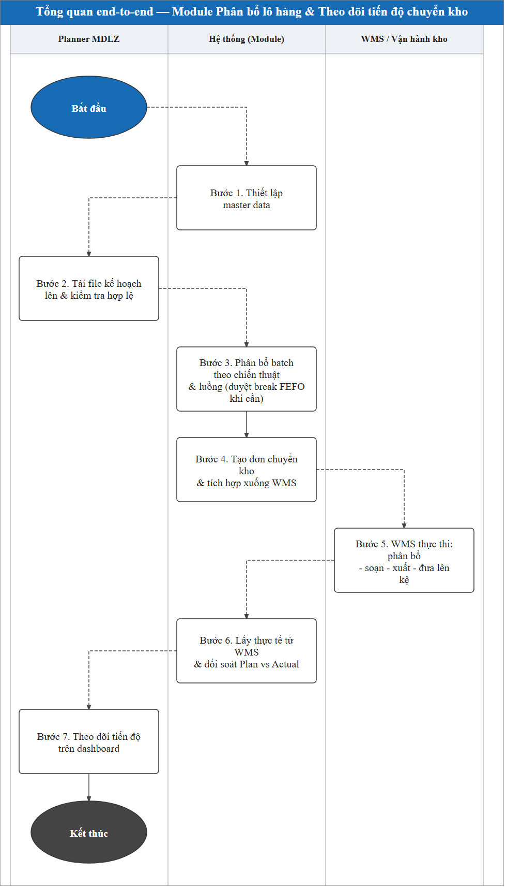
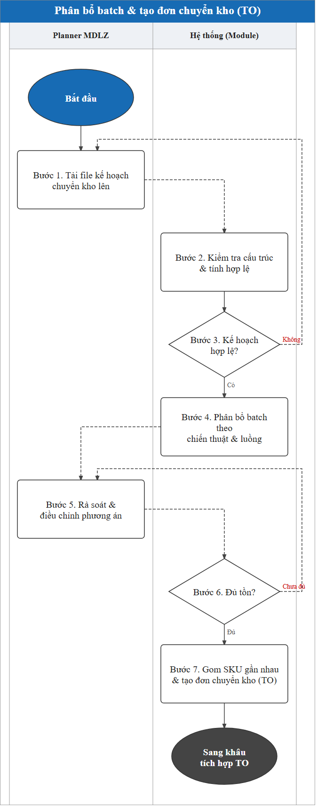
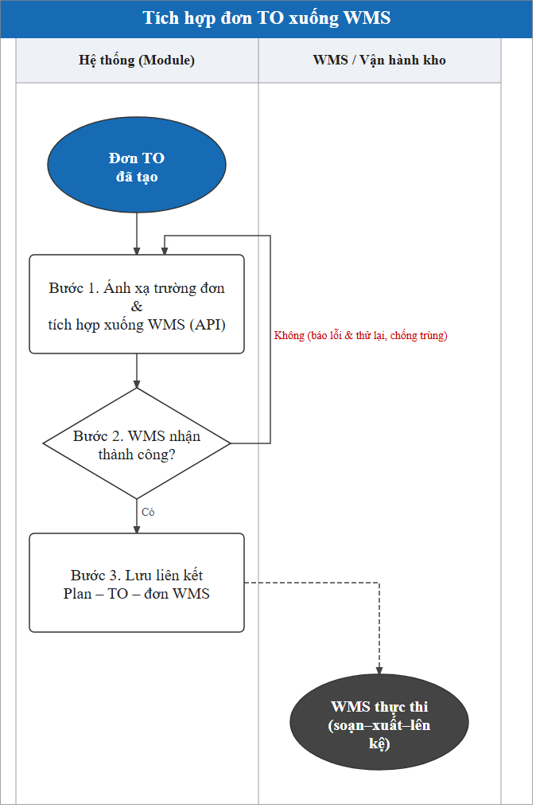
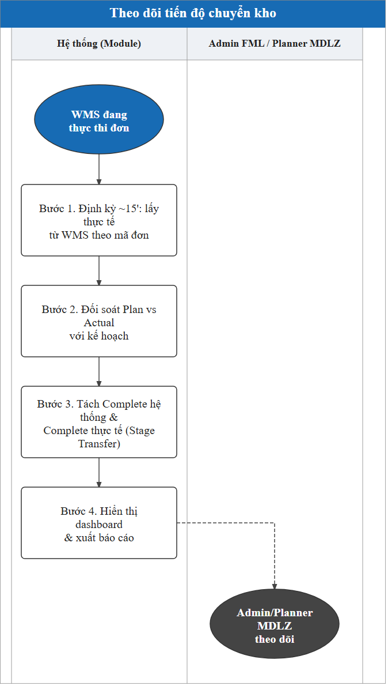
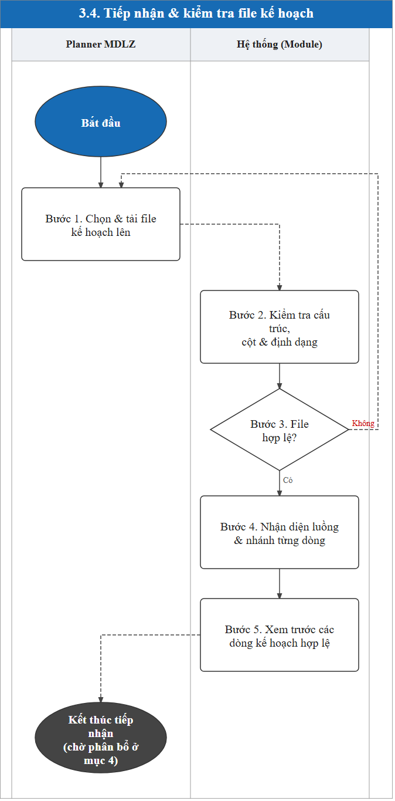
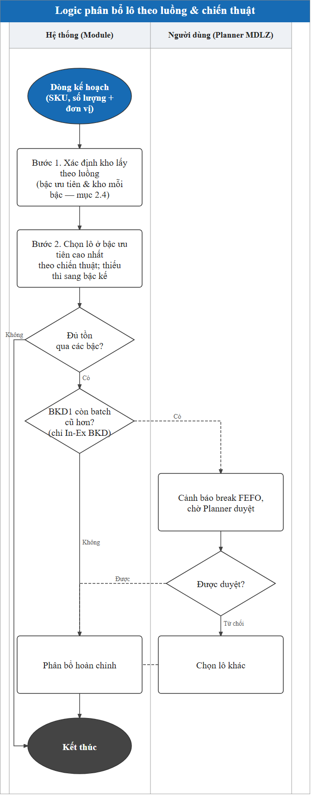
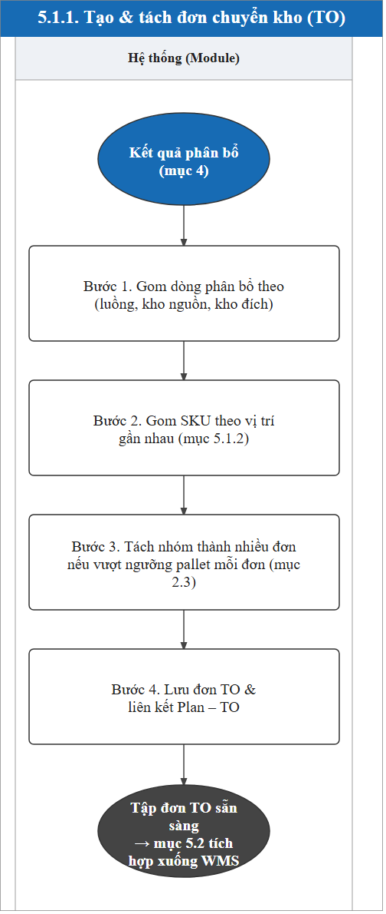
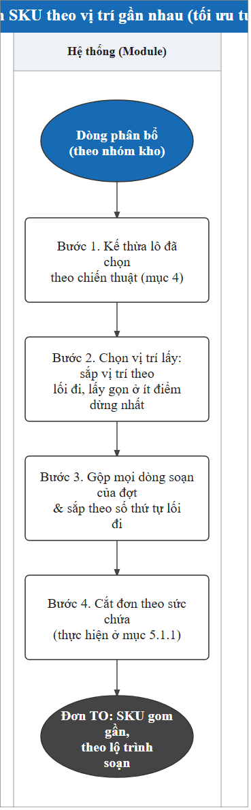

<!-- COVER
title: TÀI LIỆU THIẾT KẾ GIẢI PHÁP (TO-BE) | MODULE PHÂN BỔ LÔ HÀNG & THEO DÕI TIẾN ĐỘ CHUYỂN KHO
date: 25/06/2026
logo-left: logo-smartlog.png
logo-right: logo-mondelez.png
drop-title: true
-->

# Module Phân bổ lô hàng & Theo dõi tiến độ chuyển kho — TO-BE Blueprint

> **Khách hàng:** Mondelez (chủ hàng) · **Vận hành kho & WMS:** FML (3PL) · **Đơn vị triển khai:** Smartlog
> **Phiên bản:** 1.0 · **Ngày:** 28/06/2026
> **Nguồn nền:** Tài liệu yêu cầu nghiệp vụ (BRD) v0.8 + tài liệu hiện trạng (AS-IS).

## MỤC LỤC KẾ HOẠCH (tracking — xóa trước khi convert .docx)

| # | Mục / Nghiệp vụ | Khâu xử lý | Trạng thái |
|---|---|---|---|
| 0 | (Đầu trang) Trang ký · Quản lý thay đổi | - | ☑ Xong |
| 1 | Tổng quan giải pháp (mục tiêu & phạm vi · cấu trúc & lưu đồ tổng quan · lưu đồ từng nhóm chức năng) | A. Tổng quan | ☑ Xong |
| 2 | Thiết lập hệ thống & Master data (danh mục kho · master data SKU · cấu hình quy tắc · nguồn lấy hàng theo luồng) | B. Master data | ☑ Xong |
| 3 | Tiếp nhận kế hoạch (bảng tổng hợp · mục đích · mẫu file · tiếp nhận & kiểm tra) | C. Input | ☑ Xong |
| 4.1 | Phân bổ batch theo chiến thuật (FEFO/LEFO/Nhập xưởng/Chỉ định batch) **& nguồn lấy hàng theo luồng** (In-In / In-Ex BKD / In-Ex NKD, bậc lấy & cổng break FEFO) — 6 khối | D. Logic | ☑ Xong |
| 5.1 | Tạo đơn chuyển kho (TO): 5.1.1 tạo & tách đơn (kho nguồn + ngưỡng pallet) · 5.1.2 gom SKU theo vị trí gần nhau (dùng trường `ORDER`) | E. Output (Integration) | ☑ Xong |
| 5.2 | Tích hợp đơn xuống WMS & đối soát kết quả | E. Output (Integration) | ☑ Xong |
| 5.3 | Theo dõi tiến độ chuyển kho (Dashboard Plan vs Actual): nền dữ liệu đồng bộ ~15' · bảng Plan vs Actual · Stage Transfer & thời gian lưu · báo cáo & xuất chia sẻ | E. Output (Tracking) | ☑ Xong |
| 6 | Ngoại lệ & cách xử lý (thiếu tồn · cổng duyệt hạn dùng · lỗi tích hợp) | F. Exception | ☑ Xong |
| 7 | Phân quyền hệ thống (ma trận CRUD + thao tác) | - | ☑ Xong |
| 8 | Câu hỏi còn mở | - | ☑ Xong |

---

## QUẢN LÝ THAY ĐỔI

| Ngày thay đổi | Mục, bảng, sơ đồ được thay đổi | Mô tả thay đổi | Phiên bản |
|---|---|---|---|
| 28/06/2026 | Toàn bộ | Tạo mới tài liệu | 1.0 |
| | | | |
| | | | |
| | | | |

<!-- PAGEBREAK -->

## TRANG KÝ SMARTLOG

| Vai trò | Tên | Chữ ký | Ngày | Ghi chú |
|---|---|---|---|---|
| Solution Owner | | | | |
| PM – Project Manager | | | | |
| PD – Project Director | | | | |

<!-- PAGEBREAK -->

## TRANG KÝ MONDELEZ VIỆT NAM

| Vai trò | Tên | Chữ ký | Ngày ký | Ghi chú |
|---|---|---|---|---|
| | | | | |
| | | | | |
| | | | | |

---

# 1. TỔNG QUAN GIẢI PHÁP

Tài liệu này trình bày **thiết kế giải pháp TO-BE** cho Module **Phân bổ lô hàng & Theo dõi tiến độ chuyển kho** - giải pháp có **3 nhóm tính năng** sau:

- **Phân bổ batch** theo chiến thuật (FEFO / LEFO / Nhập xưởng / Chỉ định batch) dựa trên tồn khả dụng (**lấy từ WMS**) và quy cách pallet; **tạo TO với các SKU có vị trí lưu kho gần nhau**;
- **Tích hợp đơn** chuyển kho xuống WMS tự động sau khi phân bổ để thực thi;
- **Theo dõi tiến độ** Plan vs Actual tự động cập nhật sau mỗi 15 phút, phân biệt hàng đã đưa lên kệ với hàng còn ở khu vực trung chuyển (Stage Transfer).

## 1.1. Mục tiêu & phạm vi giải pháp

**Mục tiêu giải pháp:** Module được thiết kế để giải quyết các điểm rời rạc của hiện trạng, hướng tới 5 mục tiêu:

- **Chuẩn hóa khâu phân bổ batch** - thay thao tác chọn batch thủ công bằng phân bổ tự động theo chiến thuật (FEFO / LEFO / Nhập xưởng / Chỉ định batch), giảm nguy cơ chọn sai batch;
- **Tự động hóa tạo & tích hợp đơn** - sau khi phân bổ, hệ thống tự tạo đơn chuyển kho và tích hợp xuống WMS, không nhập tay lại;
- **Tối ưu tuyến đường pick** - gom các SKU gần nhau vào cùng đơn để rút ngắn quãng đường soạn hàng;
- **Theo dõi tiến độ gần thời gian thực** - đối soát Plan vs Actual tự động thay cho báo cáo trao đổi trực tiếp, giúp kiểm soát toàn cảnh khi khối lượng lớn;
- **Phản ánh đúng tiến độ thực tế** - tách bạch hàng đã đưa lên kệ với hàng còn ở khu vực Stage Transfer để số liệu không bị "ảo".

**Phạm vi:**

- Module áp dụng **ba nhóm chức năng**:
  - Phân bổ batch và tạo TO với các SKU có vị trí lưu kho gần nhau.
  - Tích hợp đơn TO xuống WMS.
  - Theo dõi tiến độ chuyển kho.
- Module áp dụng cho **2 hai luồng vận hành**:
  - **Luồng In-In — chuyển nội bộ trong cụm BKD:** phân bổ batch từ tồn kho của BKD2/BKD3 để chuyển hàng **từ BKD2/BKD3 → đến BKD1**. Hệ thống gộp tồn của BKD2 và BKD3, rồi chọn batch theo chiến thuật phân bổ.
  - **Luồng In-Ex — chuyển từ kho trong ra kho thuê ngoài:** gồm **nhánh BKD** (phân bổ batch từ tồn từ cụm kho BKD để chuyển **đến kho ngoài**) và **nhánh kho NKD** (phân bổ batch từ tồn kho NKD để chuyển **đến kho ngoài**).

Trên mỗi luồng, Module thực hiện trọn chuỗi: tiếp nhận kế hoạch số lượng theo SKU → phân bổ xuống batch theo chiến thuật (**tồn khả dụng theo batch lấy từ WMS**) → tạo và tích hợp đơn chuyển kho xuống WMS → theo dõi tiến độ Plan vs Actual.

> **Nguồn tồn kho:** Toàn bộ tồn kho dùng để phân bổ (tồn khả dụng theo batch của các kho nguồn, kèm % shelf life và trạng thái STATUS) được Module **đồng bộ định kỳ từ WMS (15 phút/lần hoặc đồng bộ tay)** về một bản tồn trong Module (mục **3.1**); khâu phân bổ (mục **4**) chạy trên **bản tồn đồng bộ** này chứ không gọi WMS realtime từng lần. Riêng dữ liệu thực thi để đối soát tiến độ (mục **5.3**) vẫn lấy trực tiếp từ WMS.

## 1.2. Cấu trúc giải pháp & Lưu đồ tổng quan end-to-end

Module được tổ chức thành các khâu xử lý nối tiếp nhau, từ thiết lập master data cho đến theo dõi tiến độ:

| Tính năng xử lý | Module trả lời câu hỏi gì | Mục tài liệu |
|---|---|---|
| **Thiết lập master data** | Khai báo kho, quy cách hàng, ngưỡng phân chia số lượng pallet tối đa cho đơn và các thiết lập khác | mục 2 |
| **Tiếp nhận (Input)** | Nhận kế hoạch số lượng theo SKU từ đâu | mục 3 |
| **Xử lý (Logic)** | Phân bổ số lượng xuống batch nào, lấy ở kho nào (tồn lấy từ WMS) | mục 4 |
| **Tích hợp** | Tạo đơn chuyển kho & tích hợp xuống WMS thực thi | mục 5.1–5.2 |
| **Theo dõi (Output – tracking)** | Đối soát tiến độ thực tế với kế hoạch | mục 5.3 |

Lưu đồ dưới mô tả dòng chảy end-to-end của module qua các vai trò, từ lúc Planner MDLZ tải kế hoạch lên đến lúc tiến độ chuyển kho được theo dõi trên dashboard:

**Lưu đồ tổng quan:**

**Diễn giải từng bước:**
**Bước 1 — Thiết lập master data.** Khai báo các danh mục master data: danh mục kho & cấu hình kho, master data SKU (đơn vị & quy đổi), quy tắc phân bổ & ngưỡng, nguồn lấy hàng theo luồng — làm cơ sở cho mọi chức năng tính toán phía sau.
**Bước 2 — Tiếp nhận kế hoạch.** Planner MDLZ (bộ phận kế hoạch của Mondelez) tải file kế hoạch chuyển kho trực tiếp lên module; hệ thống kiểm tra cấu trúc file trước khi cho phân bổ.
**Bước 3 — Phân bổ batch.** Hệ thống tự phân bổ số lượng mỗi SKU xuống lô/batch cụ thể theo chiến thuật đặt cho từng SKU và theo nguồn lấy hàng của luồng; **tồn khả dụng theo lô lấy từ bản đồng bộ tồn kho (mục 3.1)**.
**Bước 4 — Tạo & tích hợp đơn.** Hệ thống tạo đơn chuyển kho từ kết quả phân bổ và tích hợp xuống WMS qua kết nối tự động (API) để vận hành thực thi.
**Bước 5 — WMS thực thi.** Kho vận hành phân bổ – soạn – xuất – đưa hàng lên kệ trên WMS.
**Bước 6 — Đối soát tiến độ.** Hệ thống định kỳ lấy dữ liệu thực thi từ WMS theo mã đơn dùng chung và đối soát tự động với kế hoạch.
**Bước 7 — Theo dõi.** Admin và Planner MDLZ theo dõi tiến độ Plan vs Actual gần thời gian thực trên dashboard thay cho báo cáo Zalo thủ công.

Ba mục dưới đi sâu vào **ba nhóm chức năng cốt lõi** của Module; mỗi mục gồm giải pháp, lưu đồ và mô tả từng bước.

### 1.2.1. Phân bổ batch & tạo đơn chuyển kho (TO)

**Giải pháp:** Planner MDLZ tải kế hoạch số lượng theo SKU lên module; hệ thống kiểm tra hợp lệ rồi tự phân bổ số lượng xuống batch cụ thể, lấy từ tồn khả dụng của kho nguồn (**theo bản đồng bộ tồn kho, mục 3.1**) theo chiến thuật đặt cho từng SKU (FEFO / LEFO / Nhập xưởng / Chỉ định batch) và theo nguồn lấy hàng của luồng. Sau đó hệ thống gom các SKU có vị trí lưu kho gần nhau thành đơn chuyển kho (TO) để tối ưu tuyến soạn hàng.

**Lưu đồ:**

**Diễn giải từng bước:**
**Bước 1 — Upload kế hoạch.** Planner MDLZ tải file Excel kế hoạch chuyển kho lên module.
**Bước 2 — Kiểm tra kế hoạch.** Hệ thống đối chiếu file với mẫu chuẩn: đủ cột bắt buộc, đúng kiểu dữ liệu, mã hàng/mã kho có trong master data, nguyên tắc phân bổ hợp lệ.
**Bước 3 — Kiểm tra hợp lệ.** Nếu kế hoạch không hợp lệ → hệ thống báo lỗi chi tiết, người dùng sửa & tải lại; nếu hợp lệ → sang bước phân bổ.
**Bước 4 — Phân bổ số lượng xuống batch theo chiến thuật và luồng.** Hệ thống quy đổi số lượng kế hoạch và chọn batch theo chiến thuật của từng SKU, lấy từ tồn của các kho nguồn theo luồng (In-In xét chung BKD2/BKD3; In-Ex theo nhánh BKD hoặc NKD); **tồn khả dụng lấy từ bản đồng bộ tồn kho (mục 3.1)**.
**Bước 5 — Rà soát & điều chỉnh.** Người dùng xem phương án hệ thống đề xuất, điều chỉnh batch/kho/số lượng nếu cần.
**Bước 6 — Kiểm tra đủ tồn.** Hệ thống đối chiếu nhu cầu phân bổ với **tồn khả dụng lấy từ WMS**; nếu thiếu tồn hoặc phương án chưa hợp lệ → quay lại điều chỉnh; nếu đủ → sẵn sàng tạo đơn.
**Bước 7 — Tạo TO.** Hệ thống gom các SKU có vị trí lưu kho gần nhau, tách theo kho nguồn và ngưỡng pallet, sinh đơn chuyển kho (TO) kèm mã đơn dùng chung.

### 1.2.2. Tích hợp đơn TO xuống WMS

**Giải pháp:** Sau khi đơn TO được tạo, hệ thống tự tích hợp đơn xuống WMS qua API để vận hành thực thi.
**Lưu đồ:**

**Diễn giải từng bước:**

**Bước 1 — Tích hợp đơn.** Hệ thống ánh xạ các trường của đơn TO sang định dạng WMS và tích hợp xuống qua API.
**Bước 2 — Kiểm tra kết quả.** Nếu WMS không nhận được / lỗi → sang bước 3; nếu thành công → sang bước 4.
**Bước 3 — Báo lỗi & retry.** Hệ thống báo lỗi tích hợp, thử lại có kiểm soát và chống tạo trùng đơn.
**Bước 4 — Lưu liên kết.** Hệ thống lưu liên kết giữa kế hoạch, đơn TO và đơn WMS để theo dõi và đối soát.
**Bước 5 — WMS thực thi.** Kho vận hành phân bổ – soạn – xuất – đưa hàng lên kệ trên WMS.

### 1.2.3. Theo dõi tiến độ chuyển kho

**Giải pháp:** Hệ thống định kỳ (~15 phút/lần) lấy dữ liệu thực thi từ WMS theo mã đơn dùng chung, đối soát tự động với kế hoạch, tách bạch hàng đã đưa lên kệ với hàng còn ở khu vực trung chuyển (Stage Transfer), rồi hiển thị tiến độ Plan vs Actual gần thời gian thực trên dashboard và báo cáo.
**Lưu đồ:**

**Diễn giải từng bước:**
**Bước 1 — Lấy thực tế.** Hệ thống định kỳ lấy dữ liệu thực thi từ WMS, đối chiếu theo mã đơn dùng chung.
**Bước 2 — Đối soát.** Hệ thống đối chiếu thực tế với kế hoạch để xác định trạng thái Complete/Pending và tỷ lệ hoàn thành.
**Bước 3 — Tách Stage Transfer.** Hàng đã xuất nhưng còn ở khu trung chuyển (Stage Transfer) được tách khỏi hàng đã lên kệ, tránh đếm trùng tồn.
**Bước 4 — Hiển thị & báo cáo.** Hệ thống hiển thị tiến độ trên dashboard và cho xuất báo cáo theo luồng/ngày kế hoạch.
# 2. THIẾT LẬP HỆ THỐNG & MASTER DATA

Mục này gồm **bốn nhóm thiết lập nền**, là đầu vào cho toàn bộ logic ở các mục sau:

| STT | Danh mục dữ liệu | Mô tả |
|---|---|---|
| 1 | **Danh mục kho & cấu hình kho** (mục 2.1) | Khai báo kho, cụm (nhóm xét chung khi làm nguồn), loại kho, trạng thái hàng được phép chuyển, và zone trung chuyển của kho đích. |
| 2 | **Master data SKU** (mục 2.2) | Danh mục hàng hóa kèm **đơn vị và hệ số quy đổi 3 cấp** (nhỏ nhất/ hộp/ pallet) |
| 3 | **Cấu hình quy tắc phân bổ & ngưỡng vận hành** (mục 2.3) | Thiết lập số pallet tối đa của đơn chuyển kho, lớn hơn sẽ tách đơn |
| 4 | **Cấu hình nguồn lấy hàng theo luồng** (mục 2.4) | Khai báo tường minh các kho lấy chung và thứ tự lấy hàng giữa các kho cho từng luồng. |

## 2.1. Danh mục kho & cấu hình kho áp dụng

**Mục đích:** Khai báo các kho tham gia chuyển kho cùng các thuộc tính cố định của từng kho: **cụm** (nhóm xét chung khi làm nguồn), **loại kho** (trong/ngoài), trạng thái hàng được phép lấy, và zone trung chuyển (với kho nhận).

Bảng dưới tóm tắt thông tin nền của nghiệp vụ thiết lập danh mục kho:

| Hạng mục | Nội dung |
|---|---|
| Mục đích | Khai báo kho & thuộc tính cố định (vai trò, trạng thái lấy, zone trung chuyển) |
| Nhân sự chịu trách nhiệm | Quản lý hệ thống |
| Hệ thống thao tác | Module — màn hình *Danh mục kho* |
| Hệ thống tích hợp | Không tích hợp |
| Tần suất | Thiết lập lần đầu; cập nhật khi thêm/bớt kho |
| Phương thức | Nhập tay trên màn hình cấu hình |

**Bảng 1 — Danh mục kho (mỗi kho một dòng):**

| STT | Tên trường | Mô tả | Bắt buộc | Ví dụ |
|---|---|---|---|---|
| 1 | Mã kho | Mã định danh kho, khớp mã kho trên WMS | Có | BKD2 |
| 2 | Tên kho | Tên hiển thị | Có | Kho chứa tồn BKD2 |
| 3 | Cụm | Nhiều kho cùng cụm ⇒ xét tồn chung; Kho đứng riêng ⇒ cụm một kho (tên cụm = mã kho) | Có | BKD |
| 4 | Loại kho | *Kho trong* (kho nội bộ) hay *Kho ngoài* (kho thuê ngoài) | Có | Kho trong |

Danh mục kho mặc định:

| Mã kho | Tên kho | Cụm | Loại kho |
|---|---|---|---|
| BKD1 | Kho xuất bán chính BKD1 | BKD | Kho trong |
| BKD2 | Kho chứa tồn BKD2 | BKD | Kho trong |
| BKD3 | Kho chứa tồn BKD3 | BKD | Kho trong |
| NKD | Kho thành phẩm NKD | NKD | Kho trong |
| BEE | Kho ngoài BEE | BEE | Kho ngoài |
| ICD | Kho ngoài ICD | ICD | Kho ngoài |
| GEMADEPT | Kho ngoài Gemadept | GEMADEPT | Kho ngoài |

**Bảng 2 — Trạng thái hàng được lấy theo kho:** dùng để hệ thống xác định, trong **tồn kho lấy từ WMS**, những trạng thái (STATUS) nào được coi là khả dụng để chỉ định batch.

| Mã kho | Trạng thái được lấy (STATUS) |
|---|---|
| BKD1 | 0001_OK |
| BKD2 | 0012_OK |
| BKD3 | 0017_OK |

**Mặc định nếu không khai báo:** nếu một kho **không có dòng nào** trong bảng này, hệ thống lấy **tất cả trạng thái** của kho đó (không lọc). Bảng này là **danh sách cho phép, mang tính tùy chọn** — chỉ khi muốn giới hạn thì mới khai các trạng thái được lấy; khi đã khai, chỉ những trạng thái đó mới được phân bổ.

**Bảng 3 — Zone chờ put-away:** khai cho kho nhận nội bộ, để tách hàng đã hoàn thành thực tế (put-away lên kệ) với hàng mới hoàn thành hệ thống (hàng đang nằm ở zone Stage Transfer).

| Mã kho | PUTAWAYZONE |
|---|---|
| BKD1 | STAGE |

_[[MH-2.1: Màn hình Danh mục kho & cấu hình kho]]_
_[Chèn ảnh: màn hình danh mục kho (mã kho, cụm, loại kho), bảng trạng thái được lấy theo kho, bảng zone chờ put-away]_

## 2.2. Master data SKU (đơn vị & quy đổi)

**Mục đích:** Kế hoạch chuyển kho và tồn kho được thể hiện theo nhiều đơn vị (PCS, CASE, PALLET). Mỗi mặt hàng cần một bộ **hệ số quy đổi đơn vị** chuẩn để hệ thống quy đổi nhất quán (PCS ↔ CASE ↔ PALLET) khi phân bổ và khi hiển thị tiến độ.
Bảng dưới tóm tắt thông tin nền của nghiệp vụ master data SKU:

| Hạng mục | Nội dung |
|---|---|
| Mục đích | Cung cấp danh sách hàng hóa và đơn vị (PCS/CASE/PALLET) để quy đổi số lượng |
| Nhân sự chịu trách nhiệm | Quản lý hệ thống |
| Hệ thống thao tác | Module — màn hình *Master data SKU* |
| Hệ thống tích hợp | Không có, upload excel |
| Tần suất | Khi có SKU mới hoặc thay đổi quy cách/đơn vị |
| Phương thức | Tải lên file Excel theo mẫu; cho phép tra cứu & chỉnh trên màn hình |

Bảng dưới mô tả các trường của master data SKU:

| STT | Tên trường | Mô tả | Bắt buộc | Ví dụ |
|---|---|---|---|---|
| 1 | Mã hàng | Mã định danh mặt hàng — **phải khớp mã SKU trên WMS** để quy chiếu tồn | Có | 4299263 |
| 2 | Tên hàng | Mô tả mặt hàng | Có | KD Snack Cua Xanh 29Gx60 gói |
| 3 | Đơn vị nhỏ nhất | Đơn vị gốc WMS trả tồn về (thường là PCS) | Có | PCS |
| 4 | Đơn vị cấp hộp | Đơn vị trung gian (thường là CASE) | Không | CASE |
| 5 | Số lượng quy đổi cấp hộp | Số **đơn vị nhỏ nhất** quy đổi cho một đơn vị cấp hộp (vd 1 CASE = ? PCS) | Không | 60 |
| 6 | Đơn vị cấp pallet | Đơn vị lớn nhất (thường là PALLET) | Không | PALLET |
| 7 | Số lượng quy đổi cấp pallet | Số **đơn vị nhỏ nhất** quy đổi cho một đơn vị cấp pallet (vd 1 PALLET = ? PCS) | Không | 540 |

_[[MH-2.2: Màn hình Master data SKU (đơn vị & quy đổi)]]_
_[Chèn ảnh: màn hình danh sách SKU với đơn vị nhỏ nhất, đơn vị cấp hộp + số lượng quy đổi, đơn vị cấp pallet + số lượng quy đổi; nút tải lên Excel]_

## 2.3. Cấu hình quy tắc

**Mục đích:** Thiết lập tham số các ngưỡng và quy tắc vận hành (ngưỡng tách đơn, cơ chế kiểm soát hạn dùng, bước duyệt).

Bảng dưới tóm tắt thông tin nền của nghiệp vụ cấu hình quy tắc:

| Hạng mục | Nội dung |
|---|---|
| Mục đích | Tham số hóa ngưỡng & cổng duyệt để đổi chính sách không phải sửa hệ thống |
| Nhân sự chịu trách nhiệm | Quản lý hệ thống |
| Hệ thống thao tác | Module — màn hình *Cấu hình quy tắc phân bổ & ngưỡng vận hành* |
| Hệ thống tích hợp | Không |
| Tần suất | Thiết lập lần đầu; cập nhật khi chính sách hoặc cách phân công thay đổi |
| Phương thức | Nhập tay trên màn hình cấu hình |

Bảng dưới liệt kê các tham số cấu hình và giá trị mặc định đề xuất theo hiện trạng vận hành:

| Tham số | Ý nghĩa | Giá trị mặc định |
|---|---|---|
| Ngưỡng pallet tối đa mỗi đơn | Số pallet tối đa của một đơn chuyển kho; vượt ngưỡng thì hệ thống tự tách đơn | 100 pallet |
| Cổng duyệt kiểm soát hạn dùng (In-Ex BKD) | Với chiến thuật FEFO: bật/tắt cảnh báo khi **BKD1 còn batch cũ hơn lô đã chọn ở BKD2/BKD3** (Planner xem giữ nguyên hay đổi lô) | Bật |

_[[MH-2.3: Màn hình Cấu hình quy tắc phân bổ & ngưỡng vận hành]]_
_[Chèn ảnh: màn hình tham số với ngưỡng pallet, công tắc cổng duyệt kiểm soát hạn dùng]_

## 2.4. Cấu hình nguồn lấy hàng theo luồng

**Mục đích:** Khai báo quy tắc lấy hàng — kho nào lấy trước, kho nào gộp chung — thành một bảng cấu hình để hệ thống tự chọn đúng nguồn cho từng luồng. Khi cần đổi quy tắc (thêm kho, đổi thứ tự dự phòng), chỉ sửa trên bảng này, không phải sửa phần mềm.

Quy tắc nguồn lấy hàng mặc định cho từng luồng:

- **Luồng In-In — chuyển nội bộ về BKD1:** lấy ở **BKD2 và BKD3**, xét chung lô của cả hai kho rồi mới chọn, không lấy cạn một kho rồi mới sang kho kia. BKD1 là kho nhận nên không làm nguồn.
- **Luồng In-Ex từ cụm BKD — chuyển ra kho ngoài:** ưu tiên **BKD2 và BKD3** (xét chung); chỉ khi hai kho này không đủ pallet mới lấy thêm ở **BKD1** (dự phòng). Với chiến thuật FEFO, sau khi chọn lô ở BKD2/BKD3 mà **BKD1 vẫn còn batch cũ hơn** thì hệ thống cảnh báo Planner MDLZ (mục 4.2).
- **Luồng In-Ex từ kho NKD — chuyển ra kho ngoài:** chỉ lấy ở **NKD** — kho đơn lẻ, không có kho gộp chung.

Mỗi dòng trong bảng cấu hình bên dưới là một thứ tự ưu tiên của một luồng.

Bảng dưới tóm tắt thông tin nền của nghiệp vụ cấu hình nguồn lấy hàng:

| Hạng mục | Nội dung |
|---|---|
| Mục đích | Khai báo tường minh các kho lấy chung & thứ tự lấy hàng theo từng luồng |
| Nhân sự chịu trách nhiệm | Quản lý hệ thống |
| Hệ thống thao tác | Module — màn hình *Cấu hình nguồn lấy hàng theo luồng* |
| Hệ thống tích hợp | Không, thiết lập manual |
| Tần suất | Thiết lập lần đầu; cập nhật khi đổi quy tắc nguồn |
| Phương thức | Nhập tay trên màn hình cấu hình |

Mỗi dòng khai báo một mức ưu tiên lấy hàng cho một tổ hợp (luồng × cụm kho nguồn):

| STT | Tên trường | Mô tả | Ví dụ |
|---|---|---|---|
| 1 | Luồng | In-In hoặc In-Ex | In-Ex |
| 2 | Cụm kho nguồn (theo kế hoạch) | Giá trị cột *Cụm kho nguồn* trong file kế hoạch mà dòng này áp dụng | BKD |
| 3 | Thứ tự ưu tiên | Thứ tự lấy (số nhỏ lấy trước); một (luồng × cụm kho nguồn) có thể có nhiều mức | 1 |
| 4 | Các kho lấy ở mức này | Danh sách kho lấy ở mức ưu tiên này — nếu khai nhiều kho thì **hệ thống gộp chung lô của các kho đó** (so hạn dùng trên cả nhóm, không lấy cạn kho nào trước) rồi chọn theo chiến thuật | BKD2, BKD3 |

Cấu hình mặc định đề xuất theo hiện trạng vận hành:

| Luồng | Cụm kho nguồn (kế hoạch) | Thứ tự ưu tiên | Các kho lấy ở mức này |
|---|---|---|---|
| **In-In** | BKD | 1 | BKD2, BKD3 (gộp chung) |
| **In-Ex** | BKD | 1 | BKD2, BKD3 (gộp chung) |
| **In-Ex** | BKD | 2 (dự phòng) | BKD1 |
| **In-Ex** | NKD | 1 | NKD |

_[[MH-2.4: Màn hình Cấu hình nguồn lấy hàng theo luồng]]_
_[Chèn ảnh: bảng cấu hình theo luồng × cụm kho nguồn, mỗi mức ưu tiên với các kho lấy ở mức đó]_

# 3. DỮ LIỆU ĐẦU VÀO (INPUT)

Khâu chuẩn bị hai nguồn dữ liệu đầu vào cho khâu phân bổ (mục **4**): **tồn kho** (đồng bộ từ WMS) và **kế hoạch chuyển kho** (Planner MDLZ upload). Mục này gồm hai nghiệp vụ:

- **3.1. Đồng bộ tồn kho từ WMS** — lấy & giữ bản tồn theo lô làm nguồn cho phân bổ.
- **3.2. Upload kế hoạch** — đưa kế hoạch số lượng theo SKU vào module và kiểm tra hợp lệ.

## 3.1. Đồng bộ tồn kho từ WMS

**Mục đích:** Module lấy tồn kho từ WMS về và lưu thành một bản tồn dùng chung. Bản tồn **tự cập nhật mỗi 15 phút**, hoặc người dùng **bấm đồng bộ tay** khi cần. Khi phân bổ (mục **4**), hệ thống dùng luôn bản tồn này thay vì hỏi WMS từng lần. Người dùng cũng xem được tồn theo SKU, lô, vị trí, trạng thái ngay trên màn hình.

### 3.1.1. Bảng tổng hợp

| Hạng mục | Nội dung |
|---|---|
| Mục đích | Đồng bộ tồn khả dụng theo lô từ WMS về Module (định kỳ 15 phút/lần hoặc thủ công); làm **nguồn tồn cho phân bổ** (mục 4) và cho phép tra cứu tồn trước khi chạy |
| Nhân sự chịu trách nhiệm | Hệ thống tự đồng bộ định kỳ; Admin FML / Planner MDLZ có thể bấm đồng bộ tay |
| Hệ thống thao tác | Module — màn hình *Tồn kho WMS* |
| Hệ thống tích hợp | WMS (API lấy tồn theo lô) |
| Tần suất | Tự động 15 phút/lần (bật/tắt được) + đồng bộ tay khi cần |
| Đầu vào | Tồn theo lô của **tất cả kho nguồn** (BKD1/BKD2/BKD3, NKD) từ WMS: khả dụng, mã lô, vị trí, trạng thái, % hạn dùng, ngày nhận |
| Đầu ra | **Bản tồn đồng bộ (snapshot) trong Module** kèm mốc đồng bộ lần cuối — nguồn tồn cho khâu phân bổ (mục 4) |

### 3.1.2. Danh sách tính năng

| STT | Tên tính năng | Mô tả |
|---|---|---|
| 1 | Đồng bộ định kỳ (15 phút) | Hệ thống tự lấy tồn từ WMS mỗi 15 phút; công tắc **bật/tắt** đồng bộ tự động |
| 2 | Đồng bộ tay (manual sync) | Người dùng bấm nút để đồng bộ ngay; hiển thị trạng thái *đang đồng bộ* và cập nhật **mốc đồng bộ lần cuối** khi xong |
| 3 | Lấy tồn theo lô — tất cả kho nguồn | Lấy tồn theo lô của BKD1/BKD2/BKD3 và NKD: kho, SKU, lô (`LOTTABLE01`), vị trí (Dãy.Bay.Tầng), pallet ID, trạng thái (`STATUS`), số pallet, khả dụng (`AVAILABLE`), % hạn dùng (`SHELF LIFE (%)`), ngày nhận |
| 4 | Xác định khả dụng theo trạng thái | Chỉ lô có `STATUS` thuộc danh sách cho phép của kho (mục **2.1** Bảng 2) mới tính là khả dụng; lô ở trạng thái khác (EXPORT, GTDC, HOLD, BLOCKED, EXPIRED…) để **khả dụng = 0** |
| 5 | Tra cứu & lọc | Tìm theo SKU/tên hàng; lọc theo trạng thái; tổng hợp nhanh tổng pallet, tổng SKU và số lô **cận hạn** (% hạn dùng thấp) |
| 6 | Hiển thị mốc đồng bộ | Luôn cho biết bản tồn mới tới thời điểm nào, để người dùng biết độ tươi dữ liệu trước khi phân bổ |

### 3.1.3. Mô tả dữ liệu

**Bảng trường tồn kho (mỗi dòng = một lô tại một vị trí/pallet):**

| Tên trường | Ý nghĩa | Ví dụ |
|---|---|---|
| Kho | Kho chứa tồn | BKD1 |
| Mã hàng (SKU) | Mặt hàng | OREO-270 |
| Tên hàng | Mô tả mặt hàng | Oreo Chocolate 270g |
| Mã lô (`LOTTABLE01`) | Lô hàng | 20260301 |
| Vị trí | Vị trí lưu kho (Dãy.Bay.Tầng) | A44.84.1 |
| Pallet ID | Mã pallet trên WMS | BKD1260628001 |
| Trạng thái (`STATUS`) | Trạng thái tồn của WMS | 0001_OK |
| Số pallet | Số pallet của lô tại vị trí | 24 |
| Khả dụng | Số pallet khả dụng để phân bổ (= 0 nếu trạng thái không cho lấy) | 24 |
| % hạn dùng còn lại | `SHELF LIFE (%)` của lô | 48% |
| Ngày nhận | Ngày hàng nhập về | 20/06/2026 |

_[[MH-3.5: Màn hình Tồn kho WMS (đồng bộ & tra cứu tồn theo lô)]]_
_[Chèn ảnh: thanh đồng bộ (mốc đồng bộ lần cuối, công tắc tự động 15 phút, nút đồng bộ tay), bộ lọc SKU/trạng thái, bảng tồn theo lô (kho/SKU/lô/vị trí/pallet ID/trạng thái/số pallet/khả dụng/% hạn dùng/ngày nhận), tổng hợp tổng pallet · tổng SKU · lô cận hạn]_

## 3.2. Upload kế hoạch

**Mục đích:** Đầu vào của module hiện là **file Excel kế hoạch do Planner MDLZ tải lên**. Nghiệp vụ này chuẩn hóa khâu tiếp nhận: Planner MDLZ tải file kế hoạch lên thẳng module, hệ thống **tự kiểm tra cấu trúc** và **chỉ cho phân bổ khi dữ liệu hợp lệ**.

### 3.2.1. Bảng tổng hợp

| Hạng mục | Nội dung |
|---|---|
| Mục đích | Đưa kế hoạch chuyển kho vào module và kiểm tra hợp lệ trước khi phân bổ |
| Nhân sự chịu trách nhiệm | Planner MDLZ — bộ phận kế hoạch của Mondelez (tải file & xử lý lỗi cấu trúc) |
| Hệ thống thao tác | Module — màn hình *Tải lên kế hoạch* |
| Hệ thống tích hợp | Không tích hợp |
| Tần suất | Hằng ngày |
| Phương thức | Tải lên file Excel theo mẫu cố định (mục **3.2.2**) |

### 3.2.2. Mẫu file kế hoạch (cấu trúc cột)

Cấu trúc cột của file kế hoạch (mở rộng từ mẫu Planner MDLZ đang gửi, bổ sung cột chiến thuật và thông tin luồng):

| STT | Tên cột | Mô tả | Bắt buộc | Ví dụ |
|---|---|---|---|---|
| 1 | Luồng chuyển kho | In-In hoặc In-Ex | Có | In-In |
| 2 | Cụm kho nguồn | Cụm lấy hàng — giá trị Cụm khai ở mục 2.1 (BKD với luồng nội bộ; BKD hoặc NKD với luồng xuất ngoài) | Có | BKD |
| 3 | Kho đích | Kho nhận hàng (mã kho khai ở mục 2.1) | Có | BKD1 |
| 4 | Mã hàng (SKU) | Mặt hàng cần chuyển — phải có trong master data SKU (mục 2.2) | Có | 4299263 |
| 5 | Số lượng | Số lượng cần chuyển, hiểu theo đơn vị ở cột *Đơn vị* | Có | 16 |
| 6 | Đơn vị | Đơn vị của số lượng: **PALLET / CASE / PCS** — phải là đơn vị đã khai trong master SKU của mặt hàng (mục 2.2) | Có | PALLET |
| 7 | Nguyên tắc phân bổ | Chiến thuật áp cho SKU này: FEFO / LEFO / Nhập xưởng / Chỉ định batch | Có | LEFO |
| 8 | Batch chỉ định | Lô cần lấy — chỉ điền khi Nguyên tắc = Chỉ định batch | Không (có điều kiện) | 19062026 |

_[[MH-3.1: Màn hình cấu hình mẫu file kế hoạch (định nghĩa cột)]]_
_[Chèn ảnh: danh sách cột template với kiểu dữ liệu, bắt buộc/không, mô tả; tải mẫu file mẫu]_

### 3.2.3. Tiếp nhận & kiểm tra hợp lệ

Hệ thống cung cấp các tính năng ở khâu tiếp nhận:

| STT | Tên tính năng | Mô tả |
|---|---|---|
| 1 | Tải lên file kế hoạch | Cho phép Planner MDLZ tải file Excel kế hoạch theo mẫu cố định |
| 2 | Kiểm tra cấu trúc & định dạng | Đối chiếu file với mẫu chuẩn: đủ cột bắt buộc, **số lượng là số dương**, **đơn vị hợp lệ (thuộc đơn vị đã khai cho SKU ở master, mục 2.2)**, mã hàng có trong master data SKU, mã kho có trong danh mục kho, nguyên tắc phân bổ hợp lệ |
| 3 | Nhận diện luồng & nhánh | Tự xác định mỗi dòng thuộc luồng In-In hay In-Ex, và trong In-Ex là nhánh BKD hay nhánh kho NKD |
| 4 | Xem trước & báo lỗi | Hiển thị các dòng kế hoạch đã đọc; liệt kê rõ dòng/cột lỗi để Planner MDLZ sửa và tải lại |

**Lưu đồ quy trình tiếp nhận:**

**Diễn giải từng bước:**
**Bước 1 — Tải lên file kế hoạch.** Planner MDLZ chọn file Excel kế hoạch và tải lên màn hình tiếp nhận.
**Bước 2 — Kiểm tra cấu trúc & định dạng.** Hệ thống đối chiếu file với mẫu chuẩn:

- Đủ cột bắt buộc; số lượng là số dương; **đơn vị hợp lệ** (PALLET/CASE/PCS và phải là đơn vị đã khai cho SKU ở master, mục 2.2);
- Mã hàng có trong master data SKU; mã kho (nguồn/đích) có trong danh mục kho;
- Cột *Nguyên tắc phân bổ* nhận giá trị hợp lệ (nếu Chỉ định batch thì cột Batch không được trống).

**Bước 3 — Kiểm tra hợp lệ.**

- Nếu **hợp lệ** → sang Bước 4.
- Nếu **không hợp lệ** → hệ thống liệt kê chi tiết từng dòng/cột lỗi (ví dụ: thiếu cột *Nguyên tắc phân bổ*, mã hàng không có trong master data SKU, số lượng không phải số dương, đơn vị không khai cho SKU, dòng *Chỉ định batch* nhưng bỏ trống cột Batch) và **chặn phân bổ**; Planner MDLZ sửa file rồi **quay về Bước 1** để tải lại.

**Bước 4 — Nhận diện luồng & nhánh.** Hệ thống xác định từng dòng thuộc **In-In** hay **In-Ex** để áp đúng cơ chế nguồn lấy hàng.
**Bước 5 — Xem trước.** Hệ thống **hiển thị xem trước** toàn bộ dòng kế hoạch hợp lệ kèm luồng/nhánh để Planner MDLZ soát lại file đã đọc đúng chưa.

_[[MH-3.2: Màn hình tải lên & xem trước file kế hoạch]]_
_[Chèn ảnh: vùng tải file, bảng xem trước các dòng kế hoạch, danh sách lỗi cấu trúc tô đỏ]_
# 4. XỬ LÝ PHÂN BỔ LÔ/BATCH (LOGIC)

Khâu này để hệ thống **tự chọn hàng cho mỗi dòng kế hoạch** — thay cho việc dò tồn và chọn lô thủ công bằng Excel. Hệ thống trả lời lần lượt hai câu hỏi:

- **Lấy ở kho nào?** — xác định kho lấy theo luồng: kho nào lấy trước, kho nào lấy sau.
- **Chọn batch nào?** — trong mỗi kho, chọn lô theo chiến thuật Planner MDLZ đặt cho từng SKU: FEFO / LEFO / Nhập xưởng / Chỉ định batch.

Chi tiết logic & lưu đồ ở mục **4.2**.

Nhờ tự động, kết quả **nhất quán** (cùng tồn + chiến thuật luôn cho ra cùng kết quả), **truy được lý do** mỗi lô được chọn, và **kiểm soát hạn dùng** (bám FEFO/LEFO, cảnh báo break FEFO khi cần).

## 4.1. Bảng tổng hợp & danh sách tính năng

| Hạng mục | Nội dung |
|---|---|
| Mục đích | Xác định kho lấy hàng theo luồng & chọn batch theo chiến thuật cho mỗi dòng kế hoạch, thay thao tác dò batch thủ công bằng Excel |
| Nhân sự chịu trách nhiệm | Hệ thống tự phân bổ; Planner MDLZ đặt chiến thuật trong file kế hoạch và duyệt khi có cảnh báo break FEFO |
| Hệ thống thao tác | Module — chức năng *Phân bổ batch* |
| Hệ thống tích hợp | Không — tồn lấy từ màn hình *Tồn kho WMS* trên hệ thống (bản đồng bộ, mục 3.1) |
| Tần suất | Mỗi lần phân bổ một kế hoạch (hằng ngày) |
| Đầu vào | Dòng kế hoạch hợp lệ (SKU, số lượng + đơn vị, chiến thuật) + cấu hình nguồn lấy hàng theo luồng (mục 2.4) + bản đồng bộ tồn kho (mục 3.1) |
| Đầu ra | Danh sách phân bổ hoàn chỉnh: mỗi dòng kế hoạch → một/nhiều dòng (batch, kho, bậc lấy, số pallet, cờ break FEFO nếu có) |

Danh sách tính năng:

| STT | Tên tính năng | Mô tả |
|---|---|---|
| 1 | Xác định kho lấy theo luồng | Theo luồng của dòng kế hoạch, lấy hàng đúng kho và đúng thứ tự đã cấu hình (mục 2.4): kho nào lấy trước, kho nào lấy sau; các kho cùng một bậc thì gộp tồn xét chung |
| 2 | Chọn lô theo chiến thuật | Chọn batch theo chiến thuật của từng SKU (FEFO / LEFO / Nhập xưởng / Chỉ định batch); chỉ lấy lô có trạng thái được phép (mục 2.1 Bảng 2), lấy cuốn chiếu đến khi đủ |
| 3 | Giữ & trừ tồn đã phân bổ | Lô đã phân thì giữ lại, dòng/kế hoạch khác không lấy trùng; nhả khi đơn đạt `ALLOCATED` trên WMS hoặc kế hoạch bị hủy |
| 4 | Cổng duyệt break FEFO (In-Ex BKD) | Chiến thuật FEFO: nếu BKD1 còn batch cũ hơn lô đã chọn ở BKD2/BKD3 thì cảnh báo, chờ Planner MDLZ quyết (giữ / đổi lô) |
| 5 | Cảnh báo | Báo khi lô chỉ định không đủ, hoặc các kho nguồn không đủ đáp ứng kế hoạch |

## 4.2. Logic phân bổ

Với mỗi dòng kế hoạch, hệ thống chạy theo trình tự: **xác định kho lấy theo thứ tự bậc ưu tiên** (mục **2.4**) → trong mỗi bậc **chọn lô theo chiến thuật** → **kiểm tra break FEFO** (nếu là In-Ex nhánh BKD) → ra **danh sách phân bổ hoàn chỉnh** (lấy lô nào, ở kho nào, thuộc bậc nào, bao nhiêu pallet).

**Kịch bản nguồn theo luồng** (cấu hình mặc định mục **2.4** — mỗi mức ưu tiên gọi là một **bậc**, có thể gồm một hoặc nhiều kho gộp chung; lấy từ bậc cao nhất xuống, hết bậc chưa đủ mới sang bậc kế):

- **In-In (về BKD1):** chỉ một bậc — xét chung **BKD2 + BKD3**.
- **In-Ex nhánh BKD (ra kho ngoài):** **bậc 1** xét chung **BKD2 + BKD3**; thiếu mới xuống **bậc 2 là BKD1** (kho xuất bán, dự phòng). Với chiến thuật FEFO: nếu sau khi chọn lô ở BKD2/BKD3 mà **BKD1 vẫn còn batch cũ hơn lô vừa chọn** thì cảnh báo **Planner MDLZ** — giữ nguyên hay đổi lô (*break FEFO*).
- **In-Ex nhánh NKD (ra kho ngoài):** chỉ dùng tồn của **NKD** — **không có cảnh báo break FEFO** (một kho, không có kho khác để đối chiếu).

**Lưu đồ phân bổ:**

**Diễn giải từng bước:**
**Bước 1 — Xác định kho lấy theo luồng.** Theo (luồng × cụm kho nguồn) của dòng kế hoạch, hệ thống lấy danh sách các **bậc ưu tiên** và các kho ở mỗi bậc từ cấu hình mục **2.4**.
**Bước 2 — Chọn lô trong bậc theo chiến thuật.** Ở bậc đang xét, gộp tồn các kho thành một danh sách chung; chỉ giữ lô có trạng thái (`STATUS`) được phép lấy (mục **2.1** Bảng 2); rồi xếp lô theo chiến thuật của SKU và **lấy cuốn chiếu** đến khi đủ:

- **FEFO** — xếp theo % hạn dùng còn lại **tăng dần** (lấy lô gần hết hạn trước);
- **LEFO** — xếp theo % hạn dùng còn lại **giảm dần** (đẩy lô còn date xa);
- **Chỉ định batch** — chỉ giữ đúng lô Planner ghi ở cột *Batch chỉ định*;
- **Nhập xưởng** — Module không tự chọn batch, để **trống batch** cho WMS tự điền.

Chưa đủ ở bậc này thì chuyển sang **bậc ưu tiên kế tiếp** và lặp lại việc chọn lô.

**Bước 3 — Đủ tồn qua các bậc?** Nếu **đã lấy hết các bậc mà vẫn thiếu** → hệ thống phân bổ **tối đa phần có tồn** (không tự lấy quá tồn) và **gắn cảnh báo thiếu tồn** ngay trên màn hình kết quả (rõ dòng nào, SKU nào, thiếu bao nhiêu); Planner MDLZ / Admin FML quyết định **giảm số lượng dòng kế hoạch về phần đủ** hoặc **chuyển phần thiếu sang xử lý ngoài**, rồi kết thúc. Nếu **đủ** → sang Bước 4.
**Bước 4 — Kiểm tra break FEFO (chỉ In-Ex nhánh BKD).** Sau khi chọn đủ, nếu **BKD1 còn batch cũ hơn lô đã chọn ở BKD2/BKD3** → **cảnh báo break FEFO**, chờ **Planner MDLZ** duyệt. Nhánh NKD không kiểm tra.
**Bước 5 — Kết quả.** **Được duyệt** (hoặc không có cảnh báo) → **phân bổ hoàn chỉnh**. **Bị từ chối** → Planner chọn lô khác; không có lô phù hợp thì coi như thiếu tồn.
**Bảng trường đầu ra (mỗi dòng phân bổ):**

| Tên trường | Ý nghĩa | Ví dụ |
|---|---|---|
| Dòng kế hoạch | Tham chiếu dòng kế hoạch gốc | KH#20 — SKU 4299263 |
| Luồng / nhánh | Luồng & nhánh của dòng | In-Ex / nhánh BKD |
| Bậc lấy | Bậc ưu tiên mà dòng phân bổ này lấy hàng | 1 |
| Kho lấy | Kho nguồn của lô | BKD2 |
| Mã lô (batch) | Lô được chọn (`LOTTABLE01`) | 19062026 |
| Số pallet phân bổ | Số pallet lấy từ lô này | 6 |
| % hạn dùng còn lại | `SHELF LIFE (%)` của lô | 62% |
| Cờ cảnh báo | Thiếu tồn / batch chỉ định không đủ / **break FEFO** (BKD1 còn batch cũ hơn — chờ Planner quyết) | break FEFO — chờ duyệt |

## 4.3. Quy trình thao tác trên hệ thống

**Đường dẫn:** Module → *Phân bổ* → chạy phân bổ cho kế hoạch vừa tiếp nhận (mục 3).
**Bước 1 — Xem kết quả phân bổ.** Sau khi kế hoạch hợp lệ, hệ thống tự phân bổ và hiển thị kết quả theo từng dòng kế hoạch: mỗi dòng bung ra các batch được chọn kèm kho, số pallet, % hạn dùng và cờ cảnh báo (nếu có). Người dùng đọc được vì sao mỗi lô được chọn (theo chiến thuật nào).
**Bước 2 — Chuyển tạo đơn.** Danh sách phân bổ hoàn chỉnh (đã xác định kho lấy theo luồng & duyệt break FEFO ở mục **4.2** nếu có cảnh báo) được chuyển sang mục **5.1** để tạo & tích hợp đơn.

_[[MH-4.1: Màn hình kết quả phân bổ batch]]_
_[Chèn ảnh: bảng kết quả phân bổ theo dòng kế hoạch, bung các batch được chọn (kho, số pallet, % hạn dùng, cờ cảnh báo)]_
# 5. TẠO ĐƠN, TÍCH HỢP & THEO DÕI TIẾN ĐỘ (OUTPUT)

## 5.1. Tạo đơn chuyển kho (TO)

Từ **kết quả phân bổ** ở mục **4** (lô, kho, số pallet), hệ thống biến thành các **đơn chuyển kho (TO)** thực thi được. Nghiệp vụ gồm hai tiểu mục chạy nối tiếp nhau, **trước** khi tích hợp xuống WMS (mục **5.2**):

- **5.1.1. Tạo & tách đơn TO** — gom dòng phân bổ theo kho nguồn và kho đích rồi tách theo ngưỡng pallet để sinh các đơn chuyển kho. Đây là cơ chế nền, áp cho **cả In-In và In-Ex**.
- **5.1.2. Gom SKU theo vị trí gần nhau** — lớp tối ưu *trong* ranh giới tách đơn của 5.1.1: sắp xếp/nhóm các dòng theo vị trí lưu kho gần nhau để rút ngắn tuyến soạn hàng (chỉ áp cho kho có dữ liệu vị trí).

### 5.1.1. Tạo & tách đơn TO

**Bảng tổng hợp:**

| Hạng mục | Nội dung |
|---|---|
| Mục đích | Sinh đơn chuyển kho (TO) từ kết quả phân bổ; tách đơn theo kho nguồn, kho đích và ngưỡng pallet |
| Nhân sự chịu trách nhiệm | Hệ thống tự tạo đơn sau khi phân bổ (không thao tác tay) |
| Hệ thống thao tác | Module — chức năng *Tạo đơn chuyển kho* |
| Hệ thống tích hợp | WMS (đơn TO sẽ tích hợp xuống ở mục **5.2**) |
| Tần suất | Mỗi lần phân bổ một kế hoạch (hằng ngày) |
| Đầu vào | Kết quả phân bổ (mục **4**): các dòng (luồng, kho nguồn, kho đích, SKU, lô, số pallet) + ngưỡng pallet tối đa mỗi đơn (mục **2.3**) |
| Đầu ra | Tập đơn TO (đơn xuất) kèm liên kết Plan ↔ TO |

**Mục đích:** Hệ thống **tự sinh đơn TO** từ kết quả phân bổ theo quy tắc tách tường minh, không nhập lại tay; lưu liên kết Plan ↔ TO ↔ kết quả WMS để phục vụ tích hợp (mục **5.2**) và đối soát tiến độ (mục **5.3**).

**Danh sách tính năng:**

| STT | Tên tính năng | Mô tả |
|---|---|---|
| 1 | Gom dòng theo kho nguồn × kho đích | Mỗi đơn TO chỉ gồm hàng của **một kho nguồn** chuyển tới **một kho đích** — vì soạn/xuất diễn ra tại một kho nguồn |
| 2 | Tách theo ngưỡng pallet | Khi tổng pallet của một nhóm vượt **ngưỡng pallet tối đa mỗi đơn** (mục **2.3**, mặc định 100) thì tách thành nhiều đơn |
| 3 | Lưu liên kết Plan ↔ TO | Lưu quan hệ giữa dòng kế hoạch, dòng phân bổ và đơn TO để truy vết & đối soát |
| 4 | Áp tối ưu vị trí (nếu có) | Trong ranh giới tách đơn, gọi mục **5.1.2** để gom SKU theo vị trí gần nhau khi kho nguồn có dữ liệu vị trí |

**Lưu đồ tạo & tách đơn:**

**Diễn giải từng bước:**

> **Bước 1 — Gom theo kho nguồn × kho đích.** Hệ thống nhóm các dòng phân bổ theo tổ hợp (luồng, kho nguồn, kho đích). Vì một dòng kế hoạch có thể được phân bổ từ nhiều kho nguồn (ví dụ In-In lấy chung BKD2 + BKD3), các phần lấy từ mỗi kho nguồn tách về nhóm riêng — để mỗi đơn chỉ soạn/xuất tại một kho.

> **Bước 2 — Gom hàng gần nhau (nếu có dữ liệu vị trí).** Với kho có khai báo vị trí, hệ thống biết hàng nào nằm gần nhau nhờ hai dữ liệu: **số thứ tự vị trí** (các ô gần nhau được đánh số liền kề) và **tồn theo vị trí** (mỗi SKU×lô đang nằm ở ô nào). Từ đó gom các SKU×lô gần nhau vào cùng một đơn để rút ngắn quãng đi lấy hàng (chi tiết ở mục **5.1.2**). Kho không có dữ liệu vị trí thì bỏ qua bước này, giữ nguyên thứ tự.

> **Bước 3 — Tách theo ngưỡng pallet.** Nhóm có tổng pallet vượt **ngưỡng tối đa mỗi đơn** (mục **2.3**, mặc định 100) thì tách thành nhiều đơn, mỗi đơn không quá ngưỡng; còn lại giữ một đơn. Lý do giới hạn: tồn chỉ cập nhật lên SAP khi đơn hoàn thành 100%, đơn quá lớn sẽ giữ tồn "treo" lâu.

> **Bước 4 — Lưu đơn TO & liên kết.** Mỗi nhóm sau khi tách thành một **đơn chuyển kho (TO)** riêng; hệ thống lưu đơn cùng liên kết Plan ↔ TO để mọi dòng kế hoạch đều truy ngược được tới đơn đã tạo và ngược lại, làm cơ sở tích hợp xuống WMS (mục **5.2**) và đối soát tiến độ (mục **5.3**).

**Bảng trường đơn TO (đầu đơn):**

| Tên trường | Ý nghĩa | Ví dụ |
|---|---|---|
| Mã đơn | Mã đơn chuyển kho duy nhất để tích hợp & đối soát | TO-2026-06-27-001 |
| Luồng / nhánh | Luồng & nhánh của đơn | In-In / — |
| Kho nguồn | Kho soạn & xuất hàng | BKD2 |
| Kho đích | Kho nhận hàng | BKD1 |
| Tổng số pallet | Tổng pallet của đơn (≤ ngưỡng mục **2.3**) | 100 |
| Trạng thái đơn | Đã tạo / Đã tích hợp / Lỗi (cập nhật ở mục **5.2**) | Đã tạo |
| Tham chiếu phương án | Mã phương án phân bổ sinh ra đơn | PA-2026-06-27-01 |

**Bảng trường dòng đơn TO:**

| Tên trường | Ý nghĩa | Ví dụ |
|---|---|---|
| Mã đơn | Đơn chứa dòng này | TO-2026-06-27-001 |
| Mã hàng (SKU) | Mặt hàng | 4299263 |
| Mã lô (batch) | Lô được chọn (`LOTTABLE01`) | L2026-03-15 |
| Số pallet | Số pallet của dòng | 40 |
| Số lượng (đơn vị nhỏ nhất) | Quy đổi về PCS | 21.600 |
| Vị trí lấy gợi ý | Vị trí soạn đề xuất (từ mục **5.1.2**, nếu có) | A17.13.2 |

**Quy trình thao tác trên hệ thống:**

**Bước 1 — Tạo đơn tự động.** Ngay sau khi phân bổ (mục **4**), hệ thống tự sinh các đơn TO theo quy tắc trên; không cần thao tác tay.

**Bước 2 — Xem danh sách đơn.** Người dùng xem các đơn TO vừa tạo kèm mã đơn, kho nguồn/đích, tổng pallet và trạng thái; lọc theo luồng/kho để kiểm tra trước khi tích hợp.

_[[MH-5.1: Màn hình danh sách đơn chuyển kho (TO) đã tạo]]_
_[Chèn ảnh: bảng đơn TO theo mã đơn (kho nguồn/đích, luồng, tổng pallet, trạng thái), bung dòng đơn (SKU/lô/số pallet/vị trí lấy gợi ý)]_

> _(Truy vết: BR-014, BR-015, BR-032; BRULE-02.)_

### 5.1.2. Gom SKU theo vị trí gần nhau (tối ưu tuyến soạn)

Trong một đơn, hàng cần soạn nằm rải ở nhiều vị trí; nếu các dòng không sắp theo vị trí, nhân viên phải đi tới lui, mất thời gian và dễ sót. Nghiệp vụ này sắp các dòng hàng **theo đúng lộ trình đi soạn** để gom mặt hàng gần nhau vào cùng đơn và rút ngắn quãng đường; đồng thời tự chọn **vị trí lấy** khi một lô nằm ở nhiều vị trí. Đây là lớp tối ưu Module dựng sẵn trên đơn; khi thực thi, WMS vẫn chạy theo nghiệp vụ lõi của nó.

**Bảng tổng hợp:**

| Hạng mục | Nội dung |
|---|---|
| Mục đích | Gom SKU×lô gần nhau vào cùng đơn theo lộ trình soạn; chọn vị trí lấy khi một lô ở nhiều vị trí |
| Nhân sự chịu trách nhiệm | Hệ thống tự xử lý khi tạo đơn (không thao tác tay) |
| Hệ thống thao tác | Module — chức năng *Tạo đơn chuyển kho* (cùng mục **5.1.1**) |
| Hệ thống tích hợp | WMS (lấy số thứ tự lối đi soạn hàng ORDER & tồn theo vị trí từ danh mục vị trí kho) |
| Tần suất | Mỗi lần tạo đơn (hằng ngày) |
| Đầu vào | Dòng phân bổ trong một nhóm (kho nguồn × đích) + danh mục vị trí của kho nguồn (số thứ tự lối đi ORDER, mã vị trí, tồn theo vị trí) |
| Đầu ra | Các dòng soạn đã sắp theo lộ trình & gắn vị trí lấy hàng — đầu vào cho bước cắt đơn ở mục **5.1.1** |

**Phương pháp xử lý (4 bước):**

**Diễn giải từng bước:**
**Bước 1 — Kế thừa lô đã chọn (ràng buộc cứng).** Lô của mỗi dòng đã chốt theo chiến thuật ở khâu phân bổ (mục **4**); tối ưu tuyến soạn **không được đổi lô**. Bài toán gom chỉ chạy trên tập vị trí chứa các lô đã chọn.
**Bước 2 — Chọn vị trí lấy khi một lô ở nhiều vị trí.** Sắp các vị trí cùng chứa lô theo lối đi rồi lấy lần lượt cho đủ, **ưu tiên lấy gọn ở ít điểm dừng nhất** (chỗ nào đủ thì lấy trọn, chỗ cuối lấy phần còn thiếu).
**Bước 3 — Sắp toàn đợt theo lối đi.** Gắn số thứ tự lối đi cho mỗi dòng rồi **sắp tất cả từ nhỏ đến lớn** — danh sách này chính là trình tự đi soạn liền mạch (bước "gom gần nhau").
**Bước 4 — Cắt đơn theo giới hạn số pallet của đơn TO.** Duyệt danh sách đã sắp, dồn dòng vào một đơn đến tối đa 100 pallet thì chốt và mở đơn mới (do mục **5.1.1** thực hiện, tôn trọng ngưỡng pallet ở mục **2.3**).

## 5.2. Tích hợp đơn xuống WMS

Khi đơn TO được duyệt, hệ thống **tích hợp đơn xuống WMS** để tạo **đơn xuất chuyển kho tại kho xuất**. Toàn bộ thông tin đơn (kho xuất, kho nhận, danh mục SKU, lô, số pallet) được truyền tự động xuống WMS, không phải nhập lại bằng tay.

Sau khi WMS nhận đơn, kho xuất tiến hành vận hành thực thi: soạn hàng theo đơn, xuất kho và bàn giao cho chặng chuyển kho. Việc tích hợp tự động giúp rút ngắn thời gian từ lúc duyệt kế hoạch đến lúc kho bắt đầu soạn hàng, đồng thời hạn chế sai lệch giữa kế hoạch phân bổ và đơn thực thi trên WMS.

## 5.3. Theo dõi tiến độ chuyển kho (Dashboard Plan vs Actual)

Hệ thống lấy dữ liệu vận hành từ WMS, tracking tiến độ Plan vs Actual trên dashboard. Đối với luồng chuyển kho nội bộ In-In BKD, xử lý tách hàng đã put-away lên kệ với hàng còn ở Stage Transfer của BKD1 để hiển thị chính xác tỷ lệ hoàn thành thực tế.

| Hạng mục | Nội dung |
|---|---|
| Mục đích | Theo dõi tiến độ Plan vs Actual trên dashboard, phản ánh đúng tiến độ thực tế (tách hàng đang nằm ở Stage Transfer khỏi số lượng hoàn thành) của luồng In-In BKD |
| Nhân sự chịu trách nhiệm | Hệ thống |
| Hệ thống thao tác | Module — màn hình *Dashboard theo dõi tiến độ* |
| Hệ thống tích hợp | WMS |
| Tần suất | Đồng bộ định kỳ 15 phút/lần |
| Đầu ra | Dashboard tiến độ Plan vs Actual |
| Số lượng chart và report | Dashboard có 4 chart và report:  (1) Scorecard thể hiện tiến độ tổng quan kế hoạch — đã hoàn thành — còn lại  (2) Scorecard thể hiện hoàn thành trên hệ thống — hoàn thành ngoài thực tế  (3) Báo cáo chi tiết kế hoạch chuyển kho theo luồng, kế hoạch, SKU  (4) Báo cáo thời gian hàng nằm tại khu vực Stage Transfer |

_[[MH-5.5: Màn hình Dashboard theo dõi tiến độ Plan vs Actual]]_
_[Chèn ảnh: dashboard Plan vs Actual — score card 6 chỉ số, bảng chi tiết theo luồng/kế hoạch/SKU, báo cáo thời gian hàng ở Stage Transfer]_

**Score card — Tổng quan tiến độ**

Phần score card cho người dùng cái nhìn tổng quan về tiến độ chuyển kho: kế hoạch hôm nay chạy đến đâu, bao nhiêu pallet đã thực sự lên kệ, và còn bao nhiêu chưa xong. Score card gồm sáu chỉ số:

- **Tỷ lệ hoàn thành thực tế** — tỷ lệ % pallet đã lên kệ thực tế so với kế hoạch, là chỉ số phản ánh tiến độ tổng thể chính xác nhất.
- **Số lượng kế hoạch** — tổng pallet cần chuyển theo kế hoạch đã phân bổ.
- **Hoàn thành hệ thống** — số pallet WMS ghi nhận là hoàn thành (đã xuất khỏi kho nguồn). Với luồng In-In, con số này bao gồm cả hàng đã vào BKD1 nhưng chưa lên kệ, nên không phản ánh đúng tiến độ thực tế nếu đứng một mình.
- **Stage Transfer** — số pallet đã vào BKD1 nhưng chưa put-away lên kệ, giúp người dùng thấy được phần hàng đang "kẹt".
- **Hoàn thành thực tế** — số pallet đã lên kệ thực sự (= Hoàn thành hệ thống − Stage Transfer), đây là con số để đánh giá tiến độ đúng.
- **Số lượng chưa chuyển kho** — số pallet chưa hoàn thành.

**Bảng chi tiết tiến độ chuyển kho**

Báo cáo thể hiện tiến độ chuyển kho theo từng luồng, từng kế hoạch và từng SKU, giúp người dùng xác định chi tiết kế hoạch nào đang chậm, của luồng nào để có thể can thiệp xử lý.

**Báo cáo thời gian hàng nằm tại khu Stage Transfer · BKD1**

Báo cáo liệt kê các lô hàng đang nằm tại khu Stage Transfer của BKD1, giúp người dùng phát hiện lô nào đã vào kho lâu nhưng chưa được put-away lên kệ. Thời gian lưu kho được tính từ lúc auto-receive vào BKD1 đến thời điểm xem báo cáo.
# 6. NGOẠI LỆ & CÁCH XỬ LÝ (EXCEPTION)

**Mục đích:** Các tình huống bất thường (thiếu tồn, lô chỉ định không đủ, lệch SKU, từ chối duyệt hạn dùng, lỗi tích hợp, sai file) phát sinh rải rác ở nhiều khâu của chuỗi xử lý. Thay vì mô tả cách xử lý lặp lại ở từng mục, mục này **gom về một nơi** nguyên tắc xử lý thống nhất, để không tình huống nào bị bỏ sót và không lỗi nào lọt âm thầm xuống WMS.

Toàn bộ ngoại lệ tuân theo **ba nguyên tắc chung**:

- **Phát hiện sớm** — kiểm tra ngay tại khâu gần nguồn lỗi nhất (cấu trúc file ở khâu tiếp nhận; tồn ở khâu phân bổ; tích hợp ở khâu đẩy đơn) thay vì để lỗi trôi xuống cuối chuỗi.
- **Chặn có kiểm soát** — lỗi *chặn (blocking)* thì không cho đi tiếp; *cảnh báo (warning)* thì cho đi tiếp nhưng ghi nhận để rà soát.
- **Báo rõ & truy được** — nêu đúng dòng/đơn/SKU và lý do, để người dùng xử lý đúng chỗ và truy vết được.

Bảng dưới tổng hợp các ngoại lệ, khâu phát sinh và cách xử lý:

| Mã | Ngoại lệ | Khâu phát sinh | Loại | Cách hệ thống xử lý | Vai trò xử lý |
|---|---|---|---|---|---|
| **EX-01** | **Thiếu tồn** — các bậc nguồn không đủ số pallet kế hoạch | Phân bổ (mục **4.1**) | Chặn dòng | Phân bổ tối đa phần có tồn theo các bậc nguồn; phần thiếu gắn cảnh báo *thiếu tồn*, hiển thị ở khâu phân bổ (mục **4**) để người dùng giảm số pallet về phần đủ và chuyển phần thiếu sang xử lý ngoài — **không tự ý lấy quá tồn** | Admin FML |
| **EX-02** | **Lô chỉ định không đủ / không khả dụng** (chiến thuật *Chỉ định batch*) | Phân bổ (mục **4.1**) | Chặn dòng | Báo lô nào thiếu bao nhiêu / vì sao không hợp lệ (hết hạn, sai trạng thái); người dùng chọn lô khác hoặc chuyển phần còn lại sang chiến thuật tự động | Admin FML |
| **EX-03** | **Lệch SKU** giữa master/kế hoạch và tồn WMS | Tiếp nhận (mục **3**) & phân bổ | Chặn dòng | SKU có trong kế hoạch nhưng thiếu ở master SKU (mục **2.2**) hoặc không tra được tồn trên WMS → đánh dấu dòng lỗi, loại khỏi phân bổ tự động, báo người dùng bổ sung master / kiểm tra mã *(trường hợp hiếm — master SKU thường luôn khớp WMS; giữ làm chốt chặn an toàn)* | Quản trị / Admin FML |
| **EX-04** | **Từ chối duyệt hạn dùng (break FEFO)** | Duyệt break FEFO (mục **4.1**) | Chặn dòng | Khi người có thẩm quyền từ chối lấy hàng BKD1 dự phòng hạn thấp → người có thẩm quyền (mục **7**) **chọn tay lô khác** để thay; nếu không có lô phù hợp thì phần đó **coi như thiếu tồn** (xử lý như EX-01) | Planner MDLZ |
| **EX-05** | **Lỗi tích hợp đơn xuống WMS** | Tích hợp (mục **5.2**) | Chặn đơn | Retry có giới hạn (chống trùng theo mã đơn); hết lượt vẫn lỗi thì đánh dấu đơn *lỗi tích hợp*, báo vận hành kiểm tra rồi cho tích hợp lại | Admin FML |
| **EX-06** | **Sai cấu trúc file kế hoạch** | Tiếp nhận (mục **3**) | Chặn file/dòng | Kiểm tra theo mẫu (đủ cột, đúng kiểu, mã hợp lệ); báo lỗi chi tiết theo dòng/cột, **không cho phân bổ** đến khi sửa & tải lại | Planner MDLZ |

> **Ranh giới với cảnh báo nghiệp vụ:** *break FEFO chờ duyệt* (lấy BKD1 dự phòng hạn thấp) bản thân là **cảnh báo** xử lý ngay tại khâu duyệt (mục **4.1**); chỉ khi **bị từ chối** mới chuyển thành ngoại lệ EX-04. Tương tự, *thiếu tồn* được phát hiện và quyết ngay tại khâu phân bổ — người dùng chủ động chọn phần đủ và tách phần thiếu ra. _(Truy vết: BR-006, BR-012, BR-029; NFR-03, NFR-05.)_

# 7. PHÂN QUYỀN HỆ THỐNG

**Mục đích:** Tách bạch trách nhiệm giữa các bên (Mondelez – FML – quản trị hệ thống) để mỗi vai trò chỉ thấy/làm đúng phần việc của mình, và để các bước duyệt có người chịu trách nhiệm rõ ràng. Việc gán vai trò cho từng bước **gán lại được qua cấu hình**, không sửa hệ thống; các bước có thể bật/tắt liên kết với cấu hình ở mục **2.3**. _(Truy vết: NFR-07.)_

## 7.1. Vai trò người dùng

| Vai trò | Mô tả | Đảm nhiệm điển hình |
|---|---|---|
| **Quản trị hệ thống** | Thiết lập & cấu hình nền (danh mục kho, master SKU, quy tắc & ngưỡng, nguồn lấy hàng); quản trị tài khoản & phân quyền | Smartlog / IT vận hành hệ thống |
| **Planner MDLZ** | Tải kế hoạch chuyển kho; duyệt cổng hạn dùng (break FEFO); theo dõi tiến độ | Bộ phận kế hoạch Mondelez |
| **Admin FML** | Xử lý ngoại lệ & lỗi tích hợp; theo dõi tiến độ | Quản trị kho FML |
| **Người xem** | Chỉ xem dashboard & báo cáo, không thao tác | Các bên liên quan giám sát |

> Phân vai mặc định trên phản ánh cách vận hành hiện tại (AS-IS); khi MDLZ/FML muốn đổi (ví dụ để Admin FML tự duyệt hạn dùng), chỉ chỉnh ở cấu hình phân quyền.

## 7.2. Ma trận CRUD dữ liệu

Ký hiệu: **C** tạo · **R** xem · **U** sửa · **D** xóa · **—** không có quyền.

| Đối tượng dữ liệu | Quản trị hệ thống | Planner MDLZ | Admin FML | Người xem |
|---|---|---|---|---|
| Danh mục kho & cấu hình kho (mục **2.1**) | C R U D | R | R | — |
| Master data SKU (mục **2.2**) | C R U D | R | R | — |
| Cấu hình quy tắc & ngưỡng (mục **2.3**) | C R U D | R | R | — |
| Cấu hình nguồn lấy hàng theo luồng (mục **2.4**) | C R U D | R | R | — |
| Kế hoạch chuyển kho (mục **3**) | R | C R U D | R | — |
| Phương án phân bổ (mục **4**) | R | R | R U *(điều chỉnh)* | — |
| Đơn TO & liên kết tích hợp (mục **5.1–5.2**) | R | R | R U *(hủy & tạo lại)* | — |
| Dashboard & báo cáo tiến độ (mục **5.3**) | R | R *(+ xuất báo cáo)* | R *(+ xuất báo cáo)* | R |

> Phương án phân bổ và đơn TO **do hệ thống sinh tự động** (không có hành vi *Create* thủ công); Admin FML chỉ *điều chỉnh* phương án và *hủy–tạo lại* đơn — phù hợp nguyên tắc "không sửa đè" ở mục **5.2**.

## 7.3. Ma trận thao tác & duyệt theo bước workflow

Bảng dưới gán vai trò thực hiện cho từng bước trong chuỗi xử lý; cột *Bật/tắt* cho biết bước đó có cấu hình bật/tắt được ở mục **2.3** hay không.

| Bước workflow | Mục | Người thực hiện | Bật/tắt được |
|---|---|---|---|
| Tải kế hoạch chuyển kho | **3** | Planner MDLZ | — (luôn có) |
| Phân bổ batch theo chiến thuật | **4** | *Hệ thống tự động* | — |
| Duyệt cổng hạn dùng (break FEFO) | **4.1** | Planner MDLZ | Có (tắt ⇒ bỏ cổng duyệt) |
| Tạo & tích hợp đơn xuống WMS | **5.1–5.2** | *Hệ thống tự động* | — |
| Xử lý lỗi tích hợp / hủy – tạo lại đơn | **5.2 / 6** | Admin FML | — |
| Theo dõi tiến độ & xuất báo cáo | **5.3** | Admin FML · Planner MDLZ · Người xem (chỉ xem) | — |

> Mọi ô "Người thực hiện" đều **gán lại được qua cấu hình phân quyền**; bước *duyệt break FEFO* khi tắt thì hệ thống bỏ qua và đi thẳng (mục **2.3**).

# 8. CÂU HỎI CÒN MỞ (Open Questions — cần Mondelez/FML xác nhận)

**Mục đích:** Ghi nhận các điểm **đã chốt** với Mondelez/FML và điểm **còn treo** (kèm hướng mặc định) để không chặn tiến độ. Mỗi điểm trỏ về mục liên quan trong tài liệu.

**Đã chốt:**

| Mã | Nội dung | Mục liên quan | Kết luận đã chốt |
|---|---|---|---|
| **OQ-01b** | Mã đơn dùng chung | **5.2** | Dùng **mã đơn TO**; truy kết quả WMS theo mã đơn / ORDER KEY |
| **OQ-07** | Khu trung chuyển / put-away của BKD1 | **2.1**, **5.3** | Là zone **`STAGE`** |
| **OQ-09** | Mã kho & `STATUS` khả dụng của kho **NKD** | **2.1**, **4.1** | Do quản trị **tự thiết lập** trên màn cấu hình (không ảnh hưởng thiết kế) |
| **OQ-11** | Tiền tố & danh sách `STATUS` khả dụng từng kho | **2.1** | Do quản trị **tự thiết lập** (whitelist `{tiền tố}_OK`) |
| **OQ-10** | Chiến thuật **"Nhập xưởng"** | **4.1** | Dòng ghi chú NHẬP XƯỞNG → Module tạo đơn **để trống batch**, **WMS tự điền/vận hành** lô (Module không chọn lô) |
| **OQ-12** | Khu trung chuyển BKD1 ngoài `STAGE` | **2.1**, **5.3** | Chỉ **`STAGE`** (do quản trị tự thiết lập) |
| **OQ-13** | Mốc nhập về BKD1 (đo thời gian lưu Stage Transfer) | **5.3** | Dùng trường **`DETAIL RECEIPT DATE`** |
| **OQ-14** | SKU lệch giữa master/kế hoạch và tồn WMS | **2.2**, **3**, **6** | **Không xảy ra** (master SKU luôn khớp); EX-03 giữ làm chốt chặn an toàn |
| **OQ-15** | Trường gom SKU gần nhau | **5.1.2** | Dùng trường **`ORDER`** (lộ trình soạn), không dựng tọa độ x,y |
| **OQ-16** | Loại đơn xuất (`ORDER TYPE`) | **5.1–5.2** | **Backend tự gắn** đúng khi tích hợp; Module/DRP không quản lý giá trị này |
| **OQ-17** | Đơn vị nhập & lẻ pallet | **3.2**, **4.1** | Kế hoạch upload **số lượng + đơn vị** (PALLET/CASE/PCS); Module quy đổi về **đơn vị nhỏ nhất** bằng hệ số master SKU (mục 2.2), khi tích hợp gửi WMS theo đơn vị nhỏ nhất — WMS tự xử lý phần lẻ |
| **OQ-19** | Khi cổng **break FEFO bị từ chối** | **4.1** | Người có thẩm quyền **chọn tay lô khác**; không có lô thay thì coi như thiếu tồn |
| **OQ-20** | Report & `STATUS` theo dõi | **5.3** | Lọc `STATUS = 95` cho **đơn xuất** (đơn nhập & tồn dùng giá trị khác); tên report/trường chi tiết hóa ở **PRD/SPEC** |
| **OQ-21** | Chống phân bổ trùng lô **giữa các kế hoạch** chưa tích hợp | **4.1**, **5.2** | **Giữ tồn xuyên kế hoạch**: Module ghi sổ giữ tồn cho phần đã phân bổ của các kế hoạch chưa tích hợp; tồn khả dụng = `AVAILABLE` − phần đang giữ; nhả khi đơn đã tích hợp hoặc phương án bị hủy/mở khóa |

**Còn treo:**

| Mã | Câu hỏi cần xác nhận | Mục liên quan | Hướng mặc định |
|---|---|---|---|
| **OQ-18** | **Thứ tự xử lý** các dòng kế hoạch khi giữ tồn (reservation) — theo thứ tự file hay ưu tiên khác | **4.1** | Mặc định theo **thứ tự dòng trong file kế hoạch** (ưu tiên thấp; có thể bổ sung quy tắc ở PRD nếu cần) |

