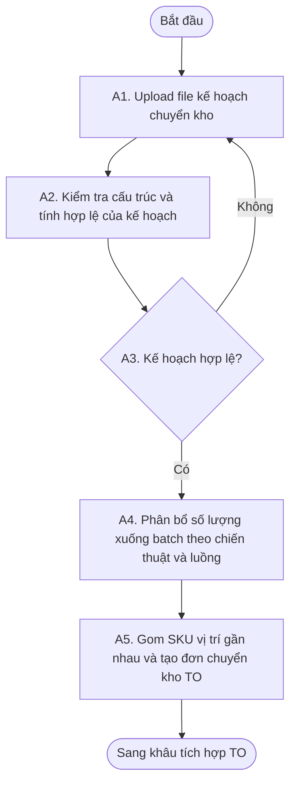
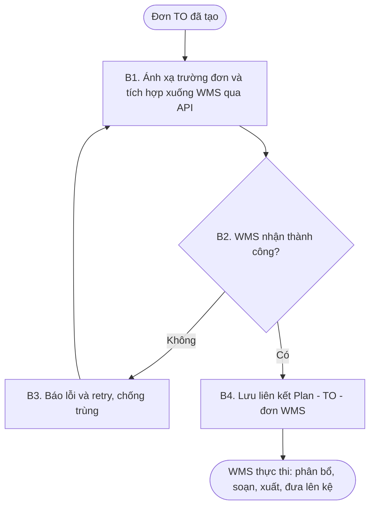
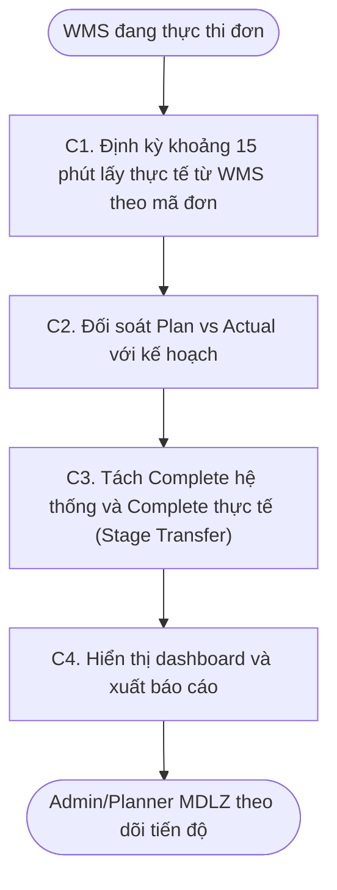
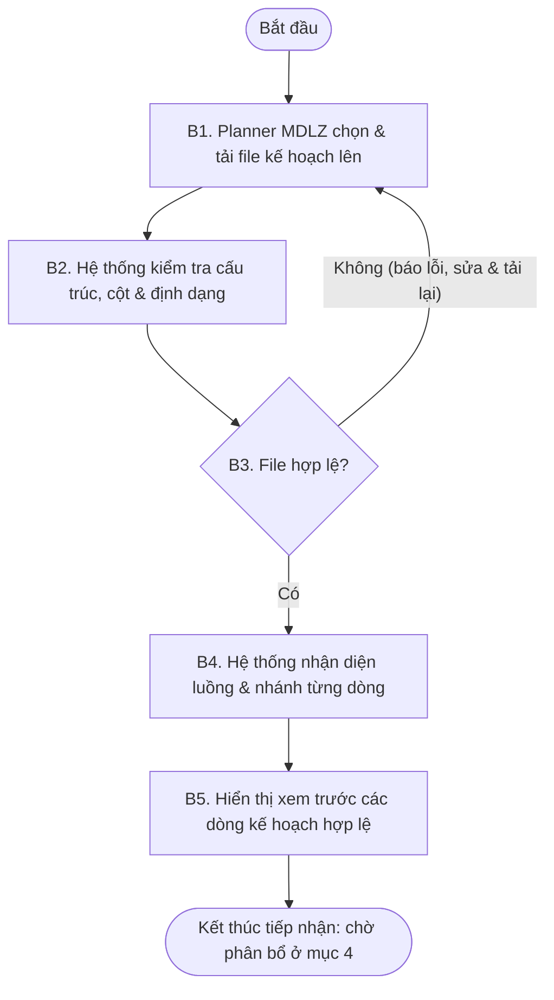
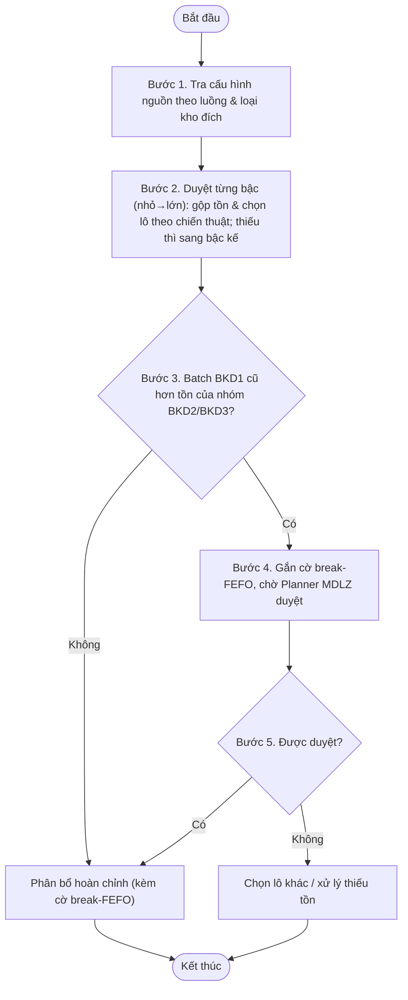
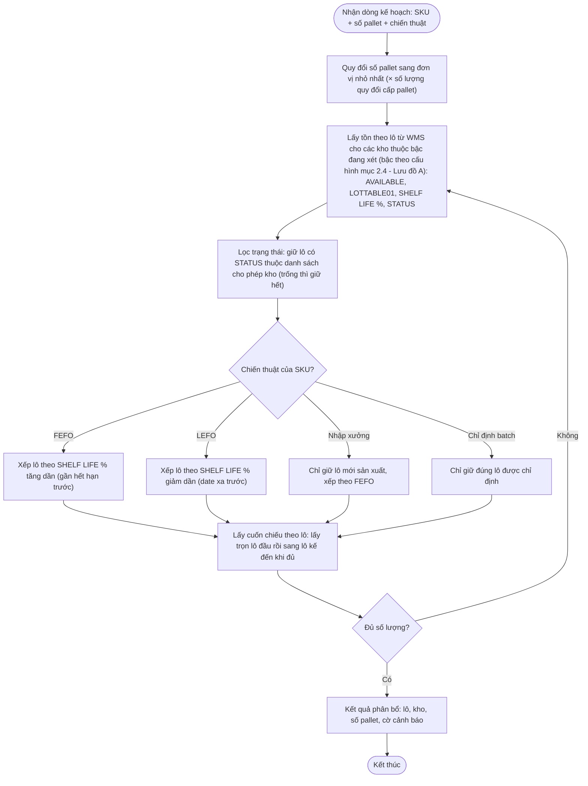
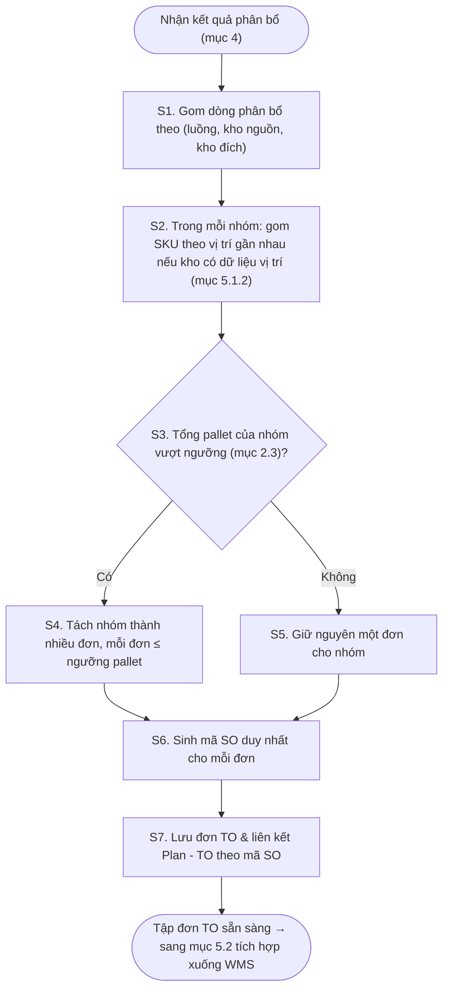
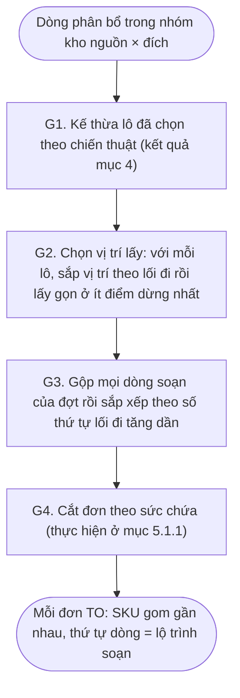
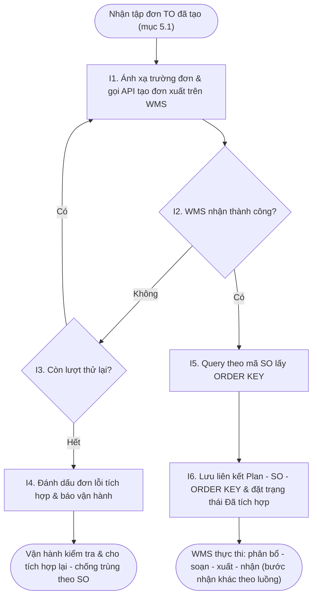
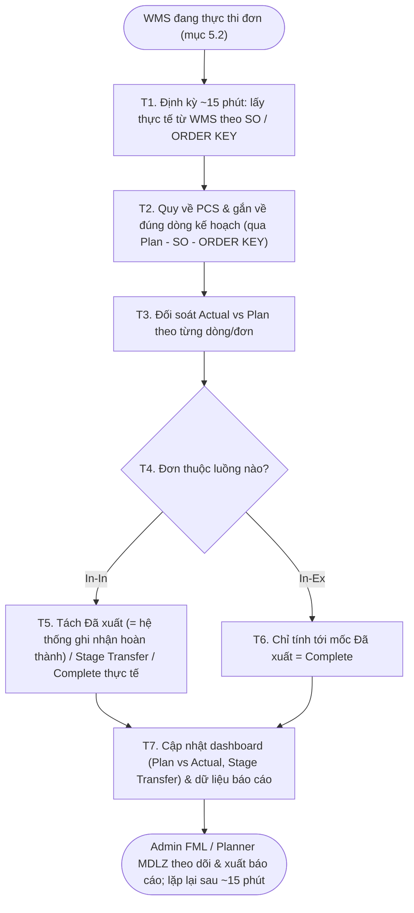

<!-- COVER
title: TÀI LIỆU THIẾT KẾ GIẢI PHÁP (TO-BE) | MODULE PHÂN BỔ LÔ HÀNG & THEO DÕI TIẾN ĐỘ CHUYỂN KHO
date: 25/06/2026
logo-left: logo-smartlog.png
logo-right: logo-mondelez.png
drop-title: true
-->

# Module Phân bổ lô hàng & Theo dõi tiến độ chuyển kho — TO-BE Blueprint

> **Khách hàng:** Mondelez (chủ hàng) · **Vận hành kho & WMS:** FML (3PL) · **Đơn vị triển khai:** Smartlog
> **Phiên bản:** 1.0 · **Ngày:** 28/06/2026
> **Nguồn nền:** Tài liệu yêu cầu nghiệp vụ (BRD) v0.8 + tài liệu hiện trạng (AS-IS).

## MỤC LỤC KẾ HOẠCH (tracking — xóa trước khi convert .docx)

| # | Mục / Nghiệp vụ | Khâu xử lý | Trạng thái |
|---|---|---|---|
| 0 | (Đầu trang) Trang ký · Quản lý thay đổi | - | ☑ Xong |
| 1 | Tổng quan giải pháp (mục tiêu & phạm vi · cấu trúc & lưu đồ tổng quan · lưu đồ từng nhóm chức năng) | A. Tổng quan | ☑ Xong |
| 2 | Thiết lập hệ thống & Master data (danh mục kho · master data SKU · cấu hình quy tắc · nguồn lấy hàng theo luồng) | B. Master data | ☑ Xong |
| 3 | Tiếp nhận kế hoạch (bảng tổng hợp · mục đích · mẫu file · tiếp nhận & kiểm tra) | C. Input | ☑ Xong |
| 4.1 | Phân bổ batch theo chiến thuật (FEFO/LEFO/Nhập xưởng/Chỉ định batch) **& nguồn lấy hàng theo luồng** (In-In / In-Ex BKD / In-Ex NKD, bậc lấy & cổng break-FEFO) — 6 khối | D. Logic | ☑ Xong |
| 5.1 | Tạo đơn chuyển kho (TO): 5.1.1 tạo & tách đơn (kho nguồn + ngưỡng pallet) · 5.1.2 gom SKU theo vị trí gần nhau (dùng trường `ORDER`) | E. Output (Integration) | ☑ Xong |
| 5.2 | Tích hợp đơn xuống WMS & đối soát kết quả | E. Output (Integration) | ☑ Xong |
| 5.3 | Theo dõi tiến độ chuyển kho (Dashboard Plan vs Actual): nền dữ liệu đồng bộ ~15' · bảng Plan vs Actual · Stage Transfer & thời gian lưu · báo cáo & xuất chia sẻ | E. Output (Tracking) | ☑ Xong |
| 6 | Ngoại lệ & cách xử lý (thiếu tồn · cổng duyệt hạn dùng · lỗi tích hợp) | F. Exception | ☑ Xong |
| 7 | Phân quyền hệ thống (ma trận CRUD + thao tác) | - | ☑ Xong |
| 8 | Câu hỏi còn mở | - | ☑ Xong |

---

## QUẢN LÝ THAY ĐỔI

| Ngày thay đổi | Mục, bảng, sơ đồ được thay đổi | Mô tả thay đổi | Phiên bản |
|---|---|---|---|
| 28/06/2026 | Toàn bộ | Tạo mới tài liệu | 1.0 |
| | | | |
| | | | |
| | | | |

<!-- PAGEBREAK -->

## TRANG KÝ SMARTLOG

| Vai trò | Tên | Chữ ký | Ngày | Ghi chú |
|---|---|---|---|---|
| Solution Owner | | | | |
| PM – Project Manager | | | | |
| PD – Project Director | | | | |

<!-- PAGEBREAK -->

## TRANG KÝ MONDELEZ VIỆT NAM

| Vai trò | Tên | Chữ ký | Ngày ký | Ghi chú |
|---|---|---|---|---|
| | | | | |
| | | | | |
| | | | | |

---

# 1. TỔNG QUAN GIẢI PHÁP

Mondelez giao FML vận hành chuyển kho trên **hai nhóm kho**:

- **Cụm kho BKD** — BKD1 là kho xuất bán chính, BKD2/BKD3 là kho chứa tồn.
- **Kho NKD** — kho đơn lẻ chứa hàng thành phẩm của nhà máy.

Hoạt động chuyển kho diễn ra theo **hai luồng**:

- **Chuyển nội bộ trong cụm BKD** (In-In): BKD2/BKD3 → BKD1.
- **Chuyển từ kho trong ra kho thuê ngoài** (In-Ex): từ BKD hoặc từ kho NKD ra các kho ngoài.

Hiện cả hai luồng đều trải qua **ba khâu rời rạc**:

- Planner MDLZ lập kế hoạch số lượng trên file Excel;
- Đội kho FML tra tồn, chọn lô thủ công rồi nhập đơn vào WMS;
- Tiến độ thực hiện được cập nhật qua trao đổi trực tiếp.

Sự rời rạc này làm tăng nguy cơ chọn sai lô, chậm cập nhật số liệu và khó kiểm soát toàn cảnh khi khối lượng chuyển kho lớn.

Tài liệu này trình bày **thiết kế giải pháp TO-BE** cho Module Phân bổ lô hàng & Theo dõi tiến độ chuyển kho — giải pháp kết nối ba khâu trên thành một chuỗi liên tục:

- **Phân bổ batch** theo chiến thuật (FEFO / LEFO / Nhập xưởng / Chỉ định batch) dựa trên tồn khả dụng và quy cách pallet; **tạo TO với các SKU có vị trí lưu kho gần nhau**;
- **Tích hợp đơn** chuyển kho xuống WMS tự động sau khi phân bổ để thực thi;
- **Theo dõi tiến độ** Plan vs Actual tự động cập nhật sau mỗi 15 phút, phân biệt hàng đã đưa lên kệ với hàng còn ở khu vực trung chuyển (Stage Transfer).

## 1.1. Mục tiêu & phạm vi giải pháp

**Mục tiêu giải pháp:** Module hướng tới các mục tiêu:

- **Chuẩn hóa khâu phân bổ lô** — thay thao tác chọn lô thủ công bằng phân bổ tự động theo chiến thuật (FEFO / LEFO / Nhập xưởng / Chỉ định batch), giảm nguy cơ chọn sai lô;
- **Tự động hóa tạo & tích hợp đơn** — sau khi phân bổ, hệ thống tự tạo đơn chuyển kho và tích hợp xuống WMS, không nhập tay lại;
- **Tối ưu tuyến đường pick** — gom các SKU gần nhau vào cùng đơn để rút ngắn quãng đường soạn hàng;
- **Theo dõi tiến độ gần thời gian thực** — đối soát Plan vs Actual tự động thay cho báo cáo trao đổi trực tiếp, giúp kiểm soát toàn cảnh khi khối lượng lớn;
- **Phản ánh đúng tiến độ thực tế** — tách bạch hàng đã đưa lên kệ với hàng còn ở khu vực trung chuyển (Stage Transfer) để số liệu không bị "ảo".

**Phạm vi:** Module áp dụng ba nhóm chức năng — Phân bổ batch và tạo TO với các SKU có vị trí lưu kho gần nhau · Tích hợp đơn TO xuống WMS · Theo dõi tiến độ chuyển kho — cho hoạt động chuyển kho do FML vận hành, gồm hai luồng:

- **Luồng In-In — chuyển nội bộ trong cụm BKD:** phân bổ batch từ tồn kho của BKD2/BKD3 để chuyển hàng **từ BKD2/BKD3 → đến BKD1** (kho xuất bán chính). Hệ thống xét chung lô của BKD2 và BKD3 (so hạn dùng trên cả hai, không ưu tiên kho nào) rồi chọn batch theo chiến thuật phân bổ.
- **Luồng In-Ex — chuyển từ kho trong ra kho thuê ngoài:** gồm **nhánh BKD** (phân bổ batch từ tồn BKD2/BKD3, dự phòng BKD1 để chuyển **đến kho ngoài**) và **nhánh kho NKD** (phân bổ batch từ tồn kho NKD đơn lẻ để chuyển **đến kho ngoài**).

Trên mỗi luồng, Module thực hiện trọn chuỗi: tiếp nhận kế hoạch số lượng theo SKU → phân bổ xuống batch/pallet theo chiến thuật (kèm duyệt break-FEFO khi cần) → tạo và tích hợp đơn chuyển kho xuống WMS → theo dõi tiến độ Plan vs Actual cho đến khi hàng lên kệ tại kho đích. _(Truy vết: BRD mục 3.2.)_

## 1.2. Cấu trúc giải pháp & Lưu đồ tổng quan end-to-end

**Mục đích:** Tổ chức ba khâu phân bổ – tích hợp – theo dõi thành **một chuỗi xử lý liền mạch** trên cùng một module, dữ liệu chảy thẳng từ kế hoạch đầu vào đến tiến độ đầu ra.

Module được tổ chức thành các khâu xử lý nối tiếp nhau, từ thiết lập nền cho đến theo dõi tiến độ:

| Khâu xử lý | Module trả lời câu hỏi gì | Mục tài liệu |
|---|---|---|
| **Thiết lập & Master data** | Khai báo kho, quy cách hàng, ngưỡng & quy tắc nền | mục 2 |
| **Tiếp nhận (Input)** | Nhận kế hoạch số lượng theo SKU từ đâu | mục 3 |
| **Xử lý (Logic)** | Phân bổ số lượng xuống lô/batch nào, lấy ở kho nào | mục 4 |
| **Tích hợp** | Tạo đơn chuyển kho & tích hợp xuống WMS thực thi | mục 5.1–5.2 |
| **Theo dõi (Output – tracking)** | Đối soát tiến độ thực tế vs kế hoạch | mục 5.3 |
| **Ngoại lệ** | Xử lý thiếu tồn, cổng duyệt hạn dùng, lỗi tích hợp | mục 6 |

Lưu đồ dưới mô tả dòng chảy end-to-end của module qua các vai trò, từ lúc Planner MDLZ tải kế hoạch lên đến lúc tiến độ chuyển kho được theo dõi trên dashboard:

**Lưu đồ tổng quan:**

```mermaid
%% src: tong-quan-end-to-end
flowchart TD
    Start([Bắt đầu]) --> B0[Bước 1. Thiết lập master data]
    B0 --> B1[Bước 2. Tải file kế hoạch lên & kiểm tra hợp lệ]
    B1 --> B2[Bước 3. Hệ thống phân bổ batch theo chiến thuật & luồng (duyệt break-FEFO khi cần)]
    B2 --> B4[Bước 4. Hệ thống tạo đơn chuyển kho & tích hợp xuống WMS]
    B4 --> B5[Bước 5. WMS thực thi: phân bổ - soạn - xuất - đưa lên kệ]
    B5 --> B6[Bước 6. Hệ thống lấy thực tế từ WMS & đối soát Plan vs Actual]
    B6 --> B7[Bước 7. Admin/Planner MDLZ theo dõi tiến độ trên dashboard]
    B7 --> End([Kết thúc])
```

**Diễn giải từng bước:**

**Bước 1 — Thiết lập master data.** Quản trị hệ thống khai báo nền trước khi vận hành: danh mục kho & cấu hình kho, master data SKU (đơn vị & quy đổi), quy tắc phân bổ & ngưỡng, nguồn lấy hàng theo luồng — làm cơ sở cho mọi khâu sau (mục **2. Thiết lập hệ thống & Master data**).

**Bước 2 — Tiếp nhận kế hoạch.** Planner MDLZ (bộ phận kế hoạch của Mondelez) tải file kế hoạch chuyển kho trực tiếp lên module; hệ thống kiểm tra cấu trúc file trước khi cho phân bổ (mục **3. Tiếp nhận kế hoạch**).

**Bước 3 — Phân bổ batch.** Hệ thống tự phân bổ số lượng mỗi SKU xuống lô/batch cụ thể theo chiến thuật đặt cho từng SKU và theo nguồn lấy hàng của luồng (mục **4. Xử lý phân bổ**).

**Bước 4 — Tạo & tích hợp đơn.** Hệ thống tạo đơn chuyển kho từ kết quả phân bổ và tích hợp xuống WMS qua kết nối tự động (API) để vận hành thực thi (mục **5.1–5.2**).

**Bước 5 — WMS thực thi.** Kho vận hành phân bổ – soạn – xuất – đưa hàng lên kệ trên WMS (nghiệp vụ lõi của WMS, Module không can thiệp).

**Bước 6 — Đối soát tiến độ.** Hệ thống định kỳ lấy dữ liệu thực thi từ WMS theo mã đơn dùng chung và đối soát tự động với kế hoạch (mục **5.3**).

**Bước 7 — Theo dõi.** Admin và Planner MDLZ theo dõi tiến độ Plan vs Actual gần thời gian thực trên dashboard thay cho báo cáo Zalo thủ công (mục **5.3**).

Ba mục dưới đi sâu vào **ba nhóm chức năng cốt lõi** của Module; mỗi mục gồm giải pháp, lưu đồ và mô tả từng bước.

### 1.2.1. Phân bổ batch & tạo đơn chuyển kho (TO)

**Giải pháp:** Planner MDLZ tải kế hoạch số lượng theo SKU lên module; hệ thống kiểm tra hợp lệ rồi tự phân bổ số lượng xuống batch/pallet cụ thể, lấy từ tồn khả dụng của kho nguồn theo chiến thuật đặt cho từng SKU (FEFO / LEFO / Nhập xưởng / Chỉ định batch) và theo nguồn lấy hàng của luồng. Sau đó hệ thống gom các SKU có vị trí lưu kho gần nhau thành đơn chuyển kho (TO) để tối ưu tuyến soạn hàng. Chi tiết ở mục **3** (tiếp nhận), mục **4** (phân bổ) và mục **5.1** (tạo đơn).

**Lưu đồ:**



**Diễn giải từng bước:**

**Bước 1 — Upload kế hoạch.** Planner MDLZ tải file Excel kế hoạch chuyển kho lên module.

**Bước 2 — Kiểm tra kế hoạch.** Hệ thống đối chiếu file với mẫu chuẩn: đủ cột bắt buộc, đúng kiểu dữ liệu, mã hàng/mã kho có trong master data, nguyên tắc phân bổ hợp lệ.

**Bước 3 — Kiểm tra hợp lệ.** Nếu kế hoạch không hợp lệ → hệ thống báo lỗi chi tiết, người dùng sửa & tải lại; nếu hợp lệ → sang bước phân bổ.

**Bước 4 — Phân bổ số lượng xuống batch theo chiến thuật và luồng.** Hệ thống quy đổi số lượng kế hoạch và chọn batch theo chiến thuật của từng SKU, lấy từ tồn của các kho nguồn theo luồng (In-In xét chung BKD2/BKD3; In-Ex theo nhánh BKD hoặc NKD).

**Bước 5 — Tạo TO.** Hệ thống gom các SKU có vị trí lưu kho gần nhau, tách theo kho nguồn và ngưỡng pallet, sinh đơn chuyển kho (TO) kèm mã đơn dùng chung.

### 1.2.2. Tích hợp đơn TO xuống WMS

**Giải pháp:** Sau khi đơn TO được tạo, hệ thống tự tích hợp đơn xuống WMS qua kết nối tự động (API) để vận hành thực thi, ánh xạ đúng các trường đơn, chống trùng và xử lý lỗi/retry, đồng thời lưu liên kết Plan ↔ TO ↔ đơn WMS để phục vụ đối soát ở khâu theo dõi (mục 1.2.3). Chi tiết ở mục **5.1–5.2**.

**Lưu đồ:**



**Diễn giải từng bước:**

**Bước 1 — Tích hợp đơn.** Hệ thống ánh xạ các trường của đơn TO sang định dạng WMS và tích hợp xuống qua API.

**Bước 2 — Kiểm tra kết quả.** Nếu WMS không nhận được/ lỗi → sang bước 3; nếu thành công → sang bước 4.

**Bước 3 — Báo lỗi & retry.** Hệ thống báo lỗi tích hợp, thử lại có kiểm soát và chống tạo trùng đơn.

**Bước 4 — Lưu liên kết.** Hệ thống lưu liên kết giữa kế hoạch, đơn TO và đơn WMS để theo dõi và đối soát.

**Bước 5 — WMS thực thi.** Kho vận hành phân bổ – soạn – xuất – đưa hàng lên kệ trên WMS (nghiệp vụ lõi của WMS, Module không can thiệp).

### 1.2.3. Theo dõi tiến độ chuyển kho

**Giải pháp:** Hệ thống định kỳ (~15 phút/lần) lấy dữ liệu thực thi từ WMS theo mã đơn dùng chung, đối soát tự động với kế hoạch, tách bạch hàng đã đưa lên kệ với hàng còn ở khu vực trung chuyển (Stage Transfer), rồi hiển thị tiến độ Plan vs Actual gần thời gian thực trên dashboard và báo cáo. Chi tiết ở mục **5.3**.

**Lưu đồ:**



**Diễn giải từng bước:**

**Bước 1 — Lấy thực tế.** Hệ thống định kỳ lấy dữ liệu thực thi từ WMS, đối chiếu theo mã đơn dùng chung.

**Bước 2 — Đối soát.** Hệ thống đối chiếu thực tế với kế hoạch để xác định trạng thái Complete/Pending và tỷ lệ hoàn thành.

**Bước 3 — Tách Stage Transfer.** Hàng đã xuất nhưng còn ở khu trung chuyển (Stage Transfer) được tách khỏi hàng đã lên kệ, tránh đếm trùng tồn.

**Bước 4 — Hiển thị & báo cáo.** Hệ thống hiển thị tiến độ trên dashboard và cho xuất báo cáo theo luồng/ngày kế hoạch.

# 2. THIẾT LẬP HỆ THỐNG & MASTER DATA

Mục này gồm **bốn nhóm thiết lập nền**, là đầu vào cho toàn bộ logic ở các mục sau:

| STT | Danh mục dữ liệu | Mô tả |
|---|---|---|
| 1 | **Danh mục kho & cấu hình kho** (mục 2.1) | Khai báo kho, cụm (nhóm xét chung khi làm nguồn), loại kho, trạng thái hàng được phép chuyển, và zone trung chuyển của kho đích. |
| 2 | **Master data SKU** (mục 2.2) | Danh mục mặt hàng kèm **đơn vị và hệ số quy đổi 3 cấp** (nhỏ nhất/hộp/pallet — thường PCS/CASE/PALLET); **do người dùng tải lên bằng Excel**, độc lập với WMS. |
| 3 | **Cấu hình quy tắc phân bổ & ngưỡng vận hành** (mục 2.3) | Tham số hóa ngưỡng tách đơn, cổng duyệt hạn dùng và phân vai theo bước. |
| 4 | **Cấu hình nguồn lấy hàng theo luồng** (mục 2.4) | Khai báo tường minh các kho lấy chung và thứ tự lấy hàng giữa các kho cho từng luồng. |

## 2.1. Danh mục kho & cấu hình kho áp dụng

**Mục đích:** Khai báo các kho tham gia chuyển kho cùng các thuộc tính cố định của từng kho: **cụm** (nhóm xét chung khi làm nguồn), **loại kho** (trong/ngoài), trạng thái hàng được phép lấy, và zone trung chuyển (với kho nhận). Đây là danh mục nền để các mục sau tham chiếu; còn **thứ tự lấy hàng giữa các cụm/kho theo từng luồng** được khai riêng ở mục **2.4. Cấu hình nguồn lấy hàng theo luồng**.

Bảng dưới tóm tắt thông tin nền của nghiệp vụ thiết lập danh mục kho:

| Hạng mục | Nội dung |
|---|---|
| Mục đích | Khai báo kho & thuộc tính cố định (vai trò, trạng thái lấy, zone trung chuyển) |
| Nhân sự chịu trách nhiệm | Quản lý hệ thống |
| Hệ thống thao tác | Module — màn hình *Danh mục kho* |
| Hệ thống tích hợp | WMS (mã kho khớp WMS; tồn theo kho lấy qua API khi phân bổ) |
| Tần suất | Thiết lập lần đầu; cập nhật khi thêm/bớt kho |
| Phương thức | Nhập tay trên màn hình cấu hình |

Mục này gồm **một danh mục kho gốc (mỗi kho một dòng)** và **hai bảng ánh xạ một-nhiều tách riêng** (trạng thái hàng được lấy, zone trung chuyển) — để bảng kho gốc giữ nguyên tắc *một kho một dòng*, không nhồi nhiều giá trị vào một ô.

**Bảng 1 — Danh mục kho (mỗi kho một dòng):**

| STT | Tên trường | Mô tả | Bắt buộc | Ví dụ |
|---|---|---|---|---|
| 1 | Mã kho | Mã định danh kho, khớp mã kho trên WMS | Có | BKD2 |
| 2 | Tên kho | Tên hiển thị | Có | Kho chứa tồn BKD2 |
| 3 | Cụm | **Nhóm 1+ kho được xét chung khi làm nguồn.** Nhiều kho cùng cụm ⇒ xét tồn chung; kho đứng riêng ⇒ cụm một thành viên (tên cụm = mã kho) | Có | BKD |
| 4 | Loại kho | *Kho trong* (kho nội bộ) hay *Kho ngoài* (kho thuê ngoài 3PL) — đây là **thuộc tính vật lý cố định**, không phải vai trò | Có | Kho trong |

Danh mục kho mặc định:

| Mã kho | Tên kho | Cụm | Loại kho |
|---|---|---|---|
| BKD1 | Kho xuất bán chính BKD1 | BKD | Kho trong |
| BKD2 | Kho chứa tồn BKD2 | BKD | Kho trong |
| BKD3 | Kho chứa tồn BKD3 | BKD | Kho trong |
| NKD | Kho thành phẩm NKD | NKD | Kho trong |
| BEE | Kho ngoài BEE | BEE | Kho ngoài |
| ICD | Kho ngoài ICD | ICD | Kho ngoài |
| GEMADEPT | Kho ngoài Gemadept | GEMADEPT | Kho ngoài |

> **Cụm = nhóm kho xét chung khi làm nguồn:** *Cụm BKD* gồm BKD1/BKD2/BKD3 (xét tồn chung); NKD và mỗi kho ngoài đứng riêng nên là cụm một thành viên (Cụm NKD = {NKD}, Cụm BEE = {BEE}…). Đây là giá trị mà cột *Cụm kho nguồn* ở mục **2.4** và ở file kế hoạch tham chiếu tới.
>
> **Vai trò *Nguồn/Đích* là theo LUỒNG, không cố định theo loại kho và không khai ở bảng này:** nguồn (cụm nào, thứ tự lấy) khai ở mục **2.4**; đích lấy từ cột *Kho đích* của kế hoạch. Một kho có thể đổi vai trò giữa các luồng — ví dụ kho ngoài (BEE/ICD…) là *đích* ở In-Ex nhưng sẽ là *nguồn* ở các luồng Ex-Ex / Ex-In (phạm vi mở rộng khi ghép bài toán điều chuyển tự động); khi đó chỉ cần thêm dòng vào mục 2.4, không sửa bảng kho này.

**Bảng 2 — Trạng thái hàng được lấy theo kho** (ánh xạ một-nhiều): mỗi cặp (kho × trạng thái) một dòng; một kho cho phép nhiều trạng thái thì khai nhiều dòng.

| Mã kho | Trạng thái được lấy (STATUS) |
|---|---|
| BKD1 | 0001_OK |
| BKD2 | 0012_OK |
| BKD3 | 0017_OK [cần xác nhận tiền tố] |
| NKD | [cần xác nhận] |

> **Mặc định khi không khai:** nếu một kho **không có dòng nào** trong bảng này, hệ thống lấy **tất cả trạng thái** của kho đó (không lọc). Bảng này là **danh sách cho phép, mang tính tùy chọn** — chỉ khi muốn giới hạn thì mới khai các trạng thái được lấy; khi đã khai, chỉ những trạng thái đó mới được phân bổ.
>
> `STATUS` trên WMS mã hóa **tiền tố kho + tình trạng** (`0001_OK` = BKD1 hàng OK; `0012_OK` = BKD2). **Khuyến nghị** khai danh sách cho phép chỉ gồm trạng thái OK (`{tiền tố kho}_OK`) để tự động loại các trạng thái không đủ điều kiện như `…_BLOCKED` (khóa), `…_EXPIRED` (hết hạn), `HOLD_FM`, `GTDC`, `TEST_FM` — vì nếu để trống thì các trạng thái này cũng bị lấy. Kho ngoài không cần khai (không lấy hàng). Danh sách đầy đủ do FML/Mondelez xác nhận.

**Bảng 3 — Zone trung chuyển theo kho** (ánh xạ một-nhiều): khai cho kho nhận nội bộ, để tách hàng "chưa lên kệ" (đang ở zone trung chuyển) khỏi "đã lên kệ" khi theo dõi tiến độ; một kho có nhiều zone trung chuyển thì khai nhiều dòng.

| Mã kho | Zone trung chuyển (PUTAWAYZONE) |
|---|---|
| BKD1 | STAGE |

> Theo dữ liệu khảo sát, zone trung chuyển của BKD1 là **`STAGE`**; cần FML xác nhận BKD1 còn zone trung chuyển nào khác không. Dùng ở mục **5.3** (theo dõi tiến độ — phần Stage Transfer). _(Truy vết: BR-031, BR-008, BR-013, BR-023, BRULE-01/03/04; OQ-09.)_

_[[MH-2.1: Màn hình Danh mục kho & cấu hình theo kho]]_
_[Chèn ảnh: màn hình danh mục kho (mã, tên, cụm, loại) + tab/bảng ánh xạ trạng thái lấy theo kho + zone trung chuyển theo kho]_

## 2.2. Master data SKU (đơn vị & quy đổi)

**Mục đích:** Kế hoạch chuyển kho và tồn kho được thể hiện theo nhiều đơn vị — kế hoạch theo **pallet/case**, còn tồn khả dụng WMS trả về theo **đơn vị nhỏ nhất (PCS)**. Mỗi mặt hàng cần một bộ **hệ số quy đổi đơn vị** chuẩn để hệ thống quy đổi nhất quán (PCS ↔ CASE ↔ PALLET) khi phân bổ và khi hiển thị tiến độ, chuẩn hóa thành master data dùng chung.

Master data SKU **do người dùng tải lên bằng file Excel, độc lập với WMS** — Module không đồng bộ danh mục SKU từ WMS. Riêng **tồn theo lô và % hạn dùng còn lại** thì Module lấy trực tiếp từ WMS qua API tại thời điểm phân bổ (xem mục **4. Xử lý phân bổ**), không lưu ở master data.

Bảng dưới tóm tắt thông tin nền của nghiệp vụ master data SKU:

| Hạng mục | Nội dung |
|---|---|
| Mục đích | Cung cấp đơn vị & hệ số quy đổi (PCS/CASE/PALLET) để quy đổi số lượng nhất quán |
| Nhân sự chịu trách nhiệm | Quản lý hệ thống |
| Hệ thống thao tác | Module — màn hình *Master data SKU* |
| Hệ thống tích hợp | Không (tải lên Excel độc lập; tồn & hạn dùng lấy từ WMS khi phân bổ) |
| Tần suất | Khi có SKU mới hoặc thay đổi quy cách/đơn vị |
| Phương thức | Tải lên file Excel theo mẫu; cho phép tra cứu & chỉnh trên màn hình |

Bảng dưới mô tả các trường của master data SKU:

| STT | Tên trường | Mô tả | Bắt buộc | Ví dụ |
|---|---|---|---|---|
| 1 | Mã hàng | Mã định danh mặt hàng — **phải khớp mã SKU trên WMS** để quy chiếu tồn | Có | 4299263 |
| 2 | Tên hàng | Mô tả mặt hàng | Có | KD Snack Cua Xanh 29Gx60 gói |
| 3 | Đơn vị nhỏ nhất | Đơn vị gốc WMS trả tồn về (thường là PCS) | Có | PCS |
| 4 | Đơn vị cấp hộp | Đơn vị trung gian (thường là CASE) | Không | CASE |
| 5 | Số lượng quy đổi cấp hộp | Số **đơn vị nhỏ nhất** quy đổi cho một đơn vị cấp hộp (vd 1 CASE = ? PCS) | Không | 60 |
| 6 | Đơn vị cấp pallet | Đơn vị lớn nhất (thường là PALLET) | Không | PALLET |
| 7 | Số lượng quy đổi cấp pallet | Số **đơn vị nhỏ nhất** quy đổi cho một đơn vị cấp pallet (vd 1 PALLET = ? PCS) | Không | 540 |

> **Quy ước hệ số quy đổi:** mỗi *Số lượng quy đổi* là **số đơn vị nhỏ nhất quy đổi cho một đơn vị cấp đó**. Ví dụ SKU 4299263: 1 CASE = 60 PCS → quy đổi cấp hộp = 60; 1 PALLET = 540 PCS → quy đổi cấp pallet = 540.
>
> **Cách dùng:** file kế hoạch chỉ nhập **số pallet** (mục **3.3**), không nhập hệ số. Module dùng *Số lượng quy đổi cấp pallet* để **nở số pallet kế hoạch thành đơn vị nhỏ nhất**: số lượng (đơn vị nhỏ nhất) = số pallet × *quy đổi cấp pallet*; rồi lưu & xử lý ở phía hệ thống bằng đơn vị nhỏ nhất, khi hiển thị thì quy ngược về pallet. Nhờ đó kế hoạch (pallet) đối soát được với thực thi trên WMS (vốn theo đơn vị nhỏ nhất). _(Truy vết: BR-007, BR-008, BRULE-03/11.)_
>
> **Trạng thái hàng không nằm ở master SKU:** trạng thái (`STATUS`) là thuộc tính của từng dòng tồn trên WMS, không cố định theo SKU; việc lọc trạng thái nào được chuyển kho cấu hình theo từng kho ở mục **2.1. Danh mục kho**.

_[[MH-2.2: Màn hình Master data SKU (đơn vị & quy đổi)]]_
_[Chèn ảnh: màn hình danh sách SKU với đơn vị nhỏ nhất, đơn vị cấp hộp + số lượng quy đổi cấp hộp, đơn vị cấp pallet + số lượng quy đổi cấp pallet; nút tải lên Excel]_

## 2.3. Cấu hình quy tắc phân bổ & ngưỡng vận hành

**Mục đích:** Tham số hóa các ngưỡng và quy tắc vận hành (ngưỡng tách đơn, cơ chế kiểm soát hạn dùng, bước duyệt) để người quản trị tự điều chỉnh khi chính sách kho thay đổi mà không cần can thiệp kỹ thuật. *(Việc gán vai trò thực hiện từng bước thuộc mục **7. Phân quyền hệ thống**.)*

Bảng dưới tóm tắt thông tin nền của nghiệp vụ cấu hình quy tắc:

| Hạng mục | Nội dung |
|---|---|
| Mục đích | Tham số hóa ngưỡng & cổng duyệt để đổi chính sách không phải sửa hệ thống |
| Nhân sự chịu trách nhiệm | Quản lý hệ thống |
| Hệ thống thao tác | Module — màn hình *Cấu hình quy tắc phân bổ & ngưỡng vận hành* |
| Hệ thống tích hợp | Không (tham số nội bộ module) |
| Tần suất | Thiết lập lần đầu; cập nhật khi chính sách hoặc cách phân công thay đổi |
| Phương thức | Nhập tay trên màn hình cấu hình |

Bảng dưới liệt kê các tham số cấu hình và giá trị mặc định đề xuất theo hiện trạng vận hành:

| Tham số | Ý nghĩa | Giá trị mặc định |
|---|---|---|
| Ngưỡng pallet tối đa mỗi đơn | Số pallet tối đa của một đơn chuyển kho; vượt ngưỡng thì hệ thống tự tách đơn | 100 pallet |
| Cổng duyệt kiểm soát hạn dùng (In-Ex BKD) | Bật/tắt yêu cầu xác nhận khi lấy hàng BKD1 có hạn dùng thấp hơn tồn BKD2 + BKD3 | Bật |

> **Về các bước duyệt:** các cổng duyệt ở trên **bật/tắt được qua cấu hình** — khi MDLZ/FML muốn bỏ một bước (ví dụ bỏ duyệt hạn dùng) thì chỉ chỉnh ở màn hình này, không phải sửa hệ thống. Việc **gán vai trò thực hiện từng bước** (ai tải kế hoạch, ai duyệt hạn dùng…) khai ở mục **7. Phân quyền hệ thống**.
>
> Các ngưỡng trên là **ràng buộc vận hành thực tế** do Mondelez/kho áp đặt (ví dụ ngưỡng 100 pallet bắt nguồn từ việc tồn chỉ lên SAP khi đơn hoàn thành 100%). Chi tiết logic áp dụng từng tham số nằm ở các nghiệp vụ tương ứng (mục **4.1**, **5.1**, **5.3**). _(Truy vết: BR-031, BR-009, BR-015, BR-029, BR-025; BRULE-02.)_

_[[MH-2.3: Màn hình Cấu hình quy tắc phân bổ & ngưỡng vận hành]]_
_[Chèn ảnh: màn hình tham số với ngưỡng pallet, công tắc cổng duyệt]_

## 2.4. Cấu hình nguồn lấy hàng theo luồng

**Mục đích:** Khai báo tường minh quy tắc lấy hàng — kho nào lấy trước, kho nào gộp chung — thành một bảng cấu hình để hệ thống tự chọn đúng nguồn lấy hàng cho từng luồng; muốn đổi quy tắc (thêm kho, đổi thứ tự dự phòng) thì chỉ sửa ở bảng này, không phải sửa phần mềm.

Quy tắc nguồn lấy hàng mặc định cho từng luồng:

- **Luồng In-In — chuyển nội bộ về BKD1:** lấy hàng ở **BKD2 và BKD3**, xét chung lô của cả hai kho rồi chọn theo chiến thuật, không lấy cạn một kho trước rồi mới sang kho kia. BKD1 là kho nhận nên không lấy làm nguồn.
- **Luồng In-Ex từ cụm BKD — chuyển ra kho ngoài:** ưu tiên lấy ở **BKD2 và BKD3** (xét chung); chỉ khi hai kho này không đủ số pallet mới lấy thêm ở **BKD1**. Khi phải chạm tới BKD1, hệ thống bật bước duyệt kiểm soát hạn dùng (mục **4.1**).
- **Luồng In-Ex từ kho NKD — chuyển ra kho ngoài:** chỉ lấy ở **NKD** — kho đơn lẻ, không có kho lấy chung.

Toàn bộ quy tắc trên được khai bằng bảng cấu hình bên dưới (mỗi dòng là một mức ưu tiên của một luồng).

Bảng dưới tóm tắt thông tin nền của nghiệp vụ cấu hình nguồn lấy hàng:

| Hạng mục | Nội dung |
|---|---|
| Mục đích | Khai báo tường minh các kho lấy chung & thứ tự lấy hàng theo từng luồng |
| Nhân sự chịu trách nhiệm | Quản lý hệ thống |
| Hệ thống thao tác | Module — màn hình *Cấu hình nguồn lấy hàng theo luồng* |
| Hệ thống tích hợp | Không (tham số nội bộ; tham chiếu mã kho ở mục 2.1) |
| Tần suất | Thiết lập lần đầu; cập nhật khi đổi quy tắc nguồn |
| Phương thức | Nhập tay trên màn hình cấu hình |

Mỗi dòng khai báo một mức ưu tiên lấy hàng cho một tổ hợp (luồng × cụm kho nguồn):

| STT | Tên trường | Mô tả | Ví dụ |
|---|---|---|---|
| 1 | Luồng | In-In hoặc In-Ex | In-Ex |
| 2 | Cụm kho nguồn (theo kế hoạch) | Giá trị cột *Cụm kho nguồn* trong file kế hoạch mà dòng này áp dụng | BKD |
| 3 | Thứ tự ưu tiên | Thứ tự lấy (số nhỏ lấy trước); một (luồng × cụm kho nguồn) có thể có nhiều mức | 1 |
| 4 | Các kho lấy ở mức này | Danh sách kho lấy ở mức ưu tiên này — nếu khai nhiều kho thì **hệ thống gộp chung lô của các kho đó** (so hạn dùng trên cả nhóm, không lấy cạn kho nào trước) rồi chọn theo chiến thuật | BKD2, BKD3 |

Cấu hình mặc định đề xuất theo hiện trạng vận hành:

| Luồng | Cụm kho nguồn (kế hoạch) | Thứ tự ưu tiên | Các kho lấy ở mức này |
|---|---|---|---|
| **In-In** | BKD | 1 | BKD2, BKD3 (gộp chung) |
| **In-Ex** | BKD | 1 | BKD2, BKD3 (gộp chung) |
| **In-Ex** | BKD | 2 (dự phòng) | BKD1 |
| **In-Ex** | NKD | 1 | NKD |

> **Kho đích bị loại khỏi nguồn dù cùng cụm:** kho đích của mỗi dòng lấy từ **cột *Kho đích* trong file kế hoạch** (mục **3.3**) — với In-In luôn là **BKD1**. Vì một kho không thể vừa là nguồn vừa là đích trong cùng một dòng, nên cụm nguồn của In-In là BKD nhưng **BKD1 không được lấy làm nguồn** (chỉ BKD2/BKD3). Đây là lý do dòng In-In ở bảng trên chỉ liệt kê BKD2/BKD3, còn In-Ex (đích là kho ngoài) mới dùng BKD1 ở mức dự phòng. Cụm là *phạm vi kho có thể xét*; mỗi luồng khai đúng kho của cụm được làm nguồn (đã loại sẵn kho đích).

> **"Cụm kho nguồn" trỏ tới một *Cụm* (đã khai ở mục 2.1):** các giá trị cột *Cụm kho nguồn* (**BKD**, **NKD**) là **Cụm** định nghĩa ở mục **2.1. Danh mục kho** (Cụm BKD = BKD1/BKD2/BKD3; Cụm NKD = {NKD}). Đây cũng là **tập giá trị hợp lệ** cho cột *Cụm kho nguồn* trong file kế hoạch (mục **3.3**). Bảng 2.4 này **không định nghĩa lại thành viên cụm** — nó chỉ khai **trong từng luồng, cụm đó lấy theo thứ tự ưu tiên nào** (ví dụ In-In không dùng BKD1 làm nguồn; In-Ex dùng BKD1 ở mức dự phòng).

> **Cách hệ thống dùng cấu hình này (chi tiết ở mục 4.1):** với một dòng kế hoạch, hệ thống lấy đúng các mức ưu tiên theo (luồng × cụm kho nguồn) rồi xét lần lượt từ mức 1 trở đi. Ở mỗi mức, hệ thống gộp chung lô của tất cả kho trong mức, xếp theo chiến thuật (FEFO/LEFO/…) rồi chọn từ trên xuống; lấy hết mức đó mà chưa đủ pallet thì mới sang mức kế. Ví dụ In-Ex từ BKD: lấy hết BKD2 + BKD3 trước, thiếu mới chạm BKD1 — và khi chạm BKD1, hệ thống kích hoạt **cổng duyệt kiểm soát hạn dùng (break-FEFO)** ở mục **4.1**. _(Truy vết: BR-004, BR-005, BR-029, BR-030, BRULE-01/04.)_
>
> **Vì sao tách khỏi bảng kho (mục 2.1):** mục 2.1 khai *thuộc tính cố định của từng kho*; mục 2.4 khai *quan hệ nguồn–thứ tự giữa các kho theo luồng*. Tách hai việc để mỗi quy tắc chỉ có một nơi định nghĩa, dễ bảo trì.

_[[MH-2.4: Màn hình Cấu hình nguồn lấy hàng theo luồng]]_
_[Chèn ảnh: bảng cấu hình theo luồng × cụm kho nguồn, mỗi mức ưu tiên với các kho lấy ở mức đó]_

# 3. TIẾP NHẬN KẾ HOẠCH (INPUT)

Khâu đầu của chuỗi xử lý: đưa kế hoạch chuyển kho của Planner MDLZ vào module một cách có kiểm soát, làm đầu vào sạch cho khâu phân bổ ở mục **4. Xử lý phân bổ**.

## 3.1. Bảng tổng hợp

Bảng dưới tóm tắt thông tin nền của nghiệp vụ tiếp nhận kế hoạch:

| Hạng mục | Nội dung |
|---|---|
| Mục đích | Đưa kế hoạch chuyển kho vào module và kiểm tra hợp lệ trước khi phân bổ |
| Nhân sự chịu trách nhiệm | Planner MDLZ — bộ phận kế hoạch của Mondelez (tải file & xử lý lỗi cấu trúc) |
| Hệ thống thao tác | Module — màn hình *Tải lên kế hoạch* |
| Hệ thống tích hợp | Không (đầu vào là file Excel; sau này thay bằng đầu ra hệ thống DRP) |
| Tần suất | Hằng ngày — kế hoạch gửi 1 lần/ngày trước ~18h ngày D; kho hoàn thành chuyển kho trước ~18h ngày D+1 |
| Phương thức | Tải lên file Excel theo mẫu cố định (mục **3.3**) |

## 3.2. Mục đích

Đầu vào của module hiện là **file Excel kế hoạch do Planner MDLZ tải lên** (hệ thống DRP tự động tính lượng điều chuyển chưa triển khai).

Nghiệp vụ này chuẩn hóa khâu tiếp nhận: Planner MDLZ tải file kế hoạch lên thẳng module qua một cửa duy nhất, hệ thống **tự kiểm tra cấu trúc** và **chỉ cho phân bổ khi dữ liệu hợp lệ**, tránh lỗi lan xuống các bước sau. Cấu trúc cột chuẩn (mục **3.3**) giúp hệ thống đọc đúng và để khi DRP sẵn sàng thì chỉ cần thay nguồn đầu vào mà không phải sửa lõi phân bổ.

## 3.3. Mẫu file kế hoạch (cấu trúc cột)

Cấu trúc cột của file kế hoạch (mở rộng từ mẫu Planner MDLZ đang gửi, bổ sung cột chiến thuật và thông tin luồng):

| STT | Tên cột | Mô tả | Bắt buộc | Ví dụ |
|---|---|---|---|---|
| 1 | Luồng chuyển kho | In-In hoặc In-Ex (xác định cơ chế nguồn lấy hàng) | Có | In-In |
| 2 | Cụm kho nguồn | Cụm lấy hàng — giá trị Cụm khai ở mục 2.1 (BKD với luồng nội bộ; BKD hoặc NKD với luồng xuất ngoài) | Có | BKD |
| 3 | Kho đích | Kho nhận hàng (mã kho khai ở mục 2.1) | Có | BKD1 |
| 4 | Mã hàng (SKU) | Mặt hàng cần chuyển — phải có trong master data SKU (mục 2.2) | Có | 4299263 |
| 5 | Số lượng pallet | Số pallet kế hoạch cần chuyển | Có | 16 |
| 6 | Nguyên tắc phân bổ | Chiến thuật áp cho SKU này: FEFO / LEFO / Nhập xưởng / Chỉ định batch | Có | LEFO |
| 7 | Batch chỉ định | Lô cần lấy — chỉ điền khi Nguyên tắc = Chỉ định batch | Không (có điều kiện) | L2026-03-15 |

> File kế hoạch chỉ nhập **số pallet theo từng SKU, chưa có batch** — đúng vai trò bàn giao: Module nhận số pallet rồi tự phân bổ xuống batch. Số lượng nhập **chỉ theo pallet** (không có cột PCS/CASE); Module dùng hệ số quy đổi trong master data SKU (mục **2.2**) để nở pallet thành đơn vị nhỏ nhất khi xử lý. Cột *Nguyên tắc phân bổ* đặt **theo từng SKU** (không cấu hình chung một chiến thuật cho cả file). _(Truy vết: BR-001, BR-006; AS-01, NFR-08.)_

_[[MH-3.1: Màn hình cấu hình mẫu file kế hoạch (định nghĩa cột)]]_
_[Chèn ảnh: danh sách cột template với kiểu dữ liệu, bắt buộc/không, mô tả; tải mẫu file mẫu]_

## 3.4. Tiếp nhận & kiểm tra hợp lệ

Hệ thống cung cấp các tính năng ở khâu tiếp nhận:

| STT | Tên tính năng | Mô tả |
|---|---|---|
| 1 | Tải lên file kế hoạch | Cho phép Planner MDLZ tải file Excel kế hoạch theo mẫu cố định |
| 2 | Kiểm tra cấu trúc & định dạng | Đối chiếu file với mẫu chuẩn: đủ cột bắt buộc, số pallet là số nguyên dương, **mã hàng có trong master data SKU** (để quy đổi), mã kho có trong danh mục kho, nguyên tắc phân bổ hợp lệ |
| 3 | Nhận diện luồng & nhánh | Tự xác định mỗi dòng thuộc luồng In-In hay In-Ex, và trong In-Ex là nhánh BKD hay nhánh kho NKD |
| 4 | Xem trước & báo lỗi | Hiển thị các dòng kế hoạch đã đọc; liệt kê rõ dòng/cột lỗi để Planner MDLZ sửa và tải lại |

**Lưu đồ quy trình tiếp nhận:**



**Diễn giải từng bước** (đầu ra là tập dòng kế hoạch hợp lệ, đã gắn luồng/nhánh, sẵn sàng cho mục **4. Xử lý phân bổ**):

**Bước 1 — Tải lên file kế hoạch.** Planner MDLZ chọn file Excel kế hoạch và tải lên màn hình tiếp nhận.

**Bước 2 — Kiểm tra cấu trúc & định dạng.** Hệ thống đối chiếu file với mẫu chuẩn (mục **3.3**): đủ cột bắt buộc; số pallet là số nguyên dương; mã hàng có trong master data SKU (mục **2.2** — để có hệ số quy đổi); mã kho (nguồn/đích) có trong danh mục kho (mục **2.1**); cột *Nguyên tắc phân bổ* nhận giá trị hợp lệ (nếu Chỉ định batch thì cột Batch không được trống).

**Bước 3 — Kiểm tra hợp lệ.** Nếu **hợp lệ** → sang Bước 4. Nếu **không hợp lệ** → hệ thống liệt kê chi tiết từng dòng/cột lỗi (ví dụ: thiếu cột *Nguyên tắc phân bổ*, mã hàng không có trong master data SKU, số pallet không phải số nguyên dương, dòng *Chỉ định batch* nhưng bỏ trống cột Batch) và **chặn phân bổ**; Planner MDLZ sửa file rồi **quay về Bước 1** để tải lại.

**Bước 4 — Nhận diện luồng & nhánh.** Hệ thống xác định từng dòng thuộc **In-In** hay **In-Ex**, và trong In-Ex là **nhánh BKD** hay **nhánh kho NKD** (căn cứ cột *Luồng* và *Cụm kho nguồn*) để áp đúng cơ chế nguồn lấy hàng ở mục **4.1**.

**Bước 5 — Xem trước.** Hệ thống **hiển thị xem trước** toàn bộ dòng kế hoạch hợp lệ kèm luồng/nhánh để Planner MDLZ soát lại file đã đọc đúng chưa. Khâu tiếp nhận **chỉ dừng ở xem trước**; việc chạy phân bổ là thao tác riêng do Planner MDLZ thực hiện ở mục **4. Xử lý phân bổ**.

_[[MH-3.2: Màn hình tải lên & xem trước file kế hoạch]]_
_[Chèn ảnh: vùng tải file, bảng xem trước các dòng kế hoạch, danh sách lỗi cấu trúc tô đỏ]_

# 4. XỬ LÝ PHÂN BỔ LÔ/BATCH (LOGIC)

## 4.1. Phân bổ batch theo chiến thuật & nguồn lấy hàng theo luồng

Đây là nghiệp vụ lõi của khâu xử lý, trả lời trọn **hai câu hỏi** của việc phân bổ: *"lấy hàng ở kho nào, theo thứ tự nào"* và *"chọn lô nào trong các kho đó"*. Với mỗi dòng kế hoạch, hệ thống **dựng nguồn lấy hàng theo cấu hình của từng luồng** (mục **2.4**) và duyệt lần lượt **qua từng bậc kho** cho đến khi đủ số pallet; trong mỗi bậc, hệ thống **chọn lô (batch) cụ thể theo đúng chiến thuật** mà Planner MDLZ đặt cho từng mã hàng (FEFO / LEFO / Nhập xưởng / Chỉ định batch). Khi phải chạm kho xuất bán **BKD1** ở bậc dự phòng, hệ thống thêm **cổng duyệt kiểm soát hạn dùng (break-FEFO)**.

Nhờ cấu hình nguồn lấy hàng theo luồng (mục **2.4**), khách hàng tự **chỉ định mỗi đơn (TO) được lấy ở kho nào** và **theo thứ tự bậc nào** mà không cần can thiệp kỹ thuật. Ba kịch bản nguồn theo luồng (theo cấu hình mặc định ở mục **2.4**):

- **In-In (về BKD1):** một bậc duy nhất — xét chung **BKD2 + BKD3**; BKD1 là đích nên bị loại khỏi nguồn, không có bậc dự phòng.
- **In-Ex nhánh BKD (ra kho ngoài):** bậc 1 xét chung **BKD2 + BKD3**; thiếu mới sang **bậc dự phòng BKD1** — nếu lô BKD1 lấy về **cũ hơn nhóm BKD2/BKD3** thì kích **cổng duyệt kiểm soát hạn dùng (break-FEFO)**.
- **In-Ex nhánh NKD (ra kho ngoài):** một bậc duy nhất — **kho NKD** đơn lẻ; không có bậc dự phòng.

### 4.1.1. Bảng tổng hợp

| Hạng mục | Nội dung |
|---|---|
| Mục đích | Dựng nguồn lấy hàng theo luồng & duyệt theo bậc, đồng thời chọn lô cụ thể theo chiến thuật của từng SKU; kiểm soát khi buộc phải chạm kho xuất bán BKD1 |
| Nhân sự chịu trách nhiệm | Hệ thống tự dựng nguồn & phân bổ; Planner MDLZ đặt chiến thuật cho từng SKU trong file kế hoạch và duyệt cổng hạn dùng khi lô BKD1 cũ hơn nhóm BKD2/BKD3 (vai trò ở mục 7) |
| Hệ thống thao tác | Module — chức năng *Phân bổ batch* |
| Hệ thống tích hợp | WMS (lấy tồn theo lô của các kho trong bậc qua API: `AVAILABLE`, `LOTTABLE01`, `SHELF LIFE (%)`, `STATUS`) |
| Tần suất | Mỗi lần phân bổ một kế hoạch (hằng ngày) |
| Đầu vào | Dòng kế hoạch hợp lệ đã gắn luồng/nhánh (SKU, số pallet, chiến thuật) + cấu hình nguồn lấy hàng theo luồng (mục 2.4) + tồn theo lô của các kho nguồn từ WMS |
| Đầu ra | Danh sách phân bổ hoàn chỉnh (gộp các bậc): mỗi dòng kế hoạch → một/nhiều dòng (lô, kho, bậc lấy, số pallet), kèm cờ break-FEFO |

### 4.1.2. Mục đích

Phân bổ batch là khâu hệ thống quyết định *"lấy hàng ở kho nào"* và *"xuất lô nào"* cho mỗi dòng kế hoạch: hệ thống **tự dựng nguồn lấy hàng theo luồng** (mục **2.4**) rồi **tự chọn lô hàng phù hợp cho từng SKU theo chiến thuật phân bổ đã đặt** (FEFO / LEFO / Nhập xưởng / Chỉ định batch), dựa trên tồn khả dụng và % hạn dùng lấy trực tiếp từ WMS tại thời điểm chạy. Nghiệp vụ hướng tới năm giá trị:

- **Nhất quán & khách quan** — cùng một bức tranh tồn kho luôn cho ra cùng một phương án phân bổ, không lệ thuộc người chạy.
- **Tuân thủ nguyên tắc xuất hàng** — bám đúng chiến thuật của từng SKU (ví dụ FEFO ưu tiên lô gần hết hạn trước), hạn chế rủi ro hàng cận hạn bị tồn đọng.
- **Kiểm soát nguồn lấy hàng** — lấy đúng kho theo luồng và thứ tự bậc đã cấu hình (mục **2.4**); chỉ chạm kho xuất bán BKD1 khi thật sự thiếu và phải qua **cổng duyệt kiểm soát hạn dùng (break-FEFO)**, tránh đụng hàng đang để bán hoặc phá nguyên tắc xuất hàng mà không ai duyệt.
- **Minh bạch & truy vết** — mỗi lô được chọn đều kèm lý do (theo chiến thuật nào, lấy ở kho/bậc nguồn nào), thuận tiện rà soát và đối chiếu.
- **Giải phóng nguồn lực** — nhân viên kho không phải tải tồn, lọc và dò chọn lô thủ công cho từng kế hoạch.

### 4.1.3. Danh sách tính năng

Danh sách tính năng chia làm hai nhóm: **(A) dựng nguồn lấy hàng theo luồng & duyệt theo bậc** — trả lời *"lấy ở kho nào, theo thứ tự nào"*; và **(B) chọn lô trong một bậc theo chiến thuật** — trả lời *"chọn lô nào"*.

| STT | Nhóm | Tên tính năng | Mô tả |
|---|---|---|---|
| 1 | A. Nguồn theo luồng | Tra cấu hình nguồn theo luồng | Lấy danh sách bậc & các kho mỗi bậc theo (luồng × cụm kho nguồn) từ cấu hình mục **2.4** — đây là nơi khách hàng tự khai mỗi đơn lấy ở kho nào, theo thứ tự bậc nào |
| 2 | A. Nguồn theo luồng | Loại kho đích khỏi nguồn | Bỏ kho đích (cột *Kho đích* của kế hoạch) ra khỏi tập kho nguồn — vd In-In đích BKD1 nên BKD1 không làm nguồn |
| 3 | A. Nguồn theo luồng | Gộp tồn theo bậc (xét chung) | Gộp tồn của tất cả kho trong cùng một bậc thành một danh sách chung để xét chung, không lấy cạn kho này mới sang kho kia |
| 4 | A. Nguồn theo luồng | Điều phối vòng lặp bậc | Duyệt bậc từ nhỏ đến lớn; mỗi bậc gọi quy trình chọn lô (nhóm B); thiếu thì sang bậc kế |
| 5 | A. Nguồn theo luồng | Cổng duyệt kiểm soát hạn dùng (break-FEFO) | Khi lô lấy từ bậc dự phòng BKD1 (In-Ex BKD) **cũ hơn nhóm BKD2/BKD3** và cổng đang bật (mục **2.3**), yêu cầu Planner MDLZ xác nhận trước khi phân bổ lô BKD1 |
| 6 | A. Nguồn theo luồng | Gắn cờ & cảnh báo nguồn | Gắn cờ break-FEFO lên dòng lấy từ BKD1 cũ hơn nhóm BKD2/BKD3; cảnh báo khi đã hết bậc mà các kho nguồn vẫn không đủ đáp ứng kế hoạch |
| 7 | B. Chọn lô | Đặt chiến thuật theo từng SKU | Mỗi dòng kế hoạch mang một chiến thuật riêng: FEFO / LEFO / Nhập xưởng / Chỉ định batch |
| 8 | B. Chọn lô | Quy đổi số lượng | Nở số pallet kế hoạch sang đơn vị nhỏ nhất bằng hệ số quy đổi master SKU (mục **2.2**) |
| 9 | B. Chọn lô | Lấy tồn theo lô | Lấy tồn khả dụng theo lô của các kho nguồn **thuộc bậc đang xét** từ WMS (kèm % hạn dùng, trạng thái) tại thời điểm phân bổ |
| 10 | B. Chọn lô | Giữ & trừ tồn đã phân bổ | Tồn khả dụng của mỗi lô bị **trừ phần đã phân bổ (đã giữ)** — chống trùng cả **giữa các dòng trong một kế hoạch** lẫn **giữa các kế hoạch chưa tích hợp xuống WMS**; phần giữ nhả khi đơn đã tích hợp hoặc phương án bị hủy/mở khóa |
| 11 | B. Chọn lô | Lọc trạng thái | Giữ lô có `STATUS` thuộc danh sách cho phép của kho (mục **2.1** Bảng 2); kho không khai thì giữ tất cả |
| 12 | B. Chọn lô | Sắp xếp & chọn lô theo chiến thuật | Xếp lô theo tiêu chí của chiến thuật rồi chọn từ trên xuống |
| 13 | B. Chọn lô | Lấy cuốn chiếu theo lô | Lấy trọn lô hiện tại rồi sang lô kế, tuần tự cho đến khi đủ số lượng |
| 14 | B. Chọn lô | Cảnh báo lô | Báo khi lô chỉ định không đủ hoặc không khả dụng (hết hạn / sai trạng thái) |

### 4.1.4. Mô tả dữ liệu đầu ra

Đầu ra của nghiệp vụ là **danh sách phân bổ hoàn chỉnh** (gộp kết quả qua tất cả các bậc đã chạm): mỗi dòng kế hoạch được tách thành một hoặc nhiều dòng phân bổ, mỗi dòng chỉ rõ lấy lô nào, ở kho nào, thuộc bậc nào, bao nhiêu pallet, kèm cờ break-FEFO nếu lấy từ BKD1 dự phòng. Logic chạy **hai lớp**: lớp ngoài dựng nguồn & duyệt theo bậc (Lưu đồ A), lớp trong chọn lô theo chiến thuật trong mỗi bậc (Lưu đồ B).

**Lưu đồ A — Dựng nguồn & duyệt theo bậc:**



**Diễn giải lưu đồ A:**

> **Bước 1 — Tra cấu hình nguồn & loại kho đích.** Theo (luồng × cụm kho nguồn) của dòng kế hoạch, hệ thống lấy danh sách **bậc lấy** (theo thứ tự) và các **kho xét chung** ở mỗi bậc từ cấu hình mục **2.4**; đồng thời loại **kho đích** khỏi tập kho nguồn (vd In-In đích BKD1 nên BKD1 không làm nguồn).

> **Bước 2 — Duyệt từng bậc.** Xét bậc **từ nhỏ đến lớn**: ở mỗi bậc gộp tồn các kho thành một danh sách chung rồi chọn lô theo chiến thuật (Lưu đồ B); thiếu thì sang bậc kế. Hết bậc mà vẫn thiếu → đưa sang *chọn lô khác / xử lý thiếu tồn*.

> **Bước 3 — Kiểm tra break-FEFO.** Nếu **batch lấy từ BKD1 dự phòng cũ hơn tồn của nhóm BKD2/BKD3** (chỉ gặp ở In-Ex nhánh BKD) thì đó là phá FEFO (ship lô mới trước, bỏ lô cũ hơn ở BKD1) → sang Bước 4. Ngược lại (BKD1 mới hơn, hoặc không chạm BKD1) → **phân bổ hoàn chỉnh**.

> **Bước 4 — Gắn cờ & chờ duyệt.** Hệ thống gắn cờ **break-FEFO** để truy vết và chờ **Planner MDLZ** duyệt. *(Cổng bật/tắt được ở mục **2.3**; nếu tắt thì phân bổ thẳng nhưng vẫn giữ cờ.)*

> **Bước 5 — Được duyệt?** Được duyệt (hoặc cổng tắt) → **phân bổ hoàn chỉnh**. Từ chối → **chọn tay lô khác** để thay; không có lô phù hợp thì phần đó coi như thiếu tồn (ngoại lệ mục **6**).

**Lưu đồ B — Chọn lô trong một bậc theo chiến thuật:**



**Diễn giải lưu đồ B:**

> **Bước 1 — Quy đổi nhu cầu.** Số pallet trong dòng kế hoạch được nở sang đơn vị nhỏ nhất để tính toán ở phía hệ thống: **số lượng (đơn vị nhỏ nhất) = số pallet × số lượng quy đổi cấp pallet** của SKU (mục 2.2).

> **Bước 2 — Lấy tồn theo lô.** Hệ thống hỏi WMS tồn khả dụng theo lô của **các kho thuộc bậc nguồn đang xét** (bậc & thứ tự theo cấu hình mục **2.4**, do Lưu đồ A điều phối — không gộp các bậc khác nhau vào cùng một lần xếp), mỗi dòng tồn gồm số khả dụng (`AVAILABLE`), mã lô (`LOTTABLE01`), % hạn dùng còn lại (`SHELF LIFE (%)`) và trạng thái (`STATUS`). Tồn khả dụng dùng để phân bổ đã **trừ phần đang giữ** cho các dòng/kế hoạch chưa tích hợp (xem ghi chú *Giữ tồn* cuối mục).

> **Bước 3 — Lọc trạng thái.** Giữ lại các lô có `STATUS` nằm trong danh sách trạng thái được lấy của kho (mục 2.1 Bảng 2); nếu kho không khai danh sách cho phép thì giữ tất cả.

> **Bước 4 — Sắp xếp theo chiến thuật.** Tùy chiến thuật của SKU, hệ thống xếp/lọc danh sách lô: **FEFO** xếp % hạn dùng tăng dần (lấy lô gần hết hạn trước); **LEFO** xếp giảm dần (đẩy lô còn date xa); **Chỉ định batch** chỉ giữ đúng lô Planner ghi ở cột *Batch chỉ định*. Riêng **Nhập xưởng** — Module **không tự chọn lô**: tạo đơn để **trống batch**, để WMS tự điền/vận hành lô khi soạn hàng (xem quy ước ở cuối mục).
>
> **Lưu ý lô chỉ định × lọc trạng thái:** nếu lô được chỉ định đã bị loại ở bước 3 (trạng thái ngoài danh sách cho phép mục 2.1 Bảng 2) hoặc không còn tồn khả dụng, hệ thống **không tự thay bằng lô khác** mà gắn cờ *lô chỉ định không khả dụng/không đủ* để người dùng quyết định ở khâu phân bổ (xem ngoại lệ mục **6**).

> **Bước 5 — Lấy cuốn chiếu theo lô.** Duyệt danh sách đã xếp, lấy trọn lô đầu rồi chuyển phần còn thiếu sang lô kế tiếp, tuần tự cho đến khi đủ số lượng yêu cầu.

> **Bước 6 — Kiểm tra đủ.** Nếu các kho của bậc đang xét không đủ **(so với tồn khả dụng lấy từ WMS ở Bước 2)**, **Lưu đồ A chuyển sang bậc nguồn kế tiếp** (lặp lại bước 2–5 cho bậc mới); khi đã hết bậc mà vẫn thiếu thì đưa vào xử lý ngoại lệ thiếu tồn (mục 6).

**Bảng trường đầu ra (mỗi dòng phân bổ):**

| Tên trường | Ý nghĩa | Ví dụ |
|---|---|---|
| Dòng kế hoạch | Tham chiếu dòng kế hoạch gốc | KH#12 — SKU 4299263 |
| Luồng / nhánh | Luồng & nhánh của dòng | In-Ex / nhánh BKD |
| Bậc lấy | Bậc nguồn của dòng phân bổ này | 2 (dự phòng) |
| Mã lô (batch) | Lô được chọn (`LOTTABLE01`) | L2026-03-15 |
| Kho lấy | Kho nguồn của lô | BKD2 |
| Số pallet phân bổ | Số pallet lấy từ lô này | 7 |
| Số lượng (đơn vị nhỏ nhất) | Quy đổi về đơn vị nhỏ nhất (thường PCS) | 3.780 |
| % hạn dùng còn lại | `SHELF LIFE (%)` của lô | 62% |
| Cờ cảnh báo | thiếu tồn / lô chỉ định không đủ; **break-FEFO** (gắn khi lô BKD1 dự phòng cũ hơn nhóm BKD2/BKD3 — Lưu đồ A) | — |

> **Giữ & trừ tồn (chống phân bổ trùng):** tồn khả dụng của mỗi lô khi phân bổ = tồn WMS (`AVAILABLE`) **trừ phần đã phân bổ (đã giữ)**. Cơ chế giữ tồn áp dụng cả **giữa các dòng trong một kế hoạch** (xử lý tuần tự theo thứ tự file) lẫn **giữa các kế hoạch chưa tích hợp xuống WMS** — Module ghi sổ phần đã giữ và **nhả** khi đơn đã tích hợp (WMS tự trừ) hoặc đơn bị hủy (mục **5.2**). Nhờ vậy một lô không bị phân trùng giữa các dòng hay giữa các kế hoạch.
>
> **Đơn vị đối sánh & lẻ pallet:** mọi phép lấy/đối sánh chạy theo **đơn vị nhỏ nhất (PCS)** — nhu cầu (số pallet × số lượng quy đổi cấp pallet) và tồn `AVAILABLE` đều ở PCS; "số pallet phân bổ" chỉ là lớp **hiển thị** (= PCS ÷ số lượng quy đổi cấp pallet). Vì nhu cầu kế hoạch luôn theo **pallet nguyên** nên tổng nhu cầu PCS luôn là bội số của pallet; phần **lẻ** chỉ phát sinh ở tồn từng lô và được lấy theo PCS nên không cần tồn lô tròn pallet. Khi một lô góp phần lẻ, màn hình hiển thị dạng **"X pallet + Y PCS lẻ"**. _(Kế hoạch upload theo **pallet chẵn**; khi tích hợp, Module gửi WMS số lượng theo **đơn vị nhỏ nhất (master unit)** — phần lẻ do WMS tự xử lý.)_

### 4.1.5. Ví dụ mô phỏng

**Ví dụ 1 — Chọn lô theo chiến thuật trong một bậc (Lưu đồ B).** Tình huống: dòng kế hoạch SKU 4299263, **chiến thuật FEFO**, cần **16 pallet**, lấy chung BKD2 + BKD3 (bậc 1, theo cấu hình mục **2.4**). Quy cách: số lượng quy đổi cấp pallet = 540 PCS/pallet. Sau khi lọc trạng thái, tồn các kho nguồn có ba lô:

| Lô | Kho | % hạn dùng | Tồn khả dụng |
|---|---|---|---|
| Lô A | BKD2 | 40% | 10 pallet |
| Lô B | BKD3 | 55% | 4 pallet |
| Lô C | BKD2 | 70% | 20 pallet |

> _Tồn hiển thị theo pallet cho dễ đọc; nội bộ đối sánh theo PCS (xem ghi chú "Đơn vị đối sánh & lẻ pallet" ở mục 4.1.4). Ví dụ này giả định tồn mỗi lô là bội số nguyên của pallet._

| Nội dung tính | Cách tính | Kết quả |
|---|---|---|
| Quy đổi nhu cầu | 16 pallet × 540 | 8.640 PCS (16 pallet) |
| Xếp lô theo FEFO | % hạn dùng tăng dần | A (40%) → B (55%) → C (70%) |
| Lấy lô A | min(cần 16, có 10) | 10 pallet — còn thiếu 6 |
| Lấy lô B | min(cần 6, có 4) | 4 pallet — còn thiếu 2 |
| Lấy lô C | min(cần 2, có 20) | 2 pallet — đủ |

**Kết luận:** hệ thống phân bổ 16 pallet từ ba lô — A (10) + B (4) + C (2) — ưu tiên lô gần hết hạn trước đúng nguyên tắc FEFO; nếu đặt LEFO thì thứ tự đảo lại (C → B → A).

**Ví dụ 2 — Duyệt bậc dự phòng & cổng break-FEFO (Lưu đồ A).** Tình huống: dòng kế hoạch **In-Ex**, cụm nguồn **BKD**, đích kho ngoài **BEE**, SKU 4299263, **chiến thuật FEFO**, cần **20 pallet**. Cấu hình mục **2.4**: bậc 1 = **BKD2 + BKD3** (xét chung), bậc 2 (dự phòng) = **BKD1**. Cổng duyệt kiểm soát hạn dùng: **Bật**. Sau khi lọc trạng thái, tồn các bậc:

| Bậc | Lô | Kho | % hạn dùng | Tồn khả dụng |
|---|---|---|---|---|
| 1 | Lô P | BKD2 | 50% | 8 pallet |
| 1 | Lô Q | BKD3 | 60% | 6 pallet |
| 2 (dự phòng) | Lô R | BKD1 | 45% | 10 pallet |

| Nội dung tính | Cách tính | Kết quả |
|---|---|---|
| Nhu cầu | 20 pallet | cần 20 |
| Bậc 1 (BKD2+BKD3, xét chung FEFO) | xếp P (50%) → Q (60%); lấy P 8 + Q 6 | 14 pallet — còn thiếu 6 |
| Chuyển bậc 2 (BKD1 dự phòng) | thiếu 6 → lấy cuốn chiếu lô R | 6 pallet (R) |
| Cổng duyệt hạn dùng | lô R (BKD1) 45% **cũ hơn** bậc 1 (P 50%, Q 60%), cổng đang Bật | gắn cờ break-FEFO, chờ Planner MDLZ duyệt |
| Kết quả phân bổ (sau khi duyệt) | P 8 + Q 6 + R 6 | 20 pallet; dòng BKD1 mang cờ break-FEFO |

**Kết luận:** hệ thống lấy hết bậc 1 (BKD2 + BKD3 xét chung theo FEFO) trước, thiếu 6 pallet mới chạm bậc dự phòng BKD1; vì lô BKD1 (R 45%) **cũ hơn** nhóm BKD2/BKD3 và cổng duyệt đang bật nên gắn cờ break-FEFO chờ Planner MDLZ xác nhận. Nếu **không được duyệt**, 6 pallet này chuyển sang ngoại lệ thiếu tồn (mục **6**). _(Nếu lô BKD1 lấy về **mới hơn** bậc 1 — lấy cũ trước, mới sau, đúng FEFO — thì không kích cổng, phân bổ thẳng.)_ Với **In-In** (đích là BKD1), BKD1 bị loại khỏi nguồn nên chỉ có một bậc BKD2 + BKD3, không phát sinh bậc dự phòng và không có cổng break-FEFO.

### 4.1.6. Quy trình thao tác trên hệ thống

**Đường dẫn:** Module → *Phân bổ* → chạy phân bổ cho kế hoạch vừa tiếp nhận (mục 3).

**Bước 1 — Chạy phân bổ.** Sau khi kế hoạch hợp lệ (mục 3), Planner MDLZ bấm chạy phân bổ. Hệ thống thực hiện **trọn một mạch**: dựng nguồn lấy hàng theo luồng & duyệt theo bậc (Lưu đồ A) và chọn lô theo chiến thuật của từng SKU trong mỗi bậc (Lưu đồ B) — người dùng không phải thao tác từng khâu rời.

**Bước 2 — Xem kết quả đã tách sẵn theo kho lấy hàng, đơn TO & chi tiết TO.** Ngay khi chạy xong, hệ thống hiển thị kết quả phân bổ **đã tách theo kho lấy hàng (kho nguồn)** và **gom thành đơn chuyển kho (TO) kèm chi tiết từng dòng** (SKU, lô, số pallet, % hạn dùng, cờ cảnh báo). Người dùng thấy ngay mỗi dòng kế hoạch lấy ở kho nào và sẽ thành những đơn TO nào — không cần sang một bước tạo đơn riêng. Quy tắc tách theo kho nguồn/kho đích, gom SKU gần nhau và ngưỡng pallet mỗi đơn mô tả ở mục **5.1. Tạo đơn chuyển kho (TO)**.

_[[MH-4.1: Màn hình kết quả phân bổ batch — tách theo kho lấy hàng, đơn TO & chi tiết TO]]_
_[Chèn ảnh: bảng kết quả phân bổ gom theo kho lấy hàng → đơn TO (mã SO, kho nguồn/đích, tổng pallet) → bung chi tiết dòng TO (SKU/lô/số pallet/% hạn dùng/cờ); bộ lọc theo luồng & chiến thuật]_

_[[MH-4.2: Màn hình phân bổ theo luồng & nguồn lấy hàng (xem theo bậc)]]_
_[Chèn ảnh: bảng phân bổ nhóm theo bậc lấy, cột kho/lô/số pallet/cờ break-FEFO; bộ lọc theo luồng & nhánh]_

**Bước 3 — Duyệt cổng kiểm soát hạn dùng (nếu có).** Với các dòng mang cờ **break-FEFO** (lô BKD1 dự phòng cũ hơn nhóm BKD2/BKD3), Planner MDLZ (mục **7**) xem đối chiếu % hạn dùng lô BKD1 với tồn bậc trên rồi **xác nhận** hoặc **từ chối**; nếu **từ chối**, Planner MDLZ **chọn tay lô khác** để thay — không có lô phù hợp thì phần đó coi như thiếu tồn (mục **6**).

_[[MH-4.3: Màn hình duyệt cổng kiểm soát hạn dùng (break-FEFO)]]_
_[Chèn ảnh: danh sách dòng cờ break-FEFO, đối chiếu % hạn dùng BKD1 vs bậc trên, nút xác nhận/từ chối]_

**Bước 4 — Chuyển tích hợp.** Kết quả phân bổ (đã qua duyệt cổng break-FEFO nếu có) cùng các đơn TO chuyển sang tạo & tích hợp đơn xuống WMS (mục **5.1–5.2**).

> **Quy ước chiến thuật "Nhập xưởng":** với dòng kế hoạch có ghi chú **NHẬP XƯỞNG**, Module **không tự chọn lô** — tạo đơn để **trống batch** và để **WMS tự điền lô/vận hành** khi soạn hàng. Do đó các dòng Nhập xưởng bỏ qua bước lấy cuốn chiếu theo lô (Bước 5) ở trên. _(Truy vết: BR-003, BR-006, BR-007, BR-008, BR-009, BR-013; BRULE-01, BRULE-03, BRULE-11.)_

# 5. TẠO ĐƠN, TÍCH HỢP & THEO DÕI TIẾN ĐỘ (OUTPUT)

## 5.1. Tạo đơn chuyển kho (TO)

Từ **kết quả phân bổ** ở mục **4** (lô, kho, số pallet), hệ thống biến thành các **đơn chuyển kho (TO)** thực thi được, mỗi đơn mang một **mã đơn (SO) dùng chung** để về sau đối soát tiến độ (mục **5.3**). Nghiệp vụ gồm hai tiểu mục chạy nối tiếp nhau, **trước** khi tích hợp xuống WMS (mục **5.2**):

- **5.1.1. Tạo & tách đơn TO** — gom dòng phân bổ theo kho nguồn và kho đích rồi tách theo ngưỡng pallet để sinh các đơn TO. Đây là cơ chế nền, áp cho **cả In-In và In-Ex**.
- **5.1.2. Gom SKU theo vị trí gần nhau** — lớp tối ưu *trong* ranh giới tách đơn của 5.1.1: sắp xếp/nhóm các dòng theo vị trí lưu kho gần nhau để rút ngắn tuyến soạn hàng (chỉ áp cho kho có dữ liệu vị trí).

### 5.1.1. Tạo & tách đơn TO

**Bảng tổng hợp:**

| Hạng mục | Nội dung |
|---|---|
| Mục đích | Sinh đơn chuyển kho (TO) từ kết quả phân bổ; tách đơn theo kho nguồn, kho đích và ngưỡng pallet; gắn mã đơn (SO) dùng chung |
| Nhân sự chịu trách nhiệm | Hệ thống tự tạo đơn sau khi phân bổ (không thao tác tay) |
| Hệ thống thao tác | Module — chức năng *Tạo đơn chuyển kho* |
| Hệ thống tích hợp | WMS (đơn TO sẽ tích hợp xuống ở mục **5.2**) |
| Tần suất | Mỗi lần phân bổ một kế hoạch (hằng ngày) |
| Đầu vào | Kết quả phân bổ (mục **4**): các dòng (luồng, kho nguồn, kho đích, SKU, lô, số pallet) + ngưỡng pallet tối đa mỗi đơn (mục **2.3**) |
| Đầu ra | Tập đơn TO (đơn xuất), mỗi đơn gắn mã SO dùng chung và liên kết Plan ↔ TO |

**Mục đích:** Hệ thống **tự sinh đơn TO** từ kết quả phân bổ theo quy tắc tách tường minh, không nhập lại tay; mỗi đơn mang **mã SO dùng chung** làm khóa nối Plan ↔ TO ↔ kết quả WMS, phục vụ tích hợp (mục **5.2**) và đối soát tiến độ (mục **5.3**).

**Danh sách tính năng:**

| STT | Tên tính năng | Mô tả |
|---|---|---|
| 1 | Gom dòng theo kho nguồn × kho đích | Mỗi đơn TO chỉ gồm hàng của **một kho nguồn** chuyển tới **một kho đích** — vì soạn/xuất diễn ra tại một kho nguồn |
| 2 | Tách theo ngưỡng pallet | Khi tổng pallet của một nhóm vượt **ngưỡng pallet tối đa mỗi đơn** (mục **2.3**, mặc định 100) thì tách thành nhiều đơn |
| 3 | Sinh mã đơn (SO) | Mỗi đơn được cấp một mã SO duy nhất, dùng chung để tích hợp & đối soát về sau |
| 4 | Loại đơn xuất | Loại đơn (`ORDER TYPE`) do **hệ thống tích hợp (backend) tự gắn đúng** khi đẩy đơn xuống WMS — Module không cấu hình/không quản lý giá trị này |
| 5 | Lưu liên kết Plan ↔ TO | Lưu quan hệ giữa dòng kế hoạch, dòng phân bổ và đơn TO theo mã SO để truy vết & đối soát |
| 6 | Áp tối ưu vị trí (nếu có) | Trong ranh giới tách đơn, gọi mục **5.1.2** để gom SKU theo vị trí gần nhau khi kho nguồn có dữ liệu vị trí |

**Lưu đồ tạo & tách đơn:**



**Diễn giải từng bước:**

> **Bước 1 — Gom theo kho nguồn × kho đích.** Hệ thống nhóm các dòng phân bổ theo tổ hợp (luồng, kho nguồn, kho đích). Vì một dòng kế hoạch có thể được phân bổ từ nhiều kho nguồn (ví dụ In-In lấy chung BKD2 + BKD3), các phần lấy từ mỗi kho nguồn tách về nhóm riêng — để mỗi đơn chỉ soạn/xuất tại một kho.

> **Bước 2 — Tối ưu vị trí (nếu có).** Với kho nguồn có dữ liệu vị trí lưu kho, hệ thống gọi mục **5.1.2** để sắp xếp/gom các SKU×lô gần nhau trong nhóm, nhằm rút ngắn tuyến soạn; kho không có dữ liệu vị trí thì giữ nguyên thứ tự, bỏ qua bước này.

> **Bước 3 — Tách theo ngưỡng pallet.** Nếu tổng số pallet của một nhóm vượt **ngưỡng pallet tối đa mỗi đơn** (mục **2.3**, mặc định 100) thì hệ thống tách nhóm thành nhiều đơn, mỗi đơn không quá ngưỡng; ngược lại giữ nguyên một đơn. Ngưỡng này bắt nguồn từ ràng buộc vận hành: tồn chỉ cập nhật lên SAP khi đơn hoàn thành 100%, nên đơn quá lớn sẽ giữ tồn "treo" lâu.

> **Bước 4 — Sinh mã SO.** Mỗi đơn được cấp một **mã SO** duy nhất — khóa dùng chung xuyên suốt tích hợp (mục **5.2**) và đối soát tiến độ (mục **5.3**). **Loại đơn xuất** (`ORDER TYPE`) do **hệ thống tích hợp (backend) tự gắn** đúng khi đẩy xuống WMS, Module không quản lý giá trị này.

> **Bước 5 — Lưu liên kết.** Hệ thống lưu đơn TO cùng liên kết Plan ↔ TO theo mã SO, để mọi dòng kế hoạch đều truy ngược được tới đơn đã tạo và ngược lại.

**Bảng trường đơn TO (đầu đơn):**

| Tên trường | Ý nghĩa | Ví dụ |
|---|---|---|
| Mã đơn (SO) | Mã đơn duy nhất, dùng chung để tích hợp & đối soát | SO-2026-06-27-001 |
| Loại đơn (ORDER TYPE) | Do hệ thống tích hợp (backend) tự gắn khi đẩy xuống WMS | (backend gắn) |
| Luồng / nhánh | Luồng & nhánh của đơn | In-In / — |
| Kho nguồn | Kho soạn & xuất hàng | BKD2 |
| Kho đích | Kho nhận hàng | BKD1 |
| Tổng số pallet | Tổng pallet của đơn (≤ ngưỡng mục **2.3**) | 100 |
| Trạng thái đơn | Đã tạo / Đã tích hợp / Lỗi (cập nhật ở mục **5.2**) | Đã tạo |
| Tham chiếu phương án | Mã phương án phân bổ sinh ra đơn | PA-2026-06-27-01 |

**Bảng trường dòng đơn TO:**

| Tên trường | Ý nghĩa | Ví dụ |
|---|---|---|
| Mã đơn (SO) | Đơn chứa dòng này | SO-2026-06-27-001 |
| Mã hàng (SKU) | Mặt hàng | 4299263 |
| Mã lô (batch) | Lô được chọn (`LOTTABLE01`) | L2026-03-15 |
| Số pallet | Số pallet của dòng | 40 |
| Số lượng (đơn vị nhỏ nhất) | Quy đổi về PCS | 21.600 |
| Vị trí lấy gợi ý | Vị trí soạn đề xuất (từ mục **5.1.2**, nếu có) | A17.13.2 |

**Ví dụ mô phỏng:** Kết quả phân bổ cho luồng In-In (đích BKD1) có 3 dòng phân bổ:

| Dòng phân bổ | SKU | Lô | Kho nguồn | Số pallet |
|---|---|---|---|---|
| KH#12 | 4299263 | L-A | BKD2 | 40 |
| KH#15 | 4301110 | L-B | BKD2 | 70 |
| KH#18 | 4299263 | L-C | BKD3 | 25 |

| Nội dung xử lý | Cách làm | Kết quả |
|---|---|---|
| Gom theo (nguồn × đích) | BKD2→BKD1: 40 + 70 = 110 pallet; BKD3→BKD1: 25 pallet | 2 nhóm |
| Tách nhóm BKD2→BKD1 | 110 > ngưỡng 100 → tách 2 đơn (100 + 10) | SO-001 (100), SO-002 (10) |
| Nhóm BKD3→BKD1 | 25 ≤ 100 → giữ một đơn | SO-003 (25) |

**Kết luận:** từ 3 dòng phân bổ, hệ thống sinh **3 đơn TO** — mỗi đơn chỉ từ một kho nguồn về BKD1 và không quá 100 pallet; nhóm BKD2 bị tách làm hai vì vượt ngưỡng (việc tách có thể chia một lô lớn qua hai đơn). Luồng In-Ex dùng cùng cơ chế, chỉ khác kho đích là kho ngoài.

**Quy trình thao tác trên hệ thống:**

**Bước 1 — Tạo đơn tự động.** Ngay sau khi phân bổ (mục **4**), hệ thống tự sinh các đơn TO theo quy tắc trên; không cần thao tác tay.

**Bước 2 — Xem danh sách đơn.** Người dùng xem các đơn TO vừa tạo kèm mã SO, kho nguồn/đích, tổng pallet và trạng thái; lọc theo luồng/kho để kiểm tra trước khi tích hợp.

_[[MH-5.1: Màn hình danh sách đơn chuyển kho (TO) đã tạo]]_
_[Chèn ảnh: bảng đơn TO theo mã SO (kho nguồn/đích, luồng, tổng pallet, trạng thái), bung dòng đơn (SKU/lô/số pallet/vị trí lấy gợi ý)]_

> _(Truy vết: BR-014, BR-015, BR-032; BRULE-02.)_

### 5.1.2. Gom SKU theo vị trí gần nhau (tối ưu tuyến soạn)

Trong một đơn chuyển kho, hàng cần soạn nằm rải ở nhiều vị trí khác nhau trong kho. Nếu các dòng hàng trên đơn không được sắp theo vị trí, nhân viên phải đi tới đi lui nhiều lần, mất thời gian và dễ sót. Nghiệp vụ này sắp xếp các dòng hàng trên đơn **theo đúng lộ trình nhân viên đi soạn**, để gom các mặt hàng gần nhau vào cùng một đơn và rút ngắn quãng đường; đồng thời tự chọn **vị trí lấy hàng** khi một lô nằm ở nhiều vị trí. Đây là phần tối ưu do Module dựng sẵn trên đơn; khi thực thi, WMS vẫn chạy theo nghiệp vụ lõi của nó.

**Bảng tổng hợp:**

| Hạng mục | Nội dung |
|---|---|
| Mục đích | Gom SKU×lô gần nhau vào cùng đơn theo lộ trình soạn; chọn vị trí lấy khi một lô ở nhiều vị trí |
| Nhân sự chịu trách nhiệm | Hệ thống tự xử lý khi tạo đơn (không thao tác tay) |
| Hệ thống thao tác | Module — chức năng *Tạo đơn chuyển kho* (cùng mục **5.1.1**) |
| Hệ thống tích hợp | WMS (lấy số thứ tự lối đi soạn hàng `ORDER` & tồn theo vị trí từ danh mục vị trí kho) |
| Tần suất | Mỗi lần tạo đơn (hằng ngày) |
| Đầu vào | Dòng phân bổ trong một nhóm (kho nguồn × đích) + danh mục vị trí của kho nguồn (số thứ tự lối đi `ORDER`, mã vị trí, tồn theo vị trí) |
| Đầu ra | Các dòng soạn đã sắp theo lộ trình & gắn vị trí lấy hàng — đầu vào cho bước cắt đơn ở mục **5.1.1** |

**Mục đích:** Hệ thống **tự gom SKU gần nhau và chỉ định vị trí lấy hàng tối ưu**, cho ra đơn TO có lộ trình soạn liền mạch và kết quả lặp lại được.

**Cách tiếp cận — tận dụng số thứ tự lối đi có sẵn trên WMS:** Mỗi vị trí trong kho đã được WMS gán sẵn một **số thứ tự lối đi** (trường `ORDER` trong danh mục vị trí) — đánh số theo đúng đường nhân viên đi một vòng soạn hàng, mỗi vị trí một số duy nhất. **Chỉ cần sắp các dòng hàng theo số thứ tự này tăng dần là đã ra đúng trình tự đi soạn** — đi liền mạch từ đầu kho đến cuối kho, không phải quay lại.

Giải pháp **không dựng thêm tọa độ (x, y)** cho từng vị trí, vì:

- **Đo khoảng cách thẳng giữa hai điểm không đúng với thực tế kho** — nhân viên phải đi vòng theo lối đi, không xuyên qua kệ. Muốn dùng tọa độ phải dựng thêm bản đồ lối đi và công cụ tính đường, rất phức tạp mà cải thiện không đáng kể.
- **Mã vị trí đã chứa sẵn thông tin không gian** — mã dạng **Dãy.Bay.Tầng** (ví dụ `A17.13.2` = dãy A17, bay 13, tầng 2); còn số thứ tự lối đi đã "trải" cả kho thành một đường đi một chiều theo đúng thực tế.

**Dữ liệu đã kiểm chứng:** Số thứ tự lối đi lấy từ danh mục vị trí của kho nguồn. Hiện đã có dữ liệu khảo sát của **BKD1** (kho ~52 dãy A02–A52 cùng các khu đặc thù, tổng **3.027 vị trí**), và đã kiểm tra thấy **đủ tin cậy để dùng ngay**:

- **Liên tục, không trùng, không sót** — số thứ tự chạy thẳng 1 → 3.026 (chỉ một vị trí rác cần loại bỏ).
- **Các dãy nối nhau đúng thứ tự** — dãy A02 trước, rồi A03 … đến A52, sau đó tới các khu đặc thù; không dãy nào chồng lấn dãy nào.
- **Trong mỗi dãy tăng đều** — cả 55 dãy đều tăng đúng theo vị trí vật lý (theo bay rồi tới tầng), không lệch.

**Phương pháp xử lý (4 bước):**



**Diễn giải từng bước:**

> **Bước 1 — Kế thừa lô đã chọn (ràng buộc cứng).** Lô của mỗi dòng đã được chọn theo chiến thuật của SKU (FEFO / LEFO / Nhập xưởng / Chỉ định batch) ở khâu phân bổ (mục **4**) — đây là **ràng buộc cứng**: việc tối ưu tuyến soạn **không được đổi sang lô khác** để rút ngắn quãng đường. Bài toán gom chỉ chạy trên tập vị trí chứa các lô đã chọn. *(Với hàng thực phẩm có hạn dùng, chiến thuật phổ biến nhất là FEFO — lấy lô gần hết hạn trước.)*

> **Bước 2 — Chọn vị trí lấy khi một lô nằm ở nhiều vị trí.** Trong các vị trí cùng chứa lô đó, hệ thống sắp theo lối đi rồi lấy lần lượt cho đến đủ số lượng, **ưu tiên lấy gọn ở ít điểm dừng nhất** (chỗ nào còn đủ thì lấy trọn một chỗ); chỗ cuối chỉ lấy đúng phần còn thiếu. Cách này giúp nhân viên dừng ít điểm hơn.

> **Bước 3 — Sắp toàn đợt theo lối đi.** Mỗi dòng hàng được gắn số thứ tự lối đi của vị trí lấy; sau đó hệ thống gom tất cả các dòng của cả đợt và **sắp xếp theo số thứ tự đó từ nhỏ đến lớn**. Danh sách sau khi sắp chính là trình tự đi soạn liền mạch qua các dãy — đây chính là bước "gom gần nhau".

> **Bước 4 — Cắt đơn theo sức chứa.** Hệ thống duyệt danh sách đã sắp từ trên xuống, dồn các dòng vào một đơn; khi đơn chạm sức chứa thì chốt lại và mở đơn mới. Thao tác cắt này **do mục 5.1.1 thực hiện** (đồng thời tôn trọng ngưỡng pallet tối đa mỗi đơn ở mục **2.3**). Vì cắt trên danh sách đã sắp theo lối đi, mỗi đơn tự nhiên gom các vị trí **nằm liền kề nhau** và **thứ tự các dòng đã sẵn là lộ trình đi soạn**, không cần thêm bước tính đường nào nữa.

**Sức chứa đơn theo khu (tham số cấu hình):** Hai loại khu trong kho dùng thiết bị soạn khác nhau (xe nâng pallet vs giỏ nhặt lẻ), nên ngưỡng sức chứa mỗi đơn được khai riêng theo khu và cho vận hành tự chỉnh:

| Tham số | Ý nghĩa | Ghi chú |
|---|---|---|
| Sức chứa đơn — khu hàng pallet/thùng chẵn | Số lượng tối đa một đơn ở khu lấy nguyên pallet/thùng | Soạn bằng xe nâng — tính theo số pallet hoặc thể tích |
| Sức chứa đơn — khu nhặt lẻ | Số lượng tối đa một đơn ở khu lấy lẻ | Soạn bằng giỏ — tính theo số dòng hoặc khối lượng |
| Đơn vị tính sức chứa | Chọn tiêu chí cắt đơn: số dòng / thể tích / khối lượng | Vận hành chọn theo thiết bị thực tế |

> Tồn BKD1 chủ yếu nằm ở khu hàng pallet/thùng chẵn (2.180 vị trí) và khu nhặt lẻ (833 vị trí); khu kệ con lăn chỉ 12 vị trí. Các tham số này **bổ sung cho** ngưỡng pallet tối đa mỗi đơn ở mục **2.3** — một đơn vừa không vượt ngưỡng pallet (ràng buộc cập nhật tồn lên SAP) vừa không vượt sức chứa thiết bị của khu.

**Phạm vi áp dụng & làm sạch dữ liệu:**

- **Loại các vị trí không lấy được** — bỏ vị trí đang kiểm kê, đang khóa và vị trí rác ra khỏi danh sách trước khi sắp xếp.
- **Chỉ áp dụng cho kho nguồn đã có số thứ tự lối đi** trong danh mục vị trí (hiện đã kiểm chứng cho BKD1). Kho nguồn chưa có dữ liệu này → **bỏ qua bước gom**, tạo đơn theo cơ chế nền ở mục **5.1.1**.
- **Triển khai gọn nhẹ** — chỉ cần đối chiếu vị trí, sắp xếp theo lối đi và cắt đơn theo một tham số sức chứa; không cần công cụ tính đường hay mô hình tối ưu phức tạp.

**Lưu ý & lộ trình nâng cấp (về sau):**

- **Chiều đi trong mỗi dãy:** số thứ tự lối đi hiện đánh theo kiểu đi một chiều mỗi dãy (vào đầu dãy, đi hết dãy rồi mới sang dãy kế). Nếu mỗi dãy chỉ có một lối ra vào ở một đầu → cách đánh số này đã đúng, không cần sửa; nếu dãy có lối thông ở **cả hai đầu** thì còn dư địa rút ngắn đường đi thêm. Điểm này **không ảnh hưởng việc gom SKU**, chỉ tinh chỉnh quãng đường *bên trong* một đơn — **cần xác nhận với đội kho**.
- **Hướng nâng cấp (để ngỏ, chưa làm ngay):** khi vận hành thấy còn lãng phí ở khúc chuyển dãy, có thể bổ sung quy tắc ưu tiên gom các vị trí trong cùng một dãy trước (giảm số lần đổi dãy, ước tính rút thêm ~20–30% quãng đường); với quy mô rất lớn hoặc khi dùng xe soạn tự động thì cân nhắc thuật toán tối ưu nâng cao. Chi tiết kỹ thuật của các mức nâng cấp xem báo cáo nghiên cứu kèm theo.

> _(Truy vết: BR-017, BR-018. Báo cáo nghiên cứu thuật toán đầy đủ: `_research/2026-06-27_gom-sku-gan-nhau-order-picking.md`.)_

_[[MH-5.2: Màn hình dòng soạn theo lộ trình & vị trí lấy hàng của đơn]]_
_[Chèn ảnh: danh sách dòng soạn của đơn sắp theo lối đi (mã vị trí Dãy.Bay.Tầng, SKU, lô, số pallet, vị trí lấy đã chọn), nhóm theo dãy; chỉ báo sức chứa đơn theo khu]_

## 5.2. Tích hợp đơn xuống WMS & đối soát kết quả

Sau khi đơn TO được tạo (mục **5.1**), hệ thống **tự tích hợp đơn xuống WMS qua kết nối tự động (API)** để vận hành thực thi — không nhập tay lại. Cả hai luồng (In-In và In-Ex) đi **cùng một kênh tích hợp, không qua SAP**; mỗi đơn sau khi WMS nhận sẽ được lấy về **ORDER KEY** (khóa đơn trên WMS) và lưu thành chuỗi liên kết Plan ↔ SO ↔ ORDER KEY làm xương sống cho đối soát tiến độ (mục **5.3**).

> **Phân biệt hai khái niệm cùng chữ "ORDER":** *ORDER KEY* ở mục này là **khóa định danh đơn** do WMS cấp cho mỗi đơn xuất — khác hoàn toàn trường *`ORDER`* (số thứ tự lối đi soạn hàng) dùng để gom SKU ở mục **5.1.2**.

### 5.2.1. Bảng tổng hợp

| Hạng mục | Nội dung |
|---|---|
| Mục đích | Tích hợp đơn TO xuống WMS qua API để thực thi; xác nhận kết quả, lấy ORDER KEY & lưu liên kết để đối soát |
| Nhân sự chịu trách nhiệm | Hệ thống tự tích hợp sau khi đơn được tạo; vận hành xử lý khi đơn báo lỗi tích hợp |
| Hệ thống thao tác | Module — chức năng *Tích hợp đơn* |
| Hệ thống tích hợp | WMS qua API (tạo đơn xuất; tra cứu theo SO lấy ORDER KEY) — **không qua SAP** |
| Tần suất | Mỗi lần tạo đơn TO (hằng ngày) |
| Đầu vào | Tập đơn TO đã tạo (mục **5.1**): mã SO, loại đơn, kho nguồn/đích, dòng đơn (SKU/lô/số pallet) |
| Đầu ra | Đơn đã nằm trên WMS; liên kết Plan ↔ SO ↔ ORDER KEY; trạng thái tích hợp từng đơn |

### 5.2.2. Mục đích

Hệ thống **tự tích hợp đơn xuống WMS qua API**: ánh xạ đúng trường, chống trùng theo mã SO, tự thử lại khi lỗi, và **lưu liên kết Plan ↔ SO ↔ ORDER KEY** để mọi đơn đều truy ngược được tới kế hoạch và để khâu theo dõi tiến độ (mục **5.3**) lấy đúng kết quả thực thi theo từng đơn. Cả hai luồng dùng **chung một cơ chế tích hợp**, đi thẳng xuống WMS (không vòng qua SAP).

### 5.2.3. Danh sách tính năng

| STT | Tên tính năng | Mô tả |
|---|---|---|
| 1 | Ánh xạ & tích hợp đơn qua API | Ánh xạ các trường đơn TO sang định dạng WMS rồi tạo đơn xuất qua API; In-In & In-Ex dùng chung kênh |
| 2 | Lấy ORDER KEY | Sau khi WMS nhận, tra cứu đơn xuất theo mã SO để lấy **ORDER KEY** (khóa đơn trên WMS) |
| 3 | Chống trùng đơn | Mỗi mã SO chỉ sinh một đơn trên WMS; tích hợp lại cùng SO không tạo đơn trùng |
| 4 | Báo lỗi & thử lại có kiểm soát | Khi WMS không nhận/lỗi → ghi lỗi, thử lại có giới hạn; quá ngưỡng thì đánh dấu lỗi & báo vận hành |
| 5 | Lưu liên kết Plan ↔ SO ↔ ORDER KEY | Lưu chuỗi liên kết làm khóa đối soát tiến độ (mục **5.3**) |
| 6 | Hủy & tạo lại khi điều chỉnh | Khi phương án/đơn được điều chỉnh sau khi đã tích hợp → **hủy đơn trên WMS rồi tạo đơn mới**, không sửa đè |
| 7 | Theo dõi trạng thái tích hợp | Hiển thị trạng thái mỗi đơn: chờ tích hợp / đã tích hợp / lỗi |

### 5.2.4. Mô tả dữ liệu đầu ra

Đầu ra là **đơn đã nằm trên WMS** kèm **ORDER KEY** và **chuỗi liên kết Plan ↔ SO ↔ ORDER KEY** — dữ liệu nền để mục **5.3** truy kết quả thực thi theo từng đơn.

**Lưu đồ tích hợp đơn & lấy ORDER KEY:**



**Diễn giải từng bước:**

> **Bước 1 — Ánh xạ & tích hợp.** Hệ thống ánh xạ các trường đơn TO (mã SO, loại đơn, kho nguồn/đích, dòng SKU/lô/số pallet) sang định dạng WMS và gọi API tạo đơn xuất.

> **Bước 2–3 — Kiểm tra kết quả, thử lại & báo lỗi.** Nếu WMS không nhận/lỗi, hệ thống thử lại có giới hạn (luôn dùng cùng mã SO để **chống trùng** — tích hợp lại không sinh đơn mới); hết lượt mà vẫn lỗi thì đánh dấu đơn **lỗi tích hợp** và báo vận hành kiểm tra (xử lý ngoại lệ lỗi tích hợp ở mục **6**).

> **Bước 4 — Lấy ORDER KEY.** Khi WMS nhận thành công, hệ thống tra cứu đơn xuất theo mã SO để lấy **ORDER KEY** — khóa đơn trên WMS, dùng để truy kết quả thực thi về sau.

> **Bước 5 — Lưu liên kết.** Hệ thống lưu chuỗi **Plan ↔ SO ↔ ORDER KEY** và đặt trạng thái đơn = *Đã tích hợp*; đây là khóa để mục **5.3** đối soát tiến độ.

> **WMS thực thi.** Kho vận hành phân bổ – soạn – xuất – nhận trên WMS (nghiệp vụ lõi của WMS). **Bước nhận khác nhau theo luồng:**
> - **In-In:** đơn nhập tại BKD1 được **tự ghi nhận (Auto-Receive)** ngay khi kho nguồn bấm Xuất — hàng có thể còn ở khu vực trung chuyển (Stage Transfer), chưa lên kệ (xử lý ở mục **5.3**).
> - **In-Ex:** thủ kho **kho ngoài bấm nhận thủ công** khi hàng tới; module chỉ theo dõi đến mốc "đã xuất" (mục **5.3**).

> **Điều chỉnh sau khi đã tích hợp:** nếu phương án/đơn cần sửa sau khi đã tích hợp, hệ thống **hủy đơn trên WMS rồi tạo đơn mới** (không sửa đè), đồng thời cập nhật lại chuỗi liên kết — để dữ liệu trên WMS và liên kết đối soát luôn nhất quán.

**Bảng trường liên kết tích hợp (mỗi đơn):**

| Tên trường | Ý nghĩa | Ví dụ |
|---|---|---|
| Mã kế hoạch (Plan) | Kế hoạch/đợt phân bổ sinh ra đơn | KH-2026-06-27 |
| Mã đơn (SO) | Mã đơn dùng chung do module cấp (mục **5.1**) | SO-2026-06-27-001 |
| ORDER KEY | Khóa đơn do WMS cấp; dùng để tra cứu kết quả thực thi | OK-887412 |
| Luồng / nhánh | Luồng & nhánh của đơn | In-In / — |
| Trạng thái tích hợp | Chờ tích hợp / Đã tích hợp / Lỗi | Đã tích hợp |
| Thời điểm tích hợp | Mốc WMS nhận đơn thành công | 27/06/2026 08:20 |

### 5.2.5. Quy trình thao tác trên hệ thống

**Bước 1 — Tích hợp tự động.** Sau khi đơn TO được tạo, hệ thống tự tích hợp xuống WMS; vận hành không thao tác tay trong điều kiện bình thường.

**Bước 2 — Theo dõi trạng thái & xử lý lỗi.** Người dùng xem trạng thái tích hợp từng đơn (chờ/đã tích hợp/lỗi); với đơn **lỗi**, kiểm tra nguyên nhân rồi cho **tích hợp lại** (hệ thống chống trùng theo mã SO) — chi tiết xử lý ngoại lệ ở mục **6**.

**Bước 3 — Điều chỉnh đơn (nếu cần).** Khi cần sửa đơn đã tích hợp, người có thẩm quyền thực hiện **hủy & tạo lại**; hệ thống cập nhật liên kết Plan ↔ SO ↔ ORDER KEY tương ứng.

_[[MH-5.3: Màn hình theo dõi tích hợp đơn xuống WMS]]_
_[Chèn ảnh: bảng đơn theo mã SO với trạng thái tích hợp, ORDER KEY, thời điểm tích hợp; nút tích hợp lại/hủy-tạo lại; danh sách đơn lỗi]_

> _(Truy vết: BR-016, BR-019, BR-020; NFR-03.)_

## 5.3. Theo dõi tiến độ chuyển kho (Dashboard Plan vs Actual)

Đến đây hàng đã nằm trên WMS và đang được vận hành thực thi (mục **5.2**). Khâu cuối của Module là **theo dõi tiến độ**: trả lời câu hỏi *"kế hoạch đã chạy tới đâu so với thực tế?"* trên **một dashboard chung** mà Admin FML và Planner MDLZ cùng nhìn — thay cho việc nhắn Zalo/gọi điện báo tiến độ rời rạc. Hệ thống tự lấy thực tế từ WMS theo chu kỳ, đối soát với kế hoạch, **tách bạch hàng đã thực sự lên kệ với hàng còn ở khu trung chuyển**, rồi hiển thị trên dashboard và cho xuất báo cáo. Mục này mô tả trọn nghiệp vụ đó: nguồn dữ liệu & chu kỳ, bảng Plan vs Actual, theo dõi Stage Transfer, và báo cáo.

### 5.3.1. Bảng tổng hợp

| Hạng mục | Nội dung |
|---|---|
| Mục đích | Theo dõi tiến độ Plan vs Actual gần thời gian thực trên một dashboard chung; phản ánh đúng tiến độ thực tế (tách Stage Transfer) và cho xuất báo cáo |
| Nhân sự chịu trách nhiệm | Hệ thống tự đồng bộ & đối soát định kỳ (chạy ngầm); Admin FML / Planner MDLZ là người theo dõi & xuất báo cáo |
| Hệ thống thao tác | Module — màn hình *Dashboard theo dõi tiến độ* |
| Hệ thống tích hợp | WMS qua API — lấy đơn xuất, đơn nhập (In-In) và tồn ở khu trung chuyển; **không qua SAP** |
| Tần suất | Đồng bộ định kỳ **~15 phút/lần** (NFR-04); chạy đến khi đơn hoàn tất |
| Đầu vào | Kế hoạch/kết quả phân bổ (số pallet theo dòng — mục **4**); chuỗi liên kết **Plan ↔ SO ↔ ORDER KEY** (mục **5.2**) |
| Đầu ra | Dashboard tiến độ Plan vs Actual theo luồng/ngày kế hoạch; báo cáo chi tiết xuất/chia sẻ được |

### 5.3.2. Mục đích

Khâu này cung cấp **một dashboard đối soát Plan vs Actual tự động**: hệ thống định kỳ lấy thực tế từ WMS theo khóa đơn dùng chung, so với kế hoạch, **tách phần đã thực sự lên kệ khỏi phần còn ở Stage Transfer** để số liệu phản ánh đúng thực tế, và cho xuất báo cáo theo luồng/ngày để chia sẻ. _(Truy vết: BR-021/022/023/024/025/026/027/028, BR-033; NFR-04; BRULE-09/10; thay PP-03 "Complete ảo" & PP-06 "báo cáo Zalo".)_

### 5.3.3. Danh sách tính năng

| STT | Tên tính năng | Mô tả |
|---|---|---|
| 1 | Đồng bộ thực tế định kỳ | ~15 phút/lần tự lấy dữ liệu thực thi từ WMS, nối về đúng dòng kế hoạch qua mã đơn dùng chung (SO/ORDER KEY) |
| 2 | Bảng tiến độ Plan vs Actual | Đối soát kế hoạch vs thực tế theo từng dòng/đơn; cộng dồn theo PCS, hiển thị quy đổi pallet |
| 3 | Tách hoàn thành hệ thống / thực tế | Với In-In, tách phần WMS ghi nhận hoàn thành (= đã xuất) khỏi phần đã thực sự lên kệ (trừ Stage Transfer) |
| 4 | Theo dõi Stage Transfer & thời gian lưu | Cột Stage Transfer (hàng chưa lên kệ ở BKD1) kèm **thời gian hàng đã nằm** ở khu trung chuyển để cảnh báo tồn đọng |
| 5 | Lọc & gom theo luồng / ngày kế hoạch | Xem tiến độ theo luồng (In-In / In-Ex), nhánh, ngày kế hoạch, kho |
| 6 | Báo cáo chi tiết & xuất chia sẻ | Kết xuất báo cáo breakdown theo pallet để tải về/chia sẻ thay báo cáo Zalo |

### 5.3.4. Màn hình dashboard & logic từng phần

Màn hình trung tâm của nghiệp vụ là **dashboard theo dõi tiến độ**. Dashboard chạy trên nền dữ liệu được hệ thống tự đồng bộ ngầm và gồm bốn phần; dưới đây mô tả từng phần cùng logic của nó.

**Phần 1 — Nền dữ liệu: đồng bộ thực tế từ WMS (chạy ngầm).** Mỗi **~15 phút**, hệ thống lấy ba nhóm dữ liệu thực thi từ WMS và nối về kế hoạch qua chuỗi **Plan ↔ SO ↔ ORDER KEY** đã lưu khi tích hợp đơn (mục **5.2**):

- **Hàng đã xuất** khỏi kho nguồn — dùng cho **cả hai luồng**;
- **Hàng đã nhận** tại BKD1 — **chỉ In-In**;
- **Hàng còn ở khu trung chuyển** (zone `STAGE` của BKD1) — **chỉ In-In**, là phần đã nhận nhưng chưa lên kệ.

Mọi số lượng được quy về **đơn vị nhỏ nhất (PCS)** để cộng dồn và đối soát (vì WMS trả thực tế theo PCS), rồi **quy ngược ra pallet** khi hiển thị cho khớp kế hoạch (kế hoạch nhập theo pallet — hệ số ở mục **2.2**). _(Tên report/trường WMS chi tiết hóa ở PRD/SPEC.)_

**Phần 2 — Bảng tiến độ Plan vs Actual.** Đây là phần lõi: mỗi dòng là một dòng kế hoạch (hoặc đơn), đối soát thực tế với số kế hoạch. **Tập cột khác nhau theo luồng**, vì hai luồng theo dõi tới mốc khác nhau:

| Cột | Ý nghĩa & logic | In-In | In-Ex |
|---|---|---|---|
| **Plan** | Số pallet kế hoạch phân bổ (mục **4**) | ✔ | ✔ |
| **Đã xuất** | Hàng đã rời kho nguồn. **Với In-In:** WMS *Auto-Receive* coi BKD1 đã nhận ngay lúc xuất, nên con số này cũng chính là "hoàn thành theo hệ thống" — **gồm cả** hàng còn ở Stage Transfer (dễ gây "ảo" nếu chỉ nhìn riêng nó) | ✔ | ✔ |
| **Stage Transfer** | Phần đã nhận nhưng **còn ở khu trung chuyển**, chưa lên kệ | ✔ | — |
| **Complete thực tế** | **= Đã xuất − Stage Transfer** — phần đã thực sự lên kệ, bán/xuất tiếp được | ✔ | — |
| **Complete** | Với In-Ex, mốc hoàn thành **= Đã xuất** (không theo dõi tiếp) | — | ✔ |
| **Pending** | **= Plan − phần hoàn thành** (Complete thực tế với In-In; Đã xuất với In-Ex) | ✔ | ✔ |
| **% hoàn thành** | Hoàn thành / Plan | ✔ | ✔ |

> **Vì sao In-Ex ngắn hơn:** kho ngoài (BEE/ICD/Gemadept) **không nằm trên WMS của FML** và bấm nhận thủ công, nên Module không có dữ liệu nhận/lên kệ để đối soát — In-Ex chỉ theo dõi tới mốc **đã xuất** và coi đó là hoàn thành. In-In thì BKD1 do FML vận hành trên cùng WMS (có Auto-Receive) nên theo dõi được **trọn vòng đời** tới lúc lên kệ.

**Phần 3 — Stage Transfer & thời gian lưu (chỉ In-In).** Cột **Stage Transfer** trực quan hóa đúng phần hàng "đã nhận nhưng chưa lên kệ" — chính là khoảng chênh giữa phần *đã xuất* (hệ thống coi là hoàn thành) và *Complete thực tế*. Kèm theo, hệ thống tính **thời gian hàng đã nằm ở khu trung chuyển** = thời điểm hiện tại − mốc hàng nhập về BKD1, để cảnh báo các pallet tồn đọng lâu chưa được đưa lên kệ. _(Mốc hàng nhập về BKD1 lấy theo trường `DETAIL RECEIPT DATE` trên WMS.)_

**Phần 4 — Lọc, báo cáo & xuất chia sẻ.** Dashboard cho **lọc/gom theo luồng – nhánh – ngày kế hoạch – kho** để soi nhanh; và cho **kết xuất báo cáo chi tiết** (breakdown theo pallet, theo trạng thái) để tải về hoặc chia sẻ — thay hẳn báo cáo Zalo thủ công.

**Lưu đồ một chu kỳ đồng bộ & đối soát** (nền chạy ngầm cho dashboard):



**Diễn giải từng bước:**

> **Bước 1 — Lấy thực tế.** Mỗi ~15 phút, hệ thống gọi API lấy dữ liệu thực thi từ WMS (đã xuất / đã nhận / tồn ở khu trung chuyển) cho các đơn đang theo dõi, định vị theo **SO / ORDER KEY**.

> **Bước 2 — Quy đổi & gắn dòng.** Quy mọi số lượng về **PCS** và dùng chuỗi liên kết **Plan ↔ SO ↔ ORDER KEY** để gắn từng bản ghi về đúng dòng kế hoạch.

> **Bước 3 — Đối soát.** So thực tế (PCS) với số kế hoạch của từng dòng/đơn để tính phần **đã làm / còn lại (Pending)** và phần trăm.

> **Bước 4 — Rẽ theo luồng.** **In-In** tách nhiều mốc (đã xuất = hoàn thành theo hệ thống → trừ Stage Transfer → Complete thực tế); **In-Ex** chỉ tới mốc **đã xuất** = Complete.

> **Bước 5 — Cập nhật dashboard.** Kết quả mỗi chu kỳ làm tươi bảng Plan vs Actual, cột Stage Transfer và dữ liệu báo cáo.

### 5.3.5. Ví dụ mô phỏng

Tình huống In-In: một dòng kế hoạch **100 pallet** từ BKD2 → BKD1. Tại một chu kỳ đồng bộ, WMS cho biết: đã xuất 80 (Auto-Receive coi BKD1 đã nhận luôn 80), trong đó còn **30 pallet ở khu trung chuyển** (zone `STAGE`).

| Cột | Giá trị | Cách tính |
|---|---|---|
| Plan | 100 | Kế hoạch |
| Đã xuất | 80 | Hàng đã rời BKD2 — WMS Auto-Receive coi BKD1 đã nhận luôn 80 (hoàn thành theo hệ thống) |
| Stage Transfer | 30 | Còn ở khu trung chuyển, chưa lên kệ |
| **Complete thực tế** | **50** | = 80 − 30 |
| Pending | 50 | = 100 − 50 |
| % hoàn thành | 50% | 50 / 100 |

**Kết luận:** nếu chỉ nhìn "đã xuất 80" thì tưởng đã xong 80%, nhưng thực tế **mới 50 pallet lên kệ (50%)** — 30 pallet còn kẹt ở khu trung chuyển. Việc tách Stage Transfer giúp dashboard phản ánh đúng tiến độ thật và chỉ ra điểm cần xử lý (đưa 30 pallet lên kệ).

### 5.3.6. Quy trình thao tác trên hệ thống

**Đường dẫn:** Module → *Theo dõi tiến độ* → *Dashboard Plan vs Actual*.

**Bước 1 — Theo dõi tiến độ.** Admin FML / Planner MDLZ mở dashboard, lọc theo luồng / ngày kế hoạch / kho; xem bảng Plan vs Actual và cột Stage Transfer được hệ thống tự làm tươi ~15 phút/lần.

**Bước 2 — Soi điểm tồn đọng.** Xem cột Stage Transfer & thời gian lưu để phát hiện pallet kẹt lâu ở khu trung chuyển, nhắc kho đưa lên kệ.

**Bước 3 — Xuất báo cáo.** Khi cần chia sẻ, kết xuất báo cáo chi tiết theo luồng/ngày để tải về hoặc gửi đi.

_[[MH-5.5: Màn hình Dashboard theo dõi tiến độ Plan vs Actual]]_
_[Chèn ảnh: bảng Plan vs Actual theo dòng kế hoạch (Plan / Đã xuất / Stage Transfer / Complete thực tế / Pending / %), cột Stage Transfer + thời gian lưu, bộ lọc luồng-ngày-kho, nút xuất báo cáo]_

> **Tham số đồng bộ đã chốt (chi tiết hóa ở PRD/SPEC):** mốc nhập về BKD1 = `DETAIL RECEIPT DATE`; zone trung chuyển = `STAGE`; lọc `STATUS = 95` áp cho **đơn xuất** (đơn nhập & tồn dùng giá trị khác — chi tiết ở PRD/SPEC). _(Truy vết: BR-021→028, BR-033; NFR-04; BRULE-09/10.)_

# 6. NGOẠI LỆ & CÁCH XỬ LÝ (EXCEPTION)

**Mục đích:** Các tình huống bất thường (thiếu tồn, lô chỉ định không đủ, lệch SKU, từ chối duyệt hạn dùng, lỗi tích hợp, sai file) phát sinh rải rác ở nhiều khâu của chuỗi xử lý. Thay vì mô tả cách xử lý lặp lại ở từng mục, mục này **gom về một nơi** nguyên tắc xử lý thống nhất, để không tình huống nào bị bỏ sót và không lỗi nào lọt âm thầm xuống WMS.

Toàn bộ ngoại lệ tuân theo **ba nguyên tắc chung**:

- **Phát hiện sớm** — kiểm tra ngay tại khâu gần nguồn lỗi nhất (cấu trúc file ở khâu tiếp nhận; tồn ở khâu phân bổ; tích hợp ở khâu đẩy đơn) thay vì để lỗi trôi xuống cuối chuỗi.
- **Chặn có kiểm soát** — lỗi *chặn (blocking)* thì không cho đi tiếp; *cảnh báo (warning)* thì cho đi tiếp nhưng ghi nhận để rà soát.
- **Báo rõ & truy được** — nêu đúng dòng/đơn/SKU và lý do, để người dùng xử lý đúng chỗ và truy vết được.

Bảng dưới tổng hợp các ngoại lệ, khâu phát sinh và cách xử lý:

| Mã | Ngoại lệ | Khâu phát sinh | Loại | Cách hệ thống xử lý | Vai trò xử lý |
|---|---|---|---|---|---|
| **EX-01** | **Thiếu tồn** — các bậc nguồn không đủ số pallet kế hoạch | Phân bổ (mục **4.1**) | Chặn dòng | Phân bổ tối đa phần có tồn theo các bậc nguồn; phần thiếu gắn cảnh báo *thiếu tồn*, hiển thị ở khâu phân bổ (mục **4**) để người dùng giảm số pallet về phần đủ và chuyển phần thiếu sang xử lý ngoài — **không tự ý lấy quá tồn** | Admin FML |
| **EX-02** | **Lô chỉ định không đủ / không khả dụng** (chiến thuật *Chỉ định batch*) | Phân bổ (mục **4.1**) | Chặn dòng | Báo lô nào thiếu bao nhiêu / vì sao không hợp lệ (hết hạn, sai trạng thái); người dùng chọn lô khác hoặc chuyển phần còn lại sang chiến thuật tự động | Admin FML |
| **EX-03** | **Lệch SKU** giữa master/kế hoạch và tồn WMS | Tiếp nhận (mục **3**) & phân bổ | Chặn dòng | SKU có trong kế hoạch nhưng thiếu ở master SKU (mục **2.2**) hoặc không tra được tồn trên WMS → đánh dấu dòng lỗi, loại khỏi phân bổ tự động, báo người dùng bổ sung master / kiểm tra mã *(trường hợp hiếm — master SKU thường luôn khớp WMS; giữ làm chốt chặn an toàn)* | Quản trị / Admin FML |
| **EX-04** | **Từ chối duyệt hạn dùng (break-FEFO)** | Duyệt break-FEFO (mục **4.1**) | Chặn dòng | Khi người có thẩm quyền từ chối lấy hàng BKD1 dự phòng hạn thấp → người có thẩm quyền (mục **7**) **chọn tay lô khác** để thay; nếu không có lô phù hợp thì phần đó **coi như thiếu tồn** (xử lý như EX-01) | Planner MDLZ |
| **EX-05** | **Lỗi tích hợp đơn xuống WMS** | Tích hợp (mục **5.2**) | Chặn đơn | Retry có giới hạn (chống trùng theo mã SO); hết lượt vẫn lỗi thì đánh dấu đơn *lỗi tích hợp*, báo vận hành kiểm tra rồi cho tích hợp lại | Admin FML |
| **EX-06** | **Sai cấu trúc file kế hoạch** | Tiếp nhận (mục **3**) | Chặn file/dòng | Kiểm tra theo mẫu (đủ cột, đúng kiểu, mã hợp lệ); báo lỗi chi tiết theo dòng/cột, **không cho phân bổ** đến khi sửa & tải lại | Planner MDLZ |

> **Ranh giới với cảnh báo nghiệp vụ:** *break-FEFO chờ duyệt* (lấy BKD1 dự phòng hạn thấp) bản thân là **cảnh báo** xử lý ngay tại khâu duyệt (mục **4.1**); chỉ khi **bị từ chối** mới chuyển thành ngoại lệ EX-04. Tương tự, *thiếu tồn* được phát hiện và quyết ngay tại khâu phân bổ — người dùng chủ động chọn phần đủ và tách phần thiếu ra. _(Truy vết: BR-006, BR-012, BR-029; NFR-03, NFR-05.)_

# 7. PHÂN QUYỀN HỆ THỐNG

**Mục đích:** Tách bạch trách nhiệm giữa các bên (Mondelez – FML – quản trị hệ thống) để mỗi vai trò chỉ thấy/làm đúng phần việc của mình, và để các bước duyệt có người chịu trách nhiệm rõ ràng. Việc gán vai trò cho từng bước **gán lại được qua cấu hình**, không sửa hệ thống; các bước có thể bật/tắt liên kết với cấu hình ở mục **2.3**. _(Truy vết: NFR-07.)_

## 7.1. Vai trò người dùng

| Vai trò | Mô tả | Đảm nhiệm điển hình |
|---|---|---|
| **Quản trị hệ thống** | Thiết lập & cấu hình nền (danh mục kho, master SKU, quy tắc & ngưỡng, nguồn lấy hàng); quản trị tài khoản & phân quyền | Smartlog / IT vận hành hệ thống |
| **Planner MDLZ** | Tải kế hoạch chuyển kho; duyệt cổng hạn dùng (break-FEFO); theo dõi tiến độ | Bộ phận kế hoạch Mondelez |
| **Admin FML** | Xử lý ngoại lệ & lỗi tích hợp; theo dõi tiến độ | Quản trị kho FML |
| **Người xem** | Chỉ xem dashboard & báo cáo, không thao tác | Các bên liên quan giám sát |

> Phân vai mặc định trên phản ánh cách vận hành hiện tại (AS-IS); khi MDLZ/FML muốn đổi (ví dụ để Admin FML tự duyệt hạn dùng), chỉ chỉnh ở cấu hình phân quyền.

## 7.2. Ma trận CRUD dữ liệu

Ký hiệu: **C** tạo · **R** xem · **U** sửa · **D** xóa · **—** không có quyền.

| Đối tượng dữ liệu | Quản trị hệ thống | Planner MDLZ | Admin FML | Người xem |
|---|---|---|---|---|
| Danh mục kho & cấu hình kho (mục **2.1**) | C R U D | R | R | — |
| Master data SKU (mục **2.2**) | C R U D | R | R | — |
| Cấu hình quy tắc & ngưỡng (mục **2.3**) | C R U D | R | R | — |
| Cấu hình nguồn lấy hàng theo luồng (mục **2.4**) | C R U D | R | R | — |
| Kế hoạch chuyển kho (mục **3**) | R | C R U D | R | — |
| Phương án phân bổ (mục **4**) | R | R | R U *(điều chỉnh)* | — |
| Đơn TO & liên kết tích hợp (mục **5.1–5.2**) | R | R | R U *(hủy & tạo lại)* | — |
| Dashboard & báo cáo tiến độ (mục **5.3**) | R | R *(+ xuất báo cáo)* | R *(+ xuất báo cáo)* | R |

> Phương án phân bổ và đơn TO **do hệ thống sinh tự động** (không có hành vi *Create* thủ công); Admin FML chỉ *điều chỉnh* phương án và *hủy–tạo lại* đơn — phù hợp nguyên tắc "không sửa đè" ở mục **5.2**.

## 7.3. Ma trận thao tác & duyệt theo bước workflow

Bảng dưới gán vai trò thực hiện cho từng bước trong chuỗi xử lý; cột *Bật/tắt* cho biết bước đó có cấu hình bật/tắt được ở mục **2.3** hay không.

| Bước workflow | Mục | Người thực hiện | Bật/tắt được |
|---|---|---|---|
| Tải kế hoạch chuyển kho | **3** | Planner MDLZ | — (luôn có) |
| Phân bổ batch theo chiến thuật | **4** | *Hệ thống tự động* | — |
| Duyệt cổng hạn dùng (break-FEFO) | **4.1** | Planner MDLZ | Có (tắt ⇒ bỏ cổng duyệt) |
| Tạo & tích hợp đơn xuống WMS | **5.1–5.2** | *Hệ thống tự động* | — |
| Xử lý lỗi tích hợp / hủy – tạo lại đơn | **5.2 / 6** | Admin FML | — |
| Theo dõi tiến độ & xuất báo cáo | **5.3** | Admin FML · Planner MDLZ · Người xem (chỉ xem) | — |

> Mọi ô "Người thực hiện" đều **gán lại được qua cấu hình phân quyền**; bước *duyệt break-FEFO* khi tắt thì hệ thống bỏ qua và đi thẳng (mục **2.3**).

# 8. CÂU HỎI CÒN MỞ (Open Questions — cần Mondelez/FML xác nhận)

**Mục đích:** Ghi nhận các điểm **đã chốt** với Mondelez/FML và điểm **còn treo** (kèm hướng mặc định) để không chặn tiến độ. Mỗi điểm trỏ về mục liên quan trong tài liệu.

**Đã chốt:**

| Mã | Nội dung | Mục liên quan | Kết luận đã chốt |
|---|---|---|---|
| **OQ-01b** | Mã đơn dùng chung | **5.2** | Dùng **SO**; truy kết quả WMS theo SO / ORDER KEY |
| **OQ-07** | Khu trung chuyển / put-away của BKD1 | **2.1**, **5.3** | Là zone **`STAGE`** |
| **OQ-09** | Mã kho & `STATUS` khả dụng của kho **NKD** | **2.1**, **4.1** | Do quản trị **tự thiết lập** trên màn cấu hình (không ảnh hưởng thiết kế) |
| **OQ-11** | Tiền tố & danh sách `STATUS` khả dụng từng kho | **2.1** | Do quản trị **tự thiết lập** (whitelist `{tiền tố}_OK`) |
| **OQ-10** | Chiến thuật **"Nhập xưởng"** | **4.1** | Dòng ghi chú NHẬP XƯỞNG → Module tạo đơn **để trống batch**, **WMS tự điền/vận hành** lô (Module không chọn lô) |
| **OQ-12** | Khu trung chuyển BKD1 ngoài `STAGE` | **2.1**, **5.3** | Chỉ **`STAGE`** (do quản trị tự thiết lập) |
| **OQ-13** | Mốc nhập về BKD1 (đo thời gian lưu Stage Transfer) | **5.3** | Dùng trường **`DETAIL RECEIPT DATE`** |
| **OQ-14** | SKU lệch giữa master/kế hoạch và tồn WMS | **2.2**, **3**, **6** | **Không xảy ra** (master SKU luôn khớp); EX-03 giữ làm chốt chặn an toàn |
| **OQ-15** | Trường gom SKU gần nhau | **5.1.2** | Dùng trường **`ORDER`** (lộ trình soạn), không dựng tọa độ x,y |
| **OQ-16** | Loại đơn xuất (`ORDER TYPE`) | **5.1–5.2** | **Backend tự gắn** đúng khi tích hợp; Module/DRP không quản lý giá trị này |
| **OQ-17** | Lẻ pallet | **4.1** | Kế hoạch upload **pallet chẵn**; khi tích hợp Module gửi WMS theo **đơn vị nhỏ nhất** — WMS tự xử lý phần lẻ |
| **OQ-19** | Khi cổng **break-FEFO bị từ chối** | **4.1**, **6** | Người có thẩm quyền (mục **7**) **chọn tay lô khác**; không có lô thay thì coi như thiếu tồn |
| **OQ-20** | Report & `STATUS` theo dõi | **5.3** | Lọc `STATUS = 95` cho **đơn xuất** (đơn nhập & tồn dùng giá trị khác); tên report/trường chi tiết hóa ở **PRD/SPEC** |
| **OQ-21** | Chống phân bổ trùng lô **giữa các kế hoạch** chưa tích hợp | **4.1**, **5.2** | **Giữ tồn xuyên kế hoạch**: Module ghi sổ giữ tồn cho phần đã phân bổ của các kế hoạch chưa tích hợp; tồn khả dụng = `AVAILABLE` − phần đang giữ; nhả khi đơn đã tích hợp hoặc phương án bị hủy/mở khóa |

**Còn treo:**

| Mã | Câu hỏi cần xác nhận | Mục liên quan | Hướng mặc định |
|---|---|---|---|
| **OQ-18** | **Thứ tự xử lý** các dòng kế hoạch khi giữ tồn (reservation) — theo thứ tự file hay ưu tiên khác | **4.1** | Mặc định theo **thứ tự dòng trong file kế hoạch** (ưu tiên thấp; có thể bổ sung quy tắc ở PRD nếu cần) |
